---
## Front matter
title: "Отчет по лабораторной работе №1"
subtitle: "Операционные системы"
author: "Мустафина Аделя Юрисовна"

## Generic otions
lang: ru-RU
toc-title: "Содержание"

## Bibliography
bibliography: bib/cite.bib
csl: pandoc/csl/gost-r-7-0-5-2008-numeric.csl

## Pdf output format
toc: true # Table of contents
toc-depth: 2
lof: true # List of figures
lot: true # List of tables
fontsize: 12pt
linestretch: 1.5
papersize: a4
documentclass: scrreprt
## I18n polyglossia
polyglossia-lang:
  name: russian
  options:
	- spelling=modern
	- babelshorthands=true
polyglossia-otherlangs:
  name: english
## I18n babel
babel-lang: russian
babel-otherlangs: english
## Fonts
mainfont: IBM Plex Serif
romanfont: IBM Plex Serif
sansfont: IBM Plex Sans
monofont: IBM Plex Mono
mathfont: STIX Two Math
mainfontoptions: Ligatures=Common,Ligatures=TeX,Scale=0.94
romanfontoptions: Ligatures=Common,Ligatures=TeX,Scale=0.94
sansfontoptions: Ligatures=Common,Ligatures=TeX,Scale=MatchLowercase,Scale=0.94
monofontoptions: Scale=MatchLowercase,Scale=0.94,FakeStretch=0.9
mathfontoptions:
## Biblatex
biblatex: true
biblio-style: "gost-numeric"
biblatexoptions:
  - parentracker=true
  - backend=biber
  - hyperref=auto
  - language=auto
  - autolang=other*
  - citestyle=gost-numeric
## Pandoc-crossref LaTeX customization
figureTitle: "Рис."
tableTitle: "Таблица"
listingTitle: "Листинг"
lofTitle: "Список иллюстраций"
lotTitle: "Список таблиц"
lolTitle: "Листинги"
## Misc options
indent: true
header-includes:
  - \usepackage{indentfirst}
  - \usepackage{float} # keep figures where there are in the text
  - \floatplacement{figure}{H} # keep figures where there are in the text
---

# Цель работы 

Целью данной работы является приобретение практических навыков установки операционной системы на виртуальную машину, настройки минимально необходимых для дальнейшей работы сервисов.

# Задание

1. Создание виртуальной машины
2. Установка операционной системы
3. Работа с операционной системой после установки
4. Установка программного обеспечения для создания документации
5. Дополнительные задания

# Выполнение лабораторной работы

## Создание виртуальной машины

VirtualBox у меня уже был установлен во время прохождения раздела "Архитектура компьютера", поэтому сразу открываю окно приложения и нажимаю создать, чтобы настроить новую виртуальную машину. Указываю ее имя, путь к папке машины, выбираю ОС (рис. [-@fig:001]).

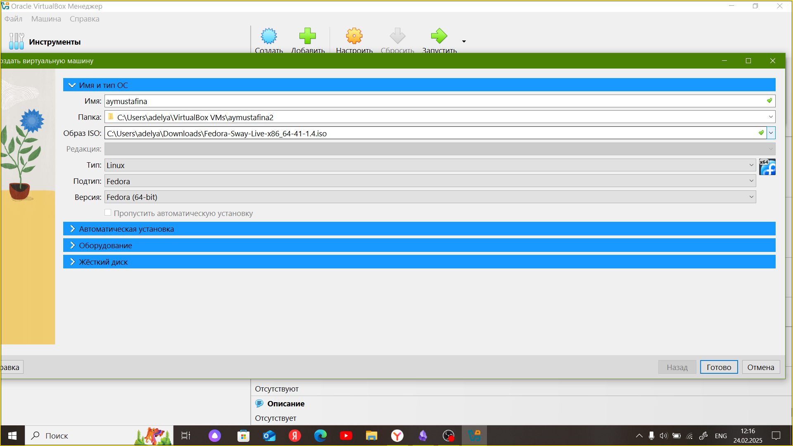{#fig:001 width=70%}

Указываю объем необходимой памяти и включаю EFI (рис. [-@fig:002]).

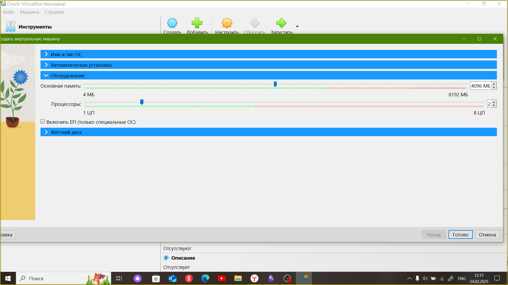{#fig:002 width=70%}

Выбираю создание нового виртуального диска. Задаю тип и формат диска. Задаю размер диска более 80 ГБ. И ставлю удобное для меня расположение жесткого диска (рис. [-@fig:003]).

{#fig:003 width=70%}

Нажимаю готово.

Далее захожу в настройки виртуальной машины и меняю видеопамять на 128 МБ (рис. [-@fig:004]).

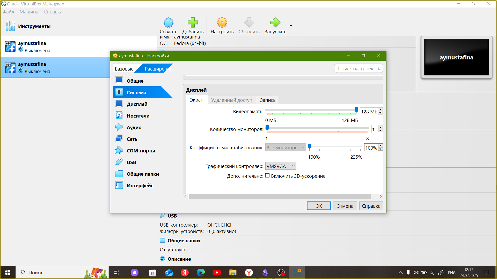{#fig:004 width=70%}

Перехожу в раздел носители и добавляю новый привод оптических дисков и выбираю необходимый образ ОС Fedora (рис. [-@fig:005]).

{#fig:005 width=70%}

В конечном итоге (рис. [-@fig:006]).

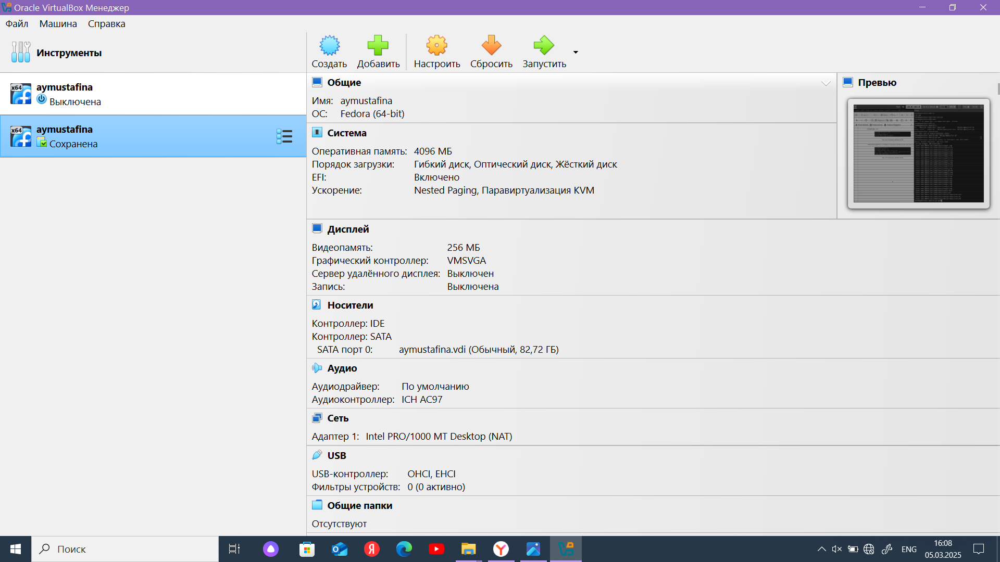{#fig:006 width=70%}

## Установка операционной системы

Запускаю виртуальнуую машину.
Вижу интерфейс начальной конфигурации, нажимаю Enter (рис. [-@fig:007]) [@lab01].

{#fig:007 width=70%}

Продолжаю работать в basic graphics mode (рис. [-@fig:008]).

{#fig:008 width=70%}

Запуск виртуальной машины (рис. [-@fig:009]).

{#fig:009 width=70%}

Нажиимаю Win + d. Пишу liveinst, чтобы перейти к установщику (рис.	[-@fig:010]).

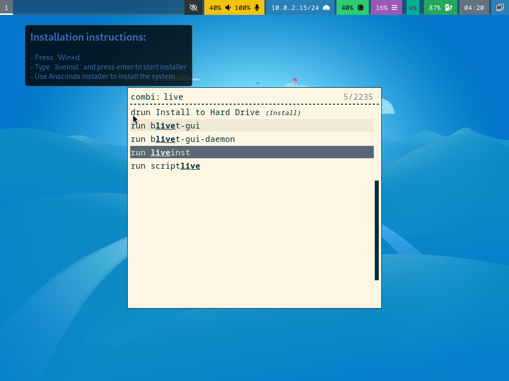{#fig:010 width=70%}

После запуска выбираю Русский язык, нажимаю далее (рис.	[-@fig:011]).

{#fig:011 width=70%}

Вижу обзор установки (рис.	[-@fig:012]).

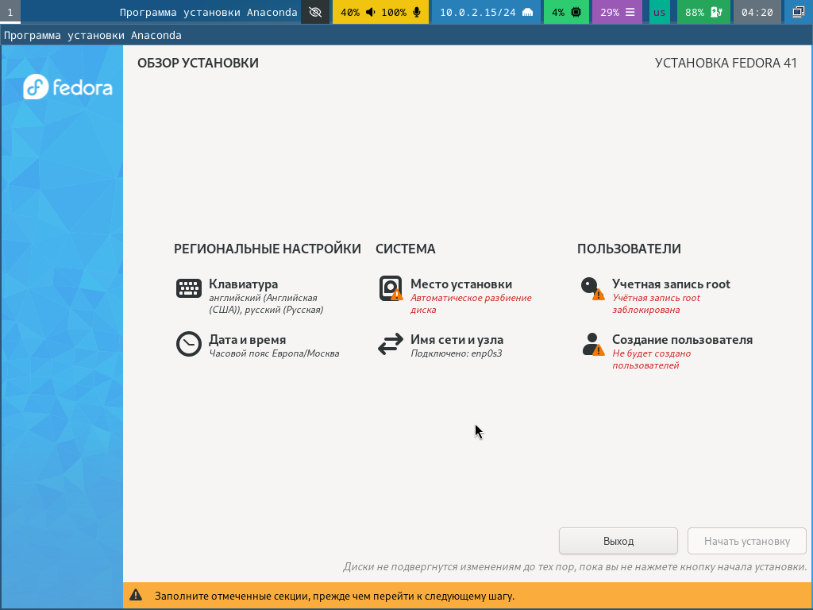{#fig:012 width=70%}

Меняю аккаунт администратора, устанавливаю пароль (рис.	[-@fig:013]).

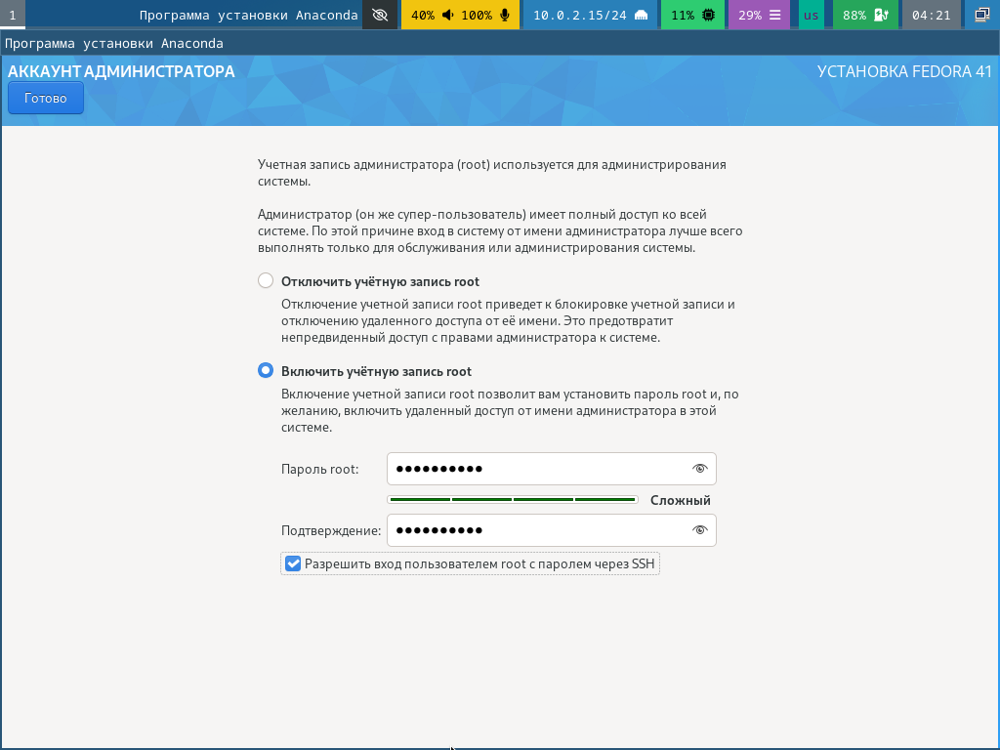{#fig:013 width=70%}

Далее создаю пользователя (рис.	[-@fig:014]).

{#fig:014 width=70%}

Выбираю место установки (рис.	[-@fig:015]).

{#fig:015 width=70%}

Остальные настройки меня устраивают, поэтому сразу начинаю установку. После установки я вручную отключила диск (рис.	[-@fig:016]).

{#fig:016 width=70%}

## Работа с операционной системой после установки

Запускаю машину и вхожу в ОС под заданной мной учетной записью (рис.	[-@fig:017]).

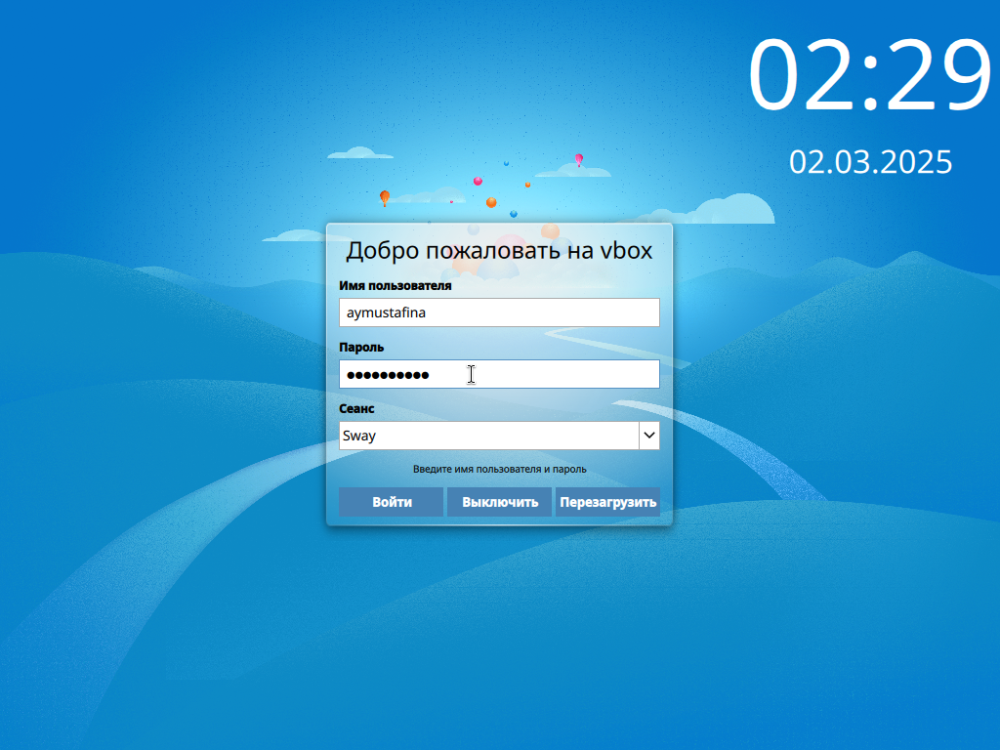{#fig:017 width=70%}

Нажимаю Win+Enter. Переключаюсь на роль супер-пользователя и обновляю все пакеты (рис.	[-@fig:018]).

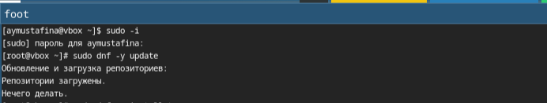{#fig:018 width=70%}

Загружаю программы для удобства работы в терминале (рис.	[-@fig:019]).

{#fig:019 width=70%}

Устанавливаю программы для автоматического обновления (рис.        [-@fig:020]).

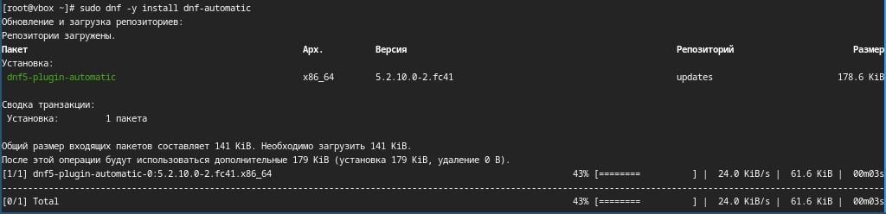{#fig:020 width=70%}

Устанавливаю таймер (рис.        [-@fig:021]).

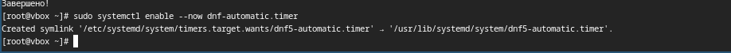{#fig:021 width=70%}

Переместившись по директориям, открываю нужный мне файл и редактирую его (рис.        [-@fig:022]).

{#fig:022 width=70%}

Меняю значение SELINUX=enforcing на значение SELINUX=permissive (рис.   [-@fig:023]).

{#fig:023 width=70%}

Перзагружаю виртуальную машину (рис.    [-@fig:024]).

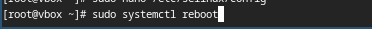{#fig:024 width=70%}

## Настройка раскладки клавиатуры

Устанавливаю пакет dkms, устанавливаю драйвера и презагружаю машину (рис.   [-@fig:025]).

{#fig:025 width=70%}

Создаю конфигурационный файл ~/.config/sway/config.d/95-system-keyboard-config.conf:

mkdir -p ~/.config/sway
touch ~/.config/sway/config.d/95-system-keyboard-config.conf (рис.   [-@fig:026]).

{#fig:026 width=70%}

Открываю файл и реадктирую его exec_always /usr/libexec/sway-systemd/locale1-xkb-config --oneshot (рис.   [-@fig:028]).

{#fig:027 width=70%}

Перемещаюсь по директориям (рис.   [-@fig:028]).

{#fig:028 width=70%}

И редактирую файл
Section "InputClass"
            Identifier "system-keyboard"
            MatchIsKeyboard "on"
            Option "XkbLayout" "us,ru"
            Option "XkbVariant" ",winkeys"
            Option "XkbOptions" "grp:rctrl_toggle,compose:ralt,terminate:ctrl_alt_bksp"
EndSection  (рис.   [-@fig:029]).

{#fig:029 width=70%}

Перезагружаю машину и проверяю работает ли переключение языка (рис.   [-@fig:030]).

{#fig:030 width=70%}

## Установка имени пользователя и названия хоста

Решила проверить имя своего хоста (рис.   [-@fig:031]).

{#fig:031 width=70%}

## Установка программного обеспечения для создания документации

Нажимаю комбинацию Win+Enter для запуска терминала. Запускаю терминальный мультиплексор tmux: tmux. Переключаюсь на роль супер-пользователя: sudo -i. Загружаю средство pandoc (рис.   [-@fig:032]).

{#fig:032 width=70%}

Загружаю пакет pandoc-crossref из github (рис.   [-@fig:033]).

{#fig:033 width=70%}

Загружаю дистрибутив TeXlive: sudo dnf -y install texlive-scheme-full (рис.   [-@fig:034]).

{#fig:034 width=70%}

# Домашнее задание

В окне терминала проанализирую последовательность загрузки системы, выполнив команду dmesg.  (рис.   [-@fig:035]).

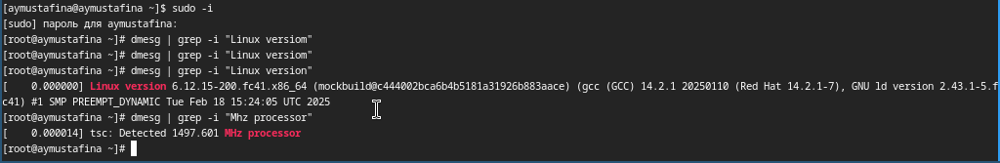{#fig:035 width=70%}

Получаю информацию. К сожалению, при поиске объема доступной оперативной памяти (Memory available) и типа файловой системы корневого раздела я не получаю ничего. 

    Версия ядра Linux (Linux version).
    Частота процессора (Detected Mhz processor).
    Модель процессора (CPU0).
    Объём доступной оперативной памяти (Memory available).
    Тип обнаруженного гипервизора (Hypervisor detected).
    Тип файловой системы корневого раздела.
    Последовательность монтирования файловых систем.  (рис.   [-@fig:036]).

{#fig:036 width=70%}

## Контрольные вопросы

1. Какую информацию содержит учётная запись пользователя?

Учетная запись пользователя содержит необходимые для идентификации пользователя при подключении к сисиетме данные, и информацию для учета и авторизации:
- имя пользователя(логин)
- пароль
- UID (User ID)
- GID (Group ID)
- Домашний каталог
- Оболочка (shell)
- Дополнительная информация

2. Укажите команды терминала и приведите примеры:

- для получения справки по команде;
man ls или ls --help

- для перемещения по файловой системе; 
cd /path/to/directory

- для просмотра содержимого каталога;
ls

- для определения объёма каталога;
du -sh /path/to/directory

- для создания / удаления каталогов / файлов;
mkdir new_directory
rm file.txt
rmdir empty_directory

- для задания определённых прав на файл / каталог;
chmod 755 file.txt

- для просмотра истории команд.
history

3. Что такое файловая система? Приведите примеры с краткой характеристикой.

Файловая система - это способ организации, хранения и управления данными на носителях информации.
Например:
ext3/ext4 - журналируемая файловая система, используемая в соновном в Linux.
NTFS - файловая система Windows, поддерживает большие файлы.
FAT32 - простая файловая система, совместима с большинством ОС, но есть ограничение размера файла.

4. Как посмотреть, какие файловые системы подмонтированы в ОС?

Используем команду:
df -h или mount

5. Как удалить зависший процесс?

Для удаления процесса нам необходимо знать id.
А удаляет команда kill <id процесса>. Также можно использовать команду killall, она удаляет все процессы, без знания id. 

# Выводы

Я изучила работу в Github, научилась подключать ssh и pgp ключи.

# Список литературы

1. Лабораторная работа №1,. URL: (https://esystem.rudn.ru/mod/page/view.php?id=1224368)

