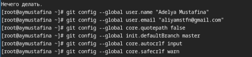

---
## Front matter
lang: ru-RU
title: "Лабораторная работа №2"
subtitle: "Операционные системы"
author:
  - Мустафина А. Ю. НКАбд-03-24
institute:
  - Российский университет дружбы народов, Москва, Россия
date: 7 марта 2025

## i18n babel
babel-lang: russian
babel-otherlangs: english

## Formatting pdf
toc: false
toc-title: Содержание
slide_level: 2
aspectratio: 169
section-titles: true
theme: metropolis
header-includes:
 - \metroset{progressbar=frametitle,sectionpage=progressbar,numbering=fraction}
---

## Цель работы

Изучить идеологию и применение средств контроля версий и освоить умения по работе с git.

## Задание

1. Создать базовую конфигурацию для работы с git.
2. Создать ключ SSH.
3. Создать ключ PGP.
4. Настроить подписи git.
5. Зарегистрироваться на Github.
6. Создать локальный каталог для выполнения заданий по предмету.

# Выполнение лабораторной работы

## Установка программного обеспечения

Устанавливаю программное обеспечение через терминал с помощью команд dnf install git и dnf install gh (рис. 1).

{#fig:001 width=50%}

## Базовая настройка git

Задаю имя и email владельца репозитория с помощью команд:
git config --global user.name "Name Surname"
git config --global user.email "work@mail" (рис. 2).

{#fig:002 width=50%}

## Базовая настройка git

Настроим utf-8 в выводе сообщений git:
git config --global core.quotepath false

Зададим имя начальной ветки (будем называть её master):
git config --global init.defaultBranch master

Параметр autocrlf:
git config --global core.autocrlf input

Параметр safecrlf:
git config --global core.safecrlf warn (рис. 3).

{#fig:003 width=50%}

## Создание ключа ssh

по алгоритму rsa с ключём размером 4096 бит:
ssh-keygen -t rsa -b 4096 (рис. 4).

{#fig:004 width=50%}

## Создание ключа ssh

по алгоритму ed25519:
ssh-keygen -t ed25519 (рис. 5).

{#fig:005 width=50%}

## Создание ключа pgp

Генерирую ключ  gpg --full-generate-key

Из предложенных опций выбираю:
  тип RSA and RSA;
  размер 4096;
  выбрала срок действия; значение по умолчанию — 0 (срок действия не истекает никогда).
  GPG запросит личную информацию, которая сохранится в ключе:
Имя.
  Адрес электронной почты.
  При вводе email убеждаюсь, что он соответствует адресу, используемому на GitHub.
  Комментарий. Нажимаю клавишу ввода, чтобы оставить это поле пустым. (рис. 6).

{#fig:006 width=50%}

## Создание ключа pgp

Ввожу фразу-пароль для защиты ключа (рис. 7).

{#fig:007 width=50%}

## Создание ключа pgp

Открытый и секретный ключ созданы (рис. 8).

{#fig:008 width=50%}

## Настройка github

У меня уже был создан аккаунт на github, основные данные аккаунта заполнены (рис. 9).

{#fig:009 width=50%}

## Добавление PGP ключа в GitHub

Вывожу список ключей и копирую отпечаток приватного ключа: gpg --list-secret-keys --keyid-format LONG

Отпечаток ключа — это последовательность байтов, используемая для идентификации более длинного, по сравнению с самим отпечатком (рис. 10).

{#fig:010 width=50%}

## Добавление PGP ключа в GitHub

Формат строки:

sec   Алгоритм/Отпечаток_ключа Дата_создания [Флаги] [Годен_до]
      ID_ключа
Копирую сгенерированный PGP ключ в буфер обмена: gpg --armor --export <PGP Fingerprint> | xclip -sel cli (рис. 11).

{#fig:011 width=50%}

## Добавление PGP ключа в GitHub

Перехожу в настройки Github, нажимаю кнопку New GPG key и вставляю полученный ключ в поле ввода (рис. 12).

{#fig:012 width=50%}

## Настройка автоматических подписей коммитов git

Используя введёный email, укажите Git применять его при подписи коммитов:

git config --global user.signingkey <PGP Fingerprint>
git config --global commit.gpgsign true
git config --global gpg.program $(which gpg2) (рис. 13).

{#fig:013 width=50%}

## Настройка gh

Сначала аворизуюсь в gh, отвечаю на наводящие вопросы, в конце выбираю авторизацию через браузер (рис. 14).

{#fig:014 width=50%}

## Настройка gh

Завершаю авторизацию на сайте (рис. 15).

{#fig:015 width=50%}

## Настройка gh

Вижу сообщение о завершении авторизации на сайте (рис. 16).

{#fig:016 width=50%}

## Создание репозитория курса на основе шаблона 

Сначала создаю директорию с помощью утилиты mkdir и с помощью cd перехожу в созданную директорию:

mkdir -p ~/work/study/2024-2025/"Операционные системы"
cd ~/work/study/2024-2025/"Операционные системы"
gh repo create study_2024-2025_os-intro --template=yamadharma/course-directory-student-template --public
git clone --recursive git@github.com:<owner>/study_2024-2025_os-intro.git os-intro (рис. 18).

{#fig:018 width=50%}

Клонирование репозитория (рис. 19).

{#fig:019 width=50%}

Перехожу в каталог курса с помощью cd. Удалаю лишние файлы rm package.json. Создаю необходимые каталоги: echo os-intro > COURSE и make (рис. 20).

{#fig:020 width=50%}

Добавляю все новые файлы для отправки на сервер и комментирую их:
git add .
git commit -am 'feat(main): make course structure' (рис. 21).

{#fig:021 width=50%}

Отправляю файлы на сервер с помощью git push (рис. 22).

{#fig:022 width=50%}

# Выводы

При выполнении данной лабораторной работы я изучила идеалогию и применение средств контроля версий, изучила команды для работы с git.

## Список литературы

1. Лабораторная работа №2
