---
## Front matter
title: "Отчет по лабораторной работе №2"
subtitle: "Операционные системы"
author: "Мустафина Аделя Юрисовна"

## Generic otions
lang: ru-RU
toc-title: "Содержание"

## Bibliography
bibliography: bib/cite.bib
csl: pandoc/csl/gost-r-7-0-5-2008-numeric.csl

## Pdf output format
toc: true # Table of contents
toc-depth: 2
lof: true # List of figures
lot: true # List of tables
fontsize: 12pt
linestretch: 1.5
papersize: a4
documentclass: scrreprt
## I18n polyglossia
polyglossia-lang:
  name: russian
  options:
	- spelling=modern
	- babelshorthands=true
polyglossia-otherlangs:
  name: english
## I18n babel
babel-lang: russian
babel-otherlangs: english
## Fonts
mainfont: IBM Plex Serif
romanfont: IBM Plex Serif
sansfont: IBM Plex Sans
monofont: IBM Plex Mono
mathfont: STIX Two Math
mainfontoptions: Ligatures=Common,Ligatures=TeX,Scale=0.94
romanfontoptions: Ligatures=Common,Ligatures=TeX,Scale=0.94
sansfontoptions: Ligatures=Common,Ligatures=TeX,Scale=MatchLowercase,Scale=0.94
monofontoptions: Scale=MatchLowercase,Scale=0.94,FakeStretch=0.9
mathfontoptions:
## Biblatex
biblatex: true
biblio-style: "gost-numeric"
biblatexoptions:
  - parentracker=true
  - backend=biber
  - hyperref=auto
  - language=auto
  - autolang=other*
  - citestyle=gost-numeric
## Pandoc-crossref LaTeX customization
figureTitle: "Рис."
tableTitle: "Таблица"
listingTitle: "Листинг"
lofTitle: "Список иллюстраций"
lotTitle: "Список таблиц"
lolTitle: "Листинги"
## Misc options
indent: true
header-includes:
  - \usepackage{indentfirst}
  - \usepackage{float} # keep figures where there are in the text
  - \floatplacement{figure}{H} # keep figures where there are in the text
---

# Цель работы

Изучить идеологию и применение средств контроля версий и освоить умения по работе с git.

# Задание

1. Создать базовую конфигурацию для работы с git.
2. Создать ключ SSH.
3. Создать ключ PGP.
4. Настроить подписи git.
5. Зарегистрироваться на Github.
6. Создать локальный каталог для выполнения заданий по предмету.

# Выполнение лабораторной работы

## Установка программного обеспечения

Устанавливаю программное обеспечение через терминал с помощью команд dnf install git и dnf install gh (рис. [-@fig:001]).

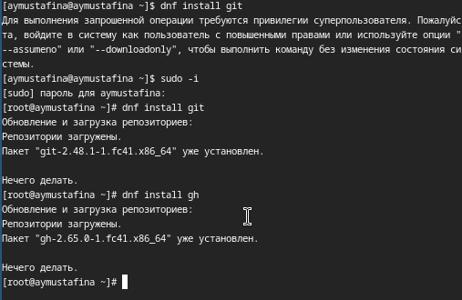{#fig:001 width=70%}

## Базовая настройка git

Задаю имя и email владельца репозитория с помощью команд:
git config --global user.name "Name Surname"
git config --global user.email "work@mail" (рис. [-@fig:002]).

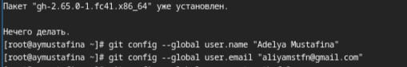{#fig:002 width=70%}

Настроим utf-8 в выводе сообщений git:
git config --global core.quotepath false

Зададим имя начальной ветки (будем называть её master):
git config --global init.defaultBranch master

Параметр autocrlf:
git config --global core.autocrlf input

Параметр safecrlf:
git config --global core.safecrlf warn (рис. [-@fig:003]).

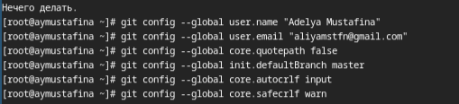{#fig:003 width=70%}

## Создание ключа ssh

по алгоритму rsa с ключём размером 4096 бит:
ssh-keygen -t rsa -b 4096 (рис. [-@fig:004]).

{#fig:004 width=70%}

по алгоритму ed25519:
ssh-keygen -t ed25519 (рис. [-@fig:005]).

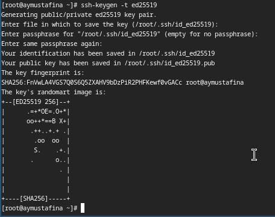{#fig:005 width=70%}

## Создание ключа pgp

Генерирую ключ  gpg --full-generate-key

Из предложенных опций выбираю:
  тип RSA and RSA;
  размер 4096;
  выбрала срок действия; значение по умолчанию — 0 (срок действия не истекает никогда).
  GPG запросит личную информацию, которая сохранится в ключе:
  Имя.
  Адрес электронной почты.
  При вводе email убеждаюсь, что он соответствует адресу, используемому на GitHub.
  Комментарий. Нажимаю клавишу ввода, чтобы оставить это поле пустым. (рис. [-@fig:006]).

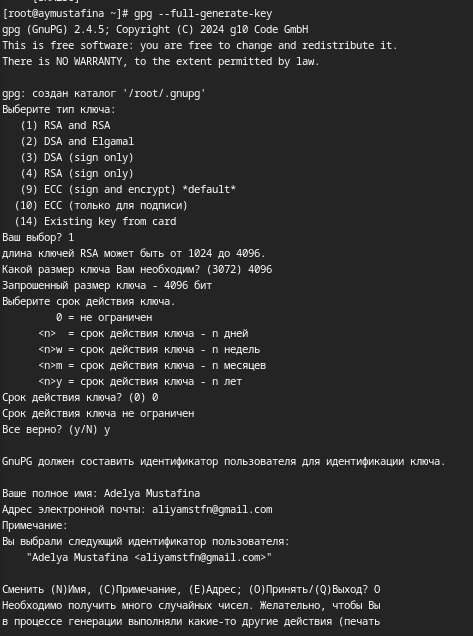{#fig:006 width=70%}

Ввожу фразу-пароль для защиты ключа (рис. [-@fig:007]).

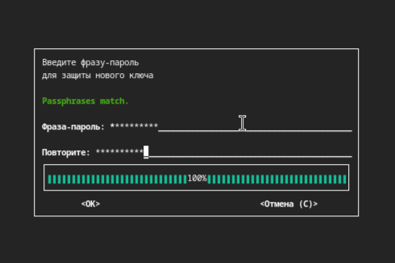{#fig:007 width=70%}

Открытый и секретный ключ созданы (рис. [-@fig:008]).

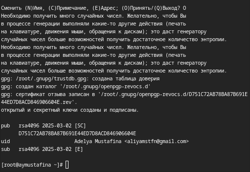{#fig:008 width=70%}

## Настройка github

У меня уже был создан аккаунт на github, основные данные аккаунта заполнены (рис. [-@fig:009]).

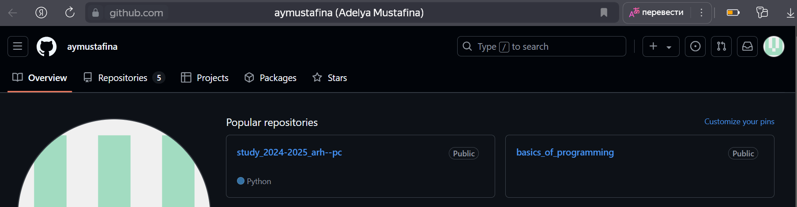{#fig:009 width=70%}

## Добавление PGP ключа в GitHub
Вывожу список ключей и копирую отпечаток приватного ключа: gpg --list-secret-keys --keyid-format LONG

Отпечаток ключа — это последовательность байтов, используемая для идентификации более длинного, по сравнению с самим отпечатком ключа.(рис.	[-@fig:010]).

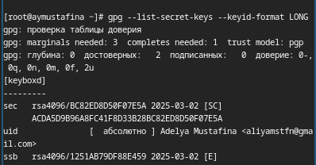{#fig:010 width=70%}

Формат строки:

sec   Алгоритм/Отпечаток_ключа Дата_создания [Флаги] [Годен_до]
      ID_ключа
Копирую сгенерированный PGP ключ в буфер обмена: gpg --armor --export <PGP Fingerprint> | xclip -sel cli (рис.	[-@fig:011]).

{#fig:011 width=70%}

Перехожу в настройки Github, нажимаю кнопку New GPG key и вставляю полученный ключ в поле ввода (рис.   [-@fig:012]).

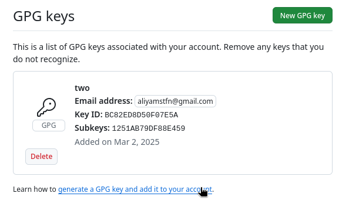{#fig:012 width=70%}

## Настройка автоматических подписей коммитов git

Используя введёный email, укажите Git применять его при подписи коммитов:

git config --global user.signingkey <PGP Fingerprint>
git config --global commit.gpgsign true
git config --global gpg.program $(which gpg2) (рис.   [-@fig:013]).

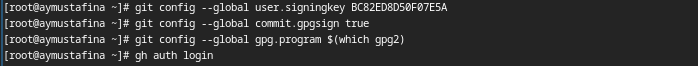{#fig:013 width=70%}

## Настройка gh

Сначала аворизуюсь в gh, отвечаю на наводящие вопросы, в конце выбираю авторизацию через браузер (рис.   [-@fig:014]).

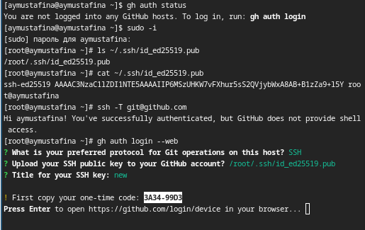{#fig:014 width=70%}

Завершаю авторизацию на сайте (рис.   [-@fig:015]).

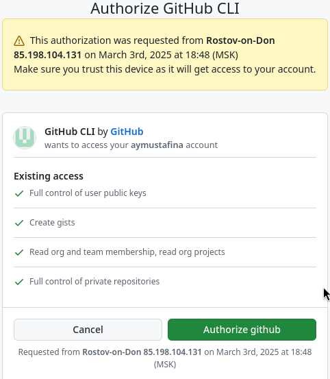{#fig:015 width=70%}

Вижу сообщение о завершении авторизации на сайте (рис.   [-@fig:016]).

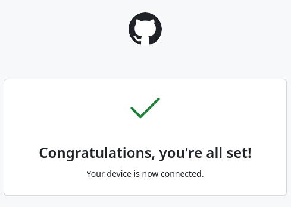{#fig:016 width=70%}

Вижу сообщение о завершении авторизации	в терминале (рис. 	[-@fig:017]).

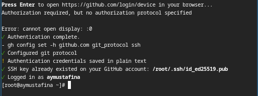{#fig:017 width=70%}

## Создание репозитория курса на основе шаблона 

Сначала создаю директорию с помощью утилиты mkdir и с помощью cd перехожу в созданную директорию:

mkdir -p ~/work/study/2024-2025/"Операционные системы"
cd ~/work/study/2024-2025/"Операционные системы"
gh repo create study_2024-2025_os-intro --template=yamadharma/course-directory-student-template --public
git clone --recursive git@github.com:<owner>/study_2024-2025_os-intro.git os-intro (рис.   [-@fig:018]).

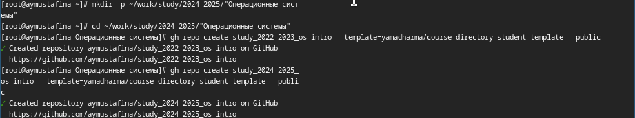{#fig:018 width=70%}

Клонирование репозитория (рис.   [-@fig:019]).

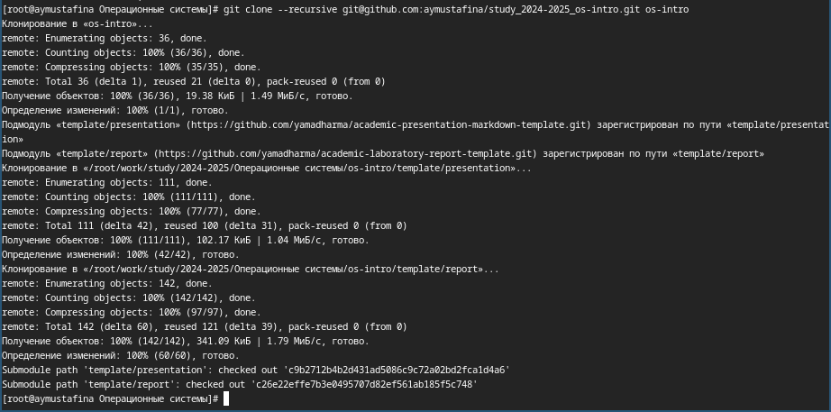{#fig:019 width=70%}

Перехожу в каталог курса с помощью cd. Удалаю лишние файлы rm package.json. Создаю необходимые каталоги: echo os-intro > COURSE и make (рис.   [-@fig:020]).

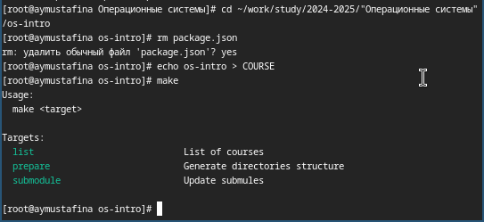{#fig:020 width=70%}

Добавляю все новые файлы для отправки на сервер и комментирую их:
git add .
git commit -am 'feat(main): make course structure' (рис.   [-@fig:021]).

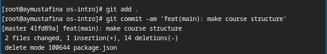{#fig:021 width=70%}

Отправляю файлы на сервер с помощью git push (рис.   [-@fig:022]).

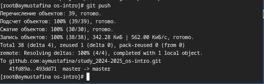{#fig:022 width=70%}

# Выводы

При выполнении данной лабораторной работы я изучила идеалогию и применение средств контроля версий, изучила команды для работы с git.

# Ответы на контрольные вопросы 

- Что такое системы контроля версий (VCS) и для решения каких задач они предназначаются?

Системы контроля версий(VCS) - программное обеспечение для облегчения работы с изменяющейся информацией.
Они помогают разработчикам отслеживать изменения и управлять версиями кода. Основная цель VCS - упростить и упорядочить работу над проектом. С его помощью можно легко отслеживать, какие изменения были внесены в проект и кем. Это помогает быстро находить и испрвалять ошибки, анализировать причины их возникновения.

- Объясните следующие понятия VCS и их отношения: хранилище, commit, история, рабочая копия.

Хранилище - это репозиторий, хранилице версий. В нем хранаятся документы и их история изменения.
Commit - отслеживание редактирования файла и его изменений. Сохранение разницы между версиями.
История - хранение всех изменений в проекте, благодаря чему возможно обратиться к данным, которые были изменены.
Рабочая копия - копия проекта, которая которая используется в данный момент. Обычно последняя измененнная версия копия.

- Что представляют собой и чем отличаются централизованные и децентрализованные VCS? Приведите примеры VCS каждого вида.

Централизованные системы контроля версий преполагают хранение проекта на едином сервере. Так чтобы изменить исходный код, разработчику необходимо скачать с сервера необходимые файлы и изменить, а затем снова вернуть эти файлы на сервер.
Примеры централизованных VCS: CVS, Subversion, Perforce.

Децентрализованные системы контроля версий препологают, что при каждом копировании удаленного репазитория происходит полное копирование данных в локальный репозиторий. И каждая новая копия хранит все данные, хранящиеся в удаленном репазитории.
Примеры	децентрализованных VCS: Git, Basaar, Mercorial.

- Опишите действия с VCS при единоличной работе с хранилищем.

Создается и подключается удаленный репазиторий. Далее при изменении поекта новые изменения отправляютя на сервер.

- Опишите порядок работы с общим хранилищем VCS.

Сначала разработчик клонирует нужный ему удаленный репазиторий. Создает ветку для работы. После внесения каких-либо изменений в код, разработчик отправляет изменения в удаленный репазиторий. ПРи этом все внесенные изменения сохраняются и к ним можно вернуться в любой момент.
- Каковы основные задачи, решаемые инструментальным средством git?

 управление версиями файлов
 отслеживание изменений
 резервное копирование и восстановление данных

- Назовите и дайте краткую характеристику командам git.

Создание основного дерева репозитория:

git init

Получение обновлений (изменений) текущего дерева из центрального репозитория:

git pull

Отправка всех произведённых изменений локального дерева в центральный репозиторий:

git push

Просмотр списка изменённых файлов в текущей директории:

git status

Просмотр текущих изменений:

git diff

Сохранение текущих изменений:

   добавить все изменённые и/или созданные файлы и/или каталоги:

   git add .

   добавить конкретные изменённые и/или созданные файлы и/или каталоги:

   git add имена_файлов

   удалить файл и/или каталог из индекса репозитория (при этом файл и/или каталог остаётся в локальной директории):

   git rm имена_файлов
Сохранение добавленных изменений:

   сохранить все добавленные изменения и все изменённые файлы:

   git commit -am 'Описание коммита'

   сохранить добавленные изменения с внесением комментария через встроенный редактор:

   git commit

   создание новой ветки, базирующейся на текущей:

   git checkout -b имя_ветки

   переключение на некоторую ветку:

   git checkout имя_ветки

   (при переключении на ветку, которой ещё нет в локальном репозитории, она будет создана и связана с удалённой)

   отправка изменений конкретной ветки в центральный репозиторий:

   git push origin имя_ветки

   слияние ветки с текущим деревом:

   git merge --no-ff имя_ветки

Удаление ветки:
   удаление локальной уже слитой с основным деревом ветки:

   git branch -d имя_ветки

   принудительное удаление локальной ветки:

   git branch -D имя_ветки

удаление ветки с центрального репозитория:

git push origin :имя_ветки

- Приведите примеры использования при работе с локальным и удалённым репозиториями.

Для локального репозитория:
git init - создание новго репозитория 
git add . - добавление всех файлов в индекс
git commit -m "Initial commit" - фиксируем изменения

Для удаленного репозитория:
git clone <ссылка> - клонирование репозитория 
git push origin main - отправка изменений в удаленный репозиторий 
git pull - плоучение изменений из удаленного репозитория

- Что такое и зачем могут быть нужны ветви (branches)?

Отдельные линии разработки, позволяющие работать над разными задачами независимо.
Нужны для изоляции изменений, тестирования, испрваления багов без влияния на основную ветку.

- Как и зачем можно игнорировать некоторые файлы при commit?

Создается файл .gitignore, в котором указываются шаблоны файлов/папок, которые следует игнорировать.
Это делается для того, чтобы не включать в репозиторий временные файлы, бинарные данные =, конфиденциальную информацию, файлы, создаваемые средой разработки.
 
# Список литературы {#refs}

1. Лабораторная работа №2 [Электронный ресурс]. URL: [https://esystem.rudn.ru/mod/page/view.php?id=1224371](https://esystem.rudn.ru/mod/page/view.php?id=1224371)
