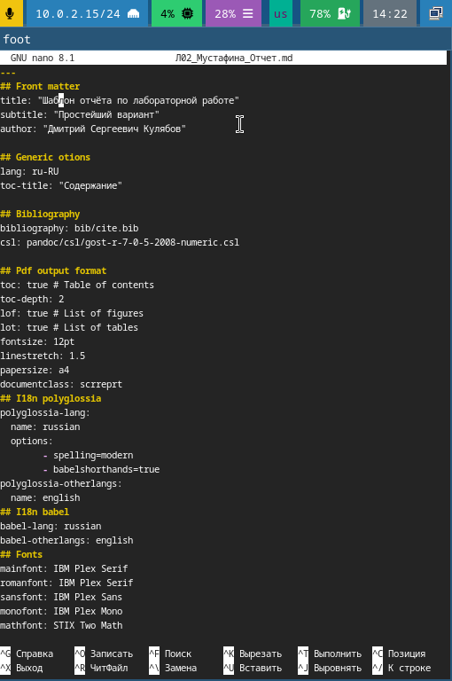
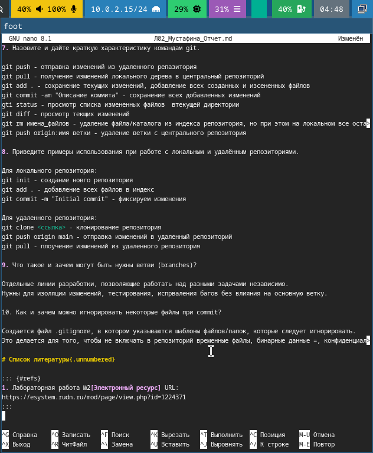
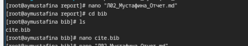
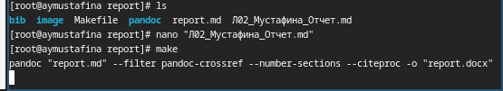
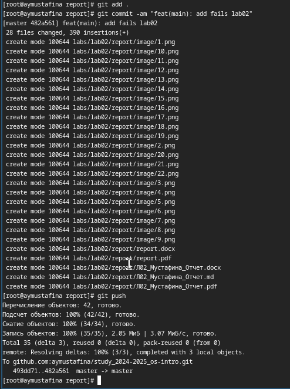

---
## Front matter
lang: ru-RU
title: "Лабораторная работа №3"
subtitle: "Операционнные системы"
author:
  - Мустафина А. Ю.
institute:
  - Российский университет дружбы народов, Москва, Россия
date: 8 марта 2025

## i18n babel
babel-lang: russian
babel-otherlangs: english

## Formatting pdf
toc: false
toc-title: Содержание
slide_level: 2
aspectratio: 169
section-titles: true
theme: metropolis
header-includes:
 - \metroset{progressbar=frametitle,sectionpage=progressbar,numbering=fraction}
---

# Цель работы

Цель данной лабораторной работы - научиться оформалять отчеты с помощью языка разметки Markdown.

# Задание

1. Сделайте отчет по предыдущей лабораторной работе в формате Markdown.
2. В качестве отчета предоставляются отчеты в 3 форматах: pdf, docx и md(в архиве,  поскольку он должен содержать скриншоты, Makefile и т.д.)

# Теоретическое введение

Markdown - облегченный язык разметки, созданный с целью обозначения форматирования в простом тексте, с максимальным сохранением его читаемости человеком, и пригодным для машинного преобразования в языки для продвинутых публикаций [@lab03]. 

## Выполнение лабораторной работы

Перемещаюсь к каталогу, в котором находится шаблон для заполнения отчета по лабораторной работе, с помощью утилиты cd. Создаю копию шаблона с другим названием, в нем и продолжу свою работу (рис. 1).

{#fig:001 width=70%}

## Выполнение лабораторной работы

Открываю файл с помощью nano (рис. 2).

{#fig:002 width=70%}

## Выполнение лабораторной работы

Заполняю файл своим отчетом выполненном с помощью языка разметки Markdown. Сохраняю изменения и закрываю файл(рис. 3).

{#fig:003 width=70%}

## Выполнение лабораторной работы

Перехожу к библиографии. Добавляю в нем электронный ресурс, который я использовала при выполнения лабораторной работы(рис. 4).

{#fig:004 width=70%}

## Выполнение лабораторной работы

После завершения редактирования отчета и выполняю команду make, чтобы файл скомпилировался в pdf и docx(рис. 5).

{#fig:005 width=70%}

## Выполнение лабораторной работы

После завершения компилирования файлов отпрвляю все созданные файлы на глобальный репозиторий(рис. 6).

{#fig:006 width=70%}

# Вывод

При выполнении данной лабораторной работы я научилась оформлять отчеты с помощью легковесного языка разметки Markdown.

## Список литературы

1. Лабораторная работа №3

