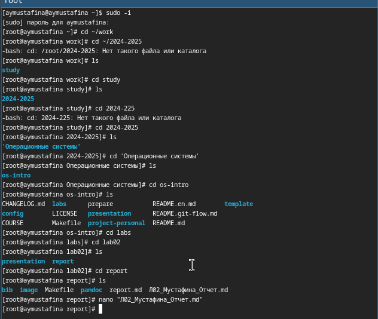
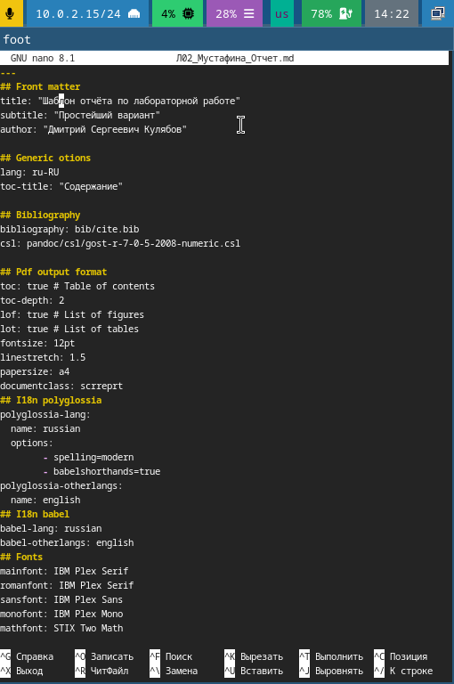
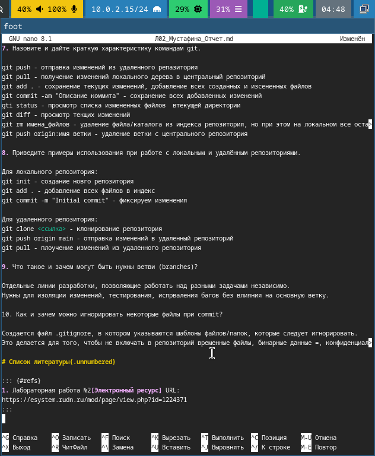
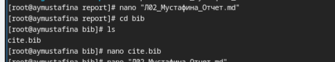
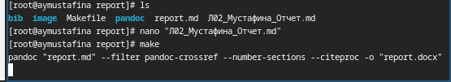
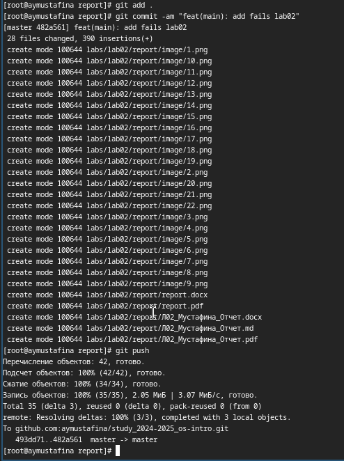

---
## Front matter
title: "Отчет по лабораторной работе №3"
subtitle: "Операционные системы"
author: "Мустафина Аделя Юрисовна"

## Generic otions
lang: ru-RU
toc-title: "Содержание"

## Bibliography
bibliography: bib/cite.bib
csl: pandoc/csl/gost-r-7-0-5-2008-numeric.csl

## Pdf output format
toc: true # Table of contents
toc-depth: 2
lof: true # List of figures
lot: true # List of tables
fontsize: 12pt
linestretch: 1.5
papersize: a4
documentclass: scrreprt
## I18n polyglossia
polyglossia-lang:
  name: russian
  options:
	- spelling=modern
	- babelshorthands=true
polyglossia-otherlangs:
  name: english
## I18n babel
babel-lang: russian
babel-otherlangs: english
## Fonts
mainfont: IBM Plex Serif
romanfont: IBM Plex Serif
sansfont: IBM Plex Sans
monofont: IBM Plex Mono
mathfont: STIX Two Math
mainfontoptions: Ligatures=Common,Ligatures=TeX,Scale=0.94
romanfontoptions: Ligatures=Common,Ligatures=TeX,Scale=0.94
sansfontoptions: Ligatures=Common,Ligatures=TeX,Scale=MatchLowercase,Scale=0.94
monofontoptions: Scale=MatchLowercase,Scale=0.94,FakeStretch=0.9
mathfontoptions:
## Biblatex
biblatex: true
biblio-style: "gost-numeric"
biblatexoptions:
  - parentracker=true
  - backend=biber
  - hyperref=auto
  - language=auto
  - autolang=other*
  - citestyle=gost-numeric
## Pandoc-crossref LaTeX customization
figureTitle: "Рис."
tableTitle: "Таблица"
listingTitle: "Листинг"
lofTitle: "Список иллюстраций"
lotTitle: "Список таблиц"
lolTitle: "Листинги"
## Misc options
indent: true
header-includes:
  - \usepackage{indentfirst}
  - \usepackage{float} # keep figures where there are in the text
  - \floatplacement{figure}{H} # keep figures where there are in the text
---

# Цель работы

Цель данной лабораторной работы - научиться оформалять отчеты с помощью языка разметки Markdown.

# Задание

1. Сделайте отчет по предыдущей лабораторной работе в формате Markdown.
2. В качестве отчета предоставляются отчеты в 3 форматах: pdf, docx и md(в архиве, поскльку он должен содержать скриншоты, Makefile и т.д.)

# Теоретическое введение

Markdown - облегченный язык разметки, созданный с целью обозначения форматирования в простом тексте, с максимальным сохранением его читаемости человеком, и приготным для машинного преобразования в языки для продвинутых публикаций [@lab03].

# Выполнение лабораторной работы

Перемещаюсь к каталогу, в котором находится шаблон для заполнения отчета по лабораторной работе, с помощью утилиты cd. Создаю копию шаблона с другим названием, в нем и продолжу свою работу (рис. [-@fig:001]).

{#fig:001 width=70%}

Открываю файл с помощью nano (рис. [-@fig:002]).

{#fig:002 width=70%}

Заполняю файл своим отчетом выполненном с помощью языка разметки Markdown. Сохраняю изменения и закрываю файл(рис. [-@fig:003]).

{#fig:003 width=70%}

Перехожу к библиографии. Добавляю в нем электронный ресурс, который я использовала при выполнении лабораторной работы(рис. [-@fig:004]).

{#fig:004 width=70%}

После завершения редактирования отчета и выполняю команду make, чтобы файл скомпилировался в pdf и docx(рис. [-@fig:005]).

{#fig:005 width=70%}

После завершения комилирования файлов отправляю все созданные файлы на глобальный репозиторий(рис. [-@fig:006]).

{#fig:006 width=70%}

# Выводы

При выполнении данной лабораторной работы я научилась оформлять отчеты с помощью легковесного языка разметки Markdown.

# Список литературы

1. Лабораторная работа №3 [@lab03]

