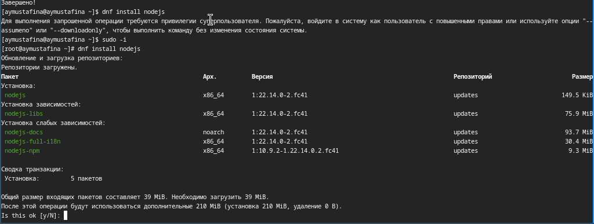
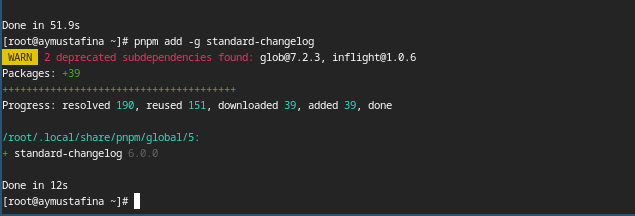
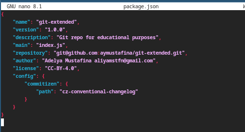

---
## Front matter
lang: ru-RU
title: Лабораторная работа №4
subtitle: Операционнные системы
author:
  - Мустафина А.Ю. НКАбд-03-24
institute:
  - Российский университет дружбы народов, Москва, Россия
date: 8 марта 2025

## i18n babel
babel-lang: russian
babel-otherlangs: english

## Formatting pdf
toc: false
toc-title: Содержание
slide_level: 2
aspectratio: 169
section-titles: true
theme: metropolis
header-includes:
 - \metroset{progressbar=frametitle,sectionpage=progressbar,numbering=fraction}
---

## Цель работы

Получение навыков правильной работы с репозиториями git.

## Задание

- Выполнить работу для тестового репозитория.
- Преобразовать рабочий репозиторий в репозиторий с git-flow и conventional commits.

# Теоретическое введение

### Общая информация

- Gitflow Workflow опубликована и популяризована Винсентом Дриссеном.
- Gitflow Workflow предполагает выстраивание строгой модели ветвления с учётом выпуска проекта.
- Данная модель отлично подходит для организации рабочего процесса на основе релизов.
- Работа по модели Gitflow включает создание отдельной ветки для исправлений ошибок в рабочей среде.
- Последовательность действий при работе по модели Gitflow:
     - Из ветки master создаётся ветка develop.
     -  Из ветки develop создаётся ветка release.
     -  Из ветки develop создаются ветки feature.
     -  Когда работа над веткой feature завершена, она сливается с веткой develop.
     -  Когда работа над веткой релиза release завершена, она сливается в ветки develop и master.
     -  Если в master обнаружена проблема, из master создаётся ветка hotfix.
     -  Когда работа над веткой исправления hotfix завершена, она сливается в ветки develop и master.

# Выполнение лабораторной работы

## Установка программного обеспечения

Устанавливаю git-flow (рис. 1).

{#fig:001 width=70%}

## Установка программного обеспечения

Устанавливаю Node.js
На Node.js базируется программное обеспечение для семантического версионирования и общепринятых коммитов(рис. 2).

{#fig:002 width=70%}

## Установка программного обеспечения

Устанавливаю pnpm (рис. 3).

{#fig:003 width=70%}

## Установка программного обеспечения

Настраиваю Node.js. Для работы с Node.js добавляю каталог с исполняемыми файлами, устанавливаемыми yarn, в переменную PATH.(рис. 4).

{#fig:004 width=70%}

## Установка программного обеспечения

Устанавливаю commitizen(рис. 5).

{#fig:005 width=70%}

## Установка программного обеспечения

Устанавливаю standard-changelog(рис. 6).

{#fig:006 width=70%}

## Практический сценарий использования Git

Создаю новый репозиторий на github, называю его git-extended(рис. 7).

{#fig:007 width=70%}

## Практический сценарий использования Git

Делаю первый коммит (рис. 8).

{#fig:008 width=70%}

## Практический сценарий использования Git

Выкладываю его на github (рис. 9).

{#fig:009 width=70%}

## Практический сценарий использования Git

Конфигурация для пакетов Node.js (рис. 10).

{#fig:010 width=70%}

## Практический сценарий использования Git

Открываю в редакторе и заполняю несколько параметров пакета.
Таким образом, файл package.json приобретает вид:
```
{
    "name": "git-extended",
    "version": "1.0.0",
    "description": "Git repo for educational purposes",
    "main": "index.js",
    "repository": "git@github.com:username/git-extended.git",
    "author": "Name Surname <username@gmail.com>",
    "license": "CC-BY-4.0",
    "config": {
       	"commitizen": {
            "path": "cz-conventional-changelog"
       	}
    }    
}
```

## Практический сценарий использования Git

Вид (рис. 11).

{#fig:011 width=70%}

## Практический сценарий использования Git

Добавляю новые файлы. Выполняю коммит  (рис.  12).

{#fig:012 width=70%}

## Практический сценарий использования Git

Отправляю все на github (рис. 13).

{#fig:013 width=70%}

## Практический сценарий использования Git

Инициализирую git-flow, префикс для ярлыков устанавливаю в v. Проверяю, что я на ветке develop. Загружаю все в хранилище (рис. 14).

{#fig:014 width=70%}

## Практический сценарий использования Git

Устанавливаю внешнюю ветку как вышестоящую для этой ветки и создаю релиз с версией 1.0.0 (рис. 15).

{#fig:015 width=70%}

## Практический сценарий использования Git

Создаю журнал изменений standard-changelog --first-release (рис. 16).

{#fig:016 width=70%}

## Практический сценарий использования Git

Добавляю журнал изменений в индекс (рис.  17).

{#fig:017 width=70%}

## Практический сценарий использования Git

Заливаю релизную ветку в основную ветку (рис. 18).

{#fig:018 width=70%}

## Практический сценарий использования Git

Отправляю данные на github и создаю релиз (рис. 19).

{#fig:019 width=70%}

## Работа с репозиторием git 

Создаю ветку для новой функциональности и по окончании работы с git объединяю ветку feature_branch c develop (рис. 20).

{#fig:020 width=70%}

## Работа с репозиторием git

Создаю релиз с версией 1.2.3, в файле обновляю ее номер (рис. 21).

{#fig:021 width=70%}

## Работа с репозиторием git

Создаю журнал изменений (рис. 22).

{#fig:022 width=70%}

## Работа с репозиторием git

Добавляю журнал изменений в индекс и заливаю релизную ветку в основную (рис. 23).

{#fig:023 width=70%}

## Работа с репозиторием git

Отправляю данные на гитхаб и создаю релиз с комментарием из журнала изменений (рис. 24).

{#fig:024 width=70%}

# Выводы

Я научилась работать с релизами в Github, узнала больше о типах и структуре коммитов. 
