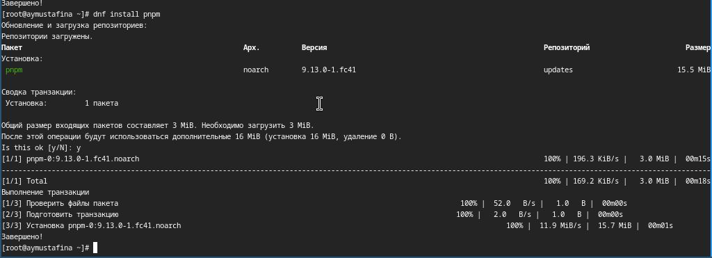
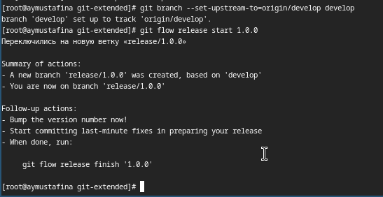
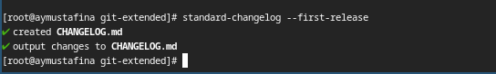
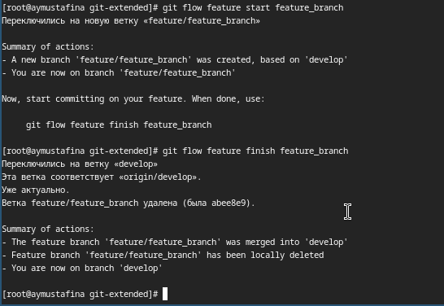

---
## Front matter
title: "Отчет по лабораторной работе №4"
subtitle: "Операционные системы"
author: "Мустафина Аделя Юрисовна"

## Generic otions
lang: ru-RU
toc-title: "Содержание"

## Bibliography
bibliography: bib/cite.bib
csl: pandoc/csl/gost-r-7-0-5-2008-numeric.csl

## Pdf output format
toc: true # Table of contents
toc-depth: 2
lof: true # List of figures
lot: true # List of tables
fontsize: 12pt
linestretch: 1.5
papersize: a4
documentclass: scrreprt
## I18n polyglossia
polyglossia-lang:
  name: russian
  options:
	- spelling=modern
	- babelshorthands=true
polyglossia-otherlangs:
  name: english
## I18n babel
babel-lang: russian
babel-otherlangs: english
## Fonts
mainfont: IBM Plex Serif
romanfont: IBM Plex Serif
sansfont: IBM Plex Sans
monofont: IBM Plex Mono
mathfont: STIX Two Math
mainfontoptions: Ligatures=Common,Ligatures=TeX,Scale=0.94
romanfontoptions: Ligatures=Common,Ligatures=TeX,Scale=0.94
sansfontoptions: Ligatures=Common,Ligatures=TeX,Scale=MatchLowercase,Scale=0.94
monofontoptions: Scale=MatchLowercase,Scale=0.94,FakeStretch=0.9
mathfontoptions:
## Biblatex
biblatex: true
biblio-style: "gost-numeric"
biblatexoptions:
  - parentracker=true
  - backend=biber
  - hyperref=auto
  - language=auto
  - autolang=other*
  - citestyle=gost-numeric
## Pandoc-crossref LaTeX customization
figureTitle: "Рис."
tableTitle: "Таблица"
listingTitle: "Листинг"
lofTitle: "Список иллюстраций"
lotTitle: "Список таблиц"
lolTitle: "Листинги"
## Misc options
indent: true
header-includes:
  - \usepackage{indentfirst}
  - \usepackage{float} # keep figures where there are in the text
  - \floatplacement{figure}{H} # keep figures where there are in the text
---

# Цель работы

Получение навыков правильной работы с репозиториями git.

# Задание

- Выполнить работу для тестового репозитория.
- Преобразовать рабочий репозиторий в репозиторий с git-flow и conventional commits.

# Теоретическое введение

### Общая информация

- Gitflow Workflow опубликована и популяризована Винсентом Дриссеном.
- Gitflow Workflow предполагает выстраивание строгой модели ветвления с учётом выпуска проекта.
- Данная модель отлично подходит для организации рабочего процесса на основе релизов.
- Работа по модели Gitflow включает создание отдельной ветки для исправлений ошибок в рабочей среде.
- Последовательность действий при работе по модели Gitflow:
     - Из ветки master создаётся ветка develop.
     -  Из ветки develop создаётся ветка release.
     -  Из ветки develop создаются ветки feature.
     -  Когда работа над веткой feature завершена, она сливается с веткой develop.
     -  Когда работа над веткой релиза release завершена, она сливается в ветки develop и master.
     -  Если в master обнаружена проблема, из master создаётся ветка hotfix.
     -  Когда работа над веткой исправления hotfix завершена, она сливается в ветки develop и master.


# Выполнение лабораторной работы

## Установка программного обеспечения

Устанавливаю git-flow (рис. [-@fig:001]).

{#fig:001 width=70%}

Устанавливаю Node.js
На Node.js базируется программное обеспечение для семантического версионирования и >

{#fig:002 width=70%}

Устанавливаю pnpm (рис. [-@fig:003]).

{#fig:003 width=70%}

Настраиваю Node.js. Для работы с Node.js добавляю каталог с исполняемыми файлами, устанавливаемыми yarn, в переменную PATH.(рис.	[-@fig:003]).

{#fig:004 width=70%}

Устанавливаю commitizen(рис.	[-@fig:005]).

{#fig:005 width=70%}

Устанавливаю standard-changelog(рис.    [-@fig:006]).

{#fig:006 width=70%}

Создаю новый репозиторий на github, называю его git-extended(рис.    [-@fig:007]).

{#fig:007 width=70%}

Делаю первый коммит (рис.    [-@fig:008]).

{#fig:008 width=70%}

Выкладываю его на github (рис.    [-@fig:009]).

{#fig:009 width=70%} 

Конфигурация для пакетов Node.js (рис.    [-@fig:010]).

{#fig:010 width=70%}

Открываю в редакторе и заполняю несколько параметров пакета.
аким образом, файл package.json приобретает вид:
```
{
    "name": "git-extended",
    "version": "1.0.0",
    "description": "Git repo for educational purposes",
    "main": "index.js",
    "repository": "git@github.com:username/git-extended.git",
    "author": "Name Surname <username@gmail.com>",
    "license": "CC-BY-4.0",
    "config": {
        "commitizen": {
            "path": "cz-conventional-changelog"
        }
    }    
}
```

 (рис.    [-@fig:011]).

{#fig:011 width=70%}

Добавляю новые файлы. Выполняю коммит  (рис. 	 [-@fig:012]).

{#fig:012 width=70%}

Отправляю все на github (рис. 	 [-@fig:013]).

{#fig:013 width=70%}

Инициализирую git-flow, префикс для ярлыков устанавливаю в v. Проверяю, что я на ветке develop. Загружаю все в хранилище (рис.    [-@fig:014]).

{#fig:014 width=70%}

Устанавливаю внешнюю ветку как вышестоящую для этой ветки и создаю релиз с версией 1.0.0 (рис.    [-@fig:015]).

{#fig:015 width=70%}

Создаю журнал изменений standard-changelog --first-release (рис.    [-@fig:016]).

{#fig:016 width=70%}

Добавляю журнал изменений в индекс (рис.    [-@fig:017]).

{#fig:017 width=70%}

Заливаю релизную ветку в основную ветку (рис.    [-@fig:018]).

{#fig:018 width=70%}

Отправляю данные на github и создаю релиз (рис.    [-@fig:019]).

{#fig:019 width=70%}

Создаю ветку для новой функциональности и по окончании работы с git объединяю ветку feature_branch c develop (рис.	  [-@fig:020]).

{#fig:020 width=70%}

Создаю релиз с версией 1.2.3, в файле обновляю ее номер (рис.	  [-@fig:021]).

{#fig:021 width=70%}

Создаю журнал изменений (рис.	 [-@fig:022]).

{#fig:022 width=70%}

Добавляю журнал изменений в индекс и заливаю релизную ветку в основную (рис.    [-@fig:023]).

{#fig:023 width=70%}

Отправляю данные на гитхаб и создаю релиз с комментарием из журнала изменений (рис.    [-@fig:024]).

{#fig:024 width=70%}

# Выводы

Я научилась работать с релизами в Github, узнала юольше о типах и структуре коммитов. 

# Список литературы

1. Лабораторная работа №4 [@lab04]
