---
## Front matter
lang: ru-RU
title: Лабораторная работа № 5
subtitle: Операционные системы
author:
  - Мустафина А. Ю.
institute:
  - Российский университет дружбы народов, Москва, Россия

date: 15 марта 2025

## i18n babel
babel-lang: russian
babel-otherlangs: english

## Formatting pdf
toc: false
toc-title: Содержание
slide_level: 2
aspectratio: 169
section-titles: true
theme: metropolis
header-includes:
 - \metroset{progressbar=frametitle,sectionpage=progressbar,numbering=fraction}
---

# Информация

## Докладчик

:::::::::::::: {.columns align=center}
::: {.column width="70%"}

  * Мустафина Аделя Юрисовна 
  * НКАбд-03-24, студ. билет №1132246719
  * Российский университет дружбы народов
  * <https://github.com/aymustafina/study_2024-2025_os-intro>

:::
::: {.column width="30%"}

:::
::::::::::::::

## Цель работы

Поработать с pass, gopass,native messaging, chezmoi. Научиться пользоваться этими утилитами, синхронизировать их с github.

# Задание

1. Установить необоходимое ПО
2. Установить и настроитть pass
3. Настроить интерфейс с браузером
4. Сохранить пароль
5. Установить и настроить chezmoi
6. Настроить chezmoi на новой машине
7. Выполнить ежедневные операции с chezmoi

# Теоретическое введение

## Менеджер паролей pass

  Менеджер паролей pass — программа, сделанная в рамках идеологии Unix.
  Также носит название стандартного менеджера паролей для Unix (The standard Unix password manager).

## Основные свойства

  Данные хранятся в файловой системе в виде каталогов и файлов.
  Файлы шифруются с помощью GPG-ключа.

### Структура базы паролей

  Структура базы может быть произвольной, если Вы собираетесь использовать её напрямую, без промежуточного программного обеспечения. Тогда семан>
  Если же необходимо использовать дополнительное программное обеспечение, необходимо семантику заложить в структуру базы паролей.

### Семантическая структура базы паролей

   Рассмотрим пользователя user в домене example.com, порт 22.

   Отсутствие имени пользователя или порта в имени файла означает, что любое имя пользователя и порт будут совпадать:

   example.com.pgp

   Соответствующее имя пользователя может быть именем файла внутри каталога, имя которого совпадает с хостом. Это полезно, если в базе есть паро>

   example.com/user.pgp

   Имя пользователя также может быть записано в виде префикса, отделенного от хоста знаком @:

   user@example.com.pgp

   Соответствующий порт может быть указан после хоста, отделённый двоеточием (:):

   example.com:22.pgp
   example.com:22/user.pgp
   user@example.com:22.pgp

Эти все записи могут быть расположены в произвольных каталогах, задающих Вашу собственную иерархию.

# Выполнение лабораторной работы

## Установка

Менеджер паролей pass

Устанавливаю необходимое ПО с помощью команд dnf install pass pass-otp 

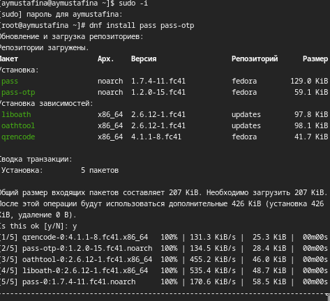{#fig:001 width=70%}

И еще dnf install gopass 

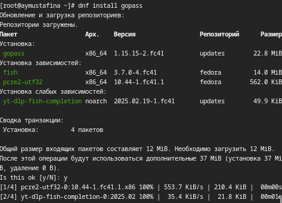{#fig:002 width=70%}  

## Настройка

Настройка ключей GPG, просматриваю список ключей gpg --list-secret-keys.

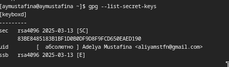{#fig:003 width=70%}  

Инициализация хранилища pass init <gpg-id or email>

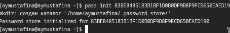{#fig:004 width=70%}  

Синхронизация с git с помощью pass git init 

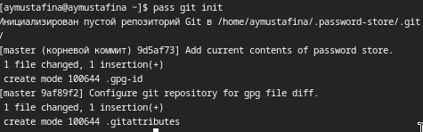{#fig:005 width=70%}

Создаю репозиторий

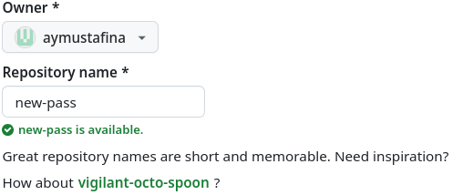{#fig:006 width=70%}

Также задаю адрес репозитория на хостинге pass git remote add origin git@github.com:<git_username>/<git_repo>.git 

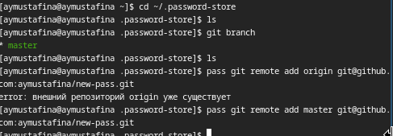{#fig:007 width=70%}

Для синхронизации выполняется следующая команда: pass git pull и  pass git push.

С помощью pass git status проверяю статус синхронизации

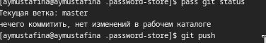{#fig:008 width=70%}

Вручную делаю коммит: cd ~/.password-store/  git add    git commit -am 'edit manually'      git push

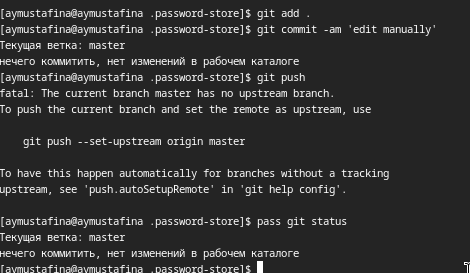{#fig:010 width=70%}

## Настройка интерфейса с браузером

Устанавливаю программу, обеспечивающую интерфейс native messaging

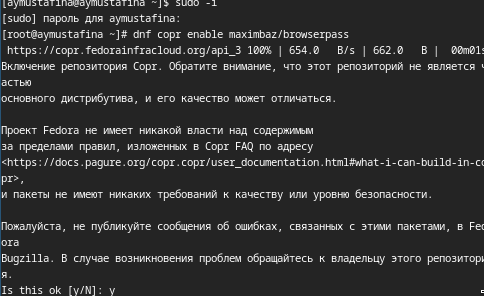{#fig:011 width=70%}

И еще другая программа

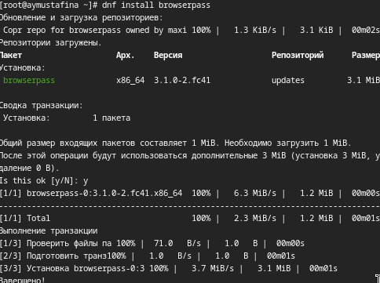{#fig:012 width=70%}

## Сохранение пароля

Добавляю новый пароль 

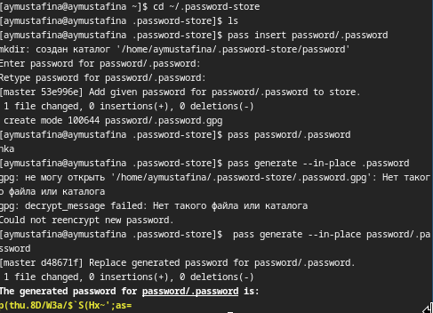{#fig:013 width=70%}

## Управление файлами конфигурации

## Дополнительное программное обеспечение

Устанавливаю дополнительное программное обеспечение

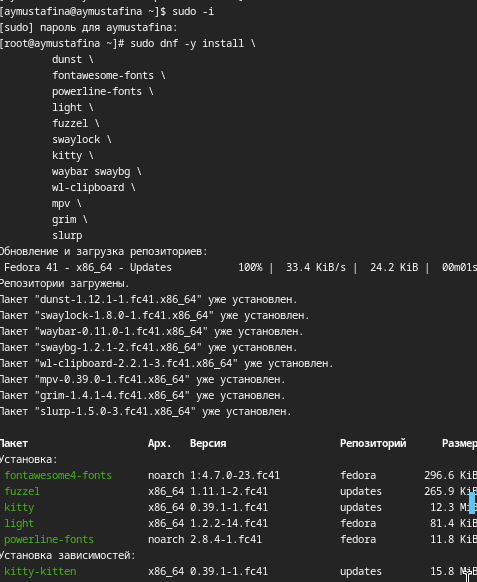{#fig:014 width=70%}

Устанавливаю шрифты:

sudo dnf copr enable peterwu/iosevka
sudo dnf search iosevka

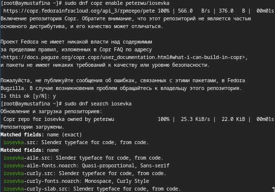{#fig:015 width=70%}

sudo dnf install iosevka-fonts iosevka-aile-fonts iosevka-curly-fonts iosevka-slab-fonts 

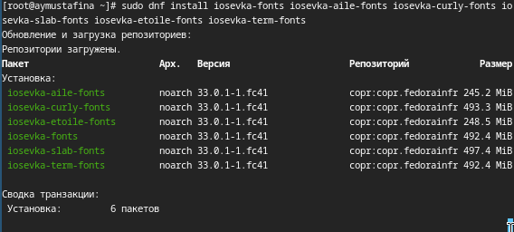{#fig:016 width=70%}

## Установка и создание собственного репозитория с помощью утилит

Установливаю бинарный файл. Скрипт определяет архитектуру процессора и операционную систему и скачивает необходимый файл: sh -c "$(wget -qO- che>
Создаю свой репозиторий для конфигурационных файлов на основе шаблона:
gh repo create dotfiles --template="yamadharma/dotfiles-template" --private

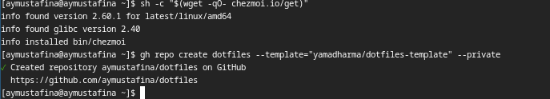{#fig:017 width=70%}

## Подключение репозитория к своей системе

Инициализирую chezmoi с репозиторием dotfiles  chezmoi init git@github.com:<username>/dotfiles.git 
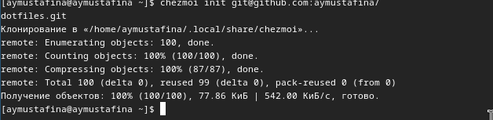{#fig:018 width=70%}

Изменения меня устраивают, поэтому ввожу необходимую команду 

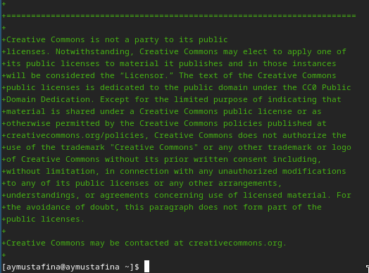{#fig:019 width=70%}

## Использование chezmoi на нескольких машинах

Инициализирую chezmoi с репозиторием dotfiles:  chezmoi init https://github.com/<username>/dotfiles.git
Проверяю, какие изменения внесёт chezmoi в домашний каталог, запустив: chezmoi diff, chezmoi apply -v,   chezmoi edit file_name, chezmoi merge file_name, chezmoi update -v

## Настройка новой машины с помощью одной команды

Устанавливаю свои dotfiles на новый компьютер с помощью одной команды: chezmoi init --apply https://github.com/<username>/dotfiles.git

Для пунктов использование chezmoi на нескольких машинах, настройка новой машины с помощью одной команды, еедневные операции c chezmoi. 

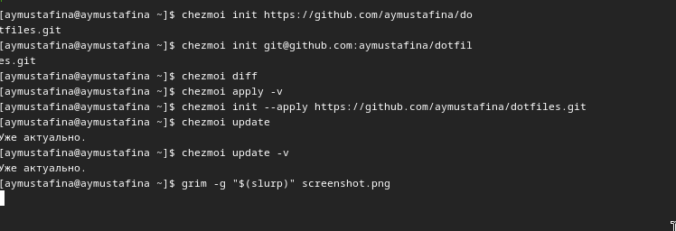{#fig:020 width=70%}

## Ежедневные операции c chezmoi

Извлекаю последние изменения из репозитория и применяю их chezmoi update

Выполняю chezmoi git pull -- --autostash --rebase && chezmoi diff

Автоматически фиксирую и отправляю изменения в репозиторий
Чтобы включить её, добавляю в файл конфигурации ~/.config/chezmoi/chezmoi.toml следующее:
        [git]
            autoCommit = true
            autoPush = true
Всякий раз, когда в исходный каталог вносятся изменения, chezmoi фиксирует изменения с помощью автоматически сгенерированного сообщения фиксации>

# Выводы

Я познакомилась c pass, gopass, native messaging, chezmoi. Научилась ползоваться этими утилитами и настраивать их.
