---
## Front matter
lang: ru-RU
title: Лабораторная работа №6
subtitle: Операционные системы
author:
  - Мустафина А. Ю.
institute:
  - Российский университет дружбы народов, Москва, Россия
date: 22 марта 2025

## i18n babel
babel-lang: russian
babel-otherlangs: english

## Formatting pdf
toc: false
toc-title: Содержание
slide_level: 2
aspectratio: 169
section-titles: true
theme: metropolis
header-includes:
 - \metroset{progressbar=frametitle,sectionpage=progressbar,numbering=fraction}
---

# Информация

## Докладчик

:::::::::::::: {.columns align=center}
::: {.column width="70%"}

  * Мустафина Аделя Юрисовна
  * НКАбд-03-24, студ. билет №1132246719
  * Российский университет дружбы народов
  * <https://github.com/aymustafina/study_2024-2025_os-intro>

:::
::: {.column width="30%"}


:::
::::::::::::::


# Цель работы

Приобретение практических навыков взаимодействия пользователя с системой посредством командной строки.

# Задание

## Задание

1. Определите полное имя вашего домашнего каталога. Далее относительно этого ката-
лога будут выполняться последующие упражнения.
2. Выполните следующие действия:
  1. Перейдите в каталог /tmp.
  2. Выведите на экран содержимое каталога /tmp. Для этого используйте команду ls с различными опциями. Поясните разницу в выводимой на экран информации.
  3. Определите, есть ли в каталоге /var/spool подкаталог с именем cron?
  4. Перейдите в Ваш домашний каталог и выведите на экран его содержимое. Определите, кто является владельцем файлов и подкаталогов?

## Задание

3. Выполните следующие действия:
  1. В домашнем каталоге создайте новый каталог с именем newdir.
  2. В каталоге ~/newdir создайте новый каталог с именем morefun.
  3. В домашнем каталоге создайте одной командой три новых каталога с именами letters, memos, misk. Затем удалите эти каталоги одной командой.
  4. Попробуйте удалить ранее созданный каталог ~/newdir командой rm. Проверьте, был ли каталог удалён.
  5. Удалите каталог ~/newdir/morefun из домашнего каталога. Проверьте, был ли каталог удалён.
4. С помощью команды man определите, какую опцию команды ls нужно использовать для просмотра содержимое не только указанного каталога, но и подкаталогов, входящих в него.
5. С помощью команды man определите набор опций команды ls, позволяющий отсортировать по времени последнего изменения выводимый список содержимого с развёрнутым описанием файлов.
6. Используйте команду man для просмотра описания следующих команд: cd, pwd, mkdir, rmdir, rm. Поясните основные опции этих команд.
7. Используя информацию, полученную при помощи команды history, выполните модификацию и исполнение нескольких команд из буфера команд.

# Выполнение лабораторной работы

## Выполнение лабораторной работы

Определим полное имя домашнего каталога.
Перейдем в каталог /tmp и выведем на экран содеожимое катлога /tmp с помощью ls, используя различные опции.
Так с опцией -a на экран отобразятся имена скрытых файлов (рис. 1).

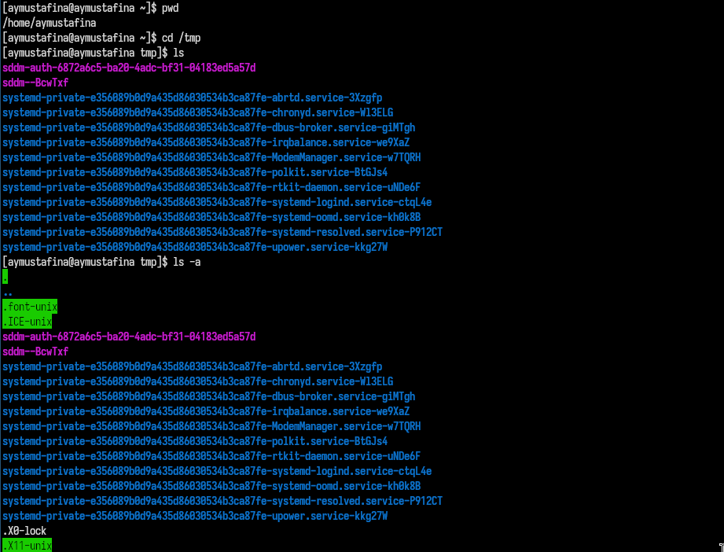{#fig:001 width=70%}

## Выполнение лабораторной работы

С помощью опции -l можно вывести информацию о файлах и каталогах.
Команда ls -alF выводит подробный список файлов и каталогов, включая скрытые файлы, с дополнительной информацией и символами, 
указывающими тип файла (рис. 2).

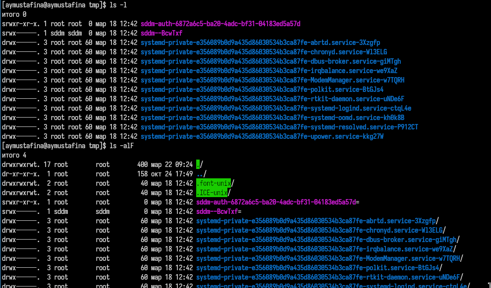{#fig:002 width=70%}

## Выполнение лабораторной работы

Определю есть ли в каталоге /var/spool подкаталог с именем cron. Да, он у меня есть (рис. 3).

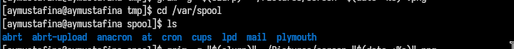{#fig:003 width=70%}

## Выполнение лабораторной работы

Перехожу в домашний каталог и вывожу на экран его содержимое. Владелец файлов - я (рис. 4).

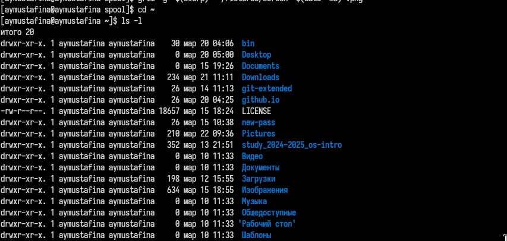{#fig:004 width=70%}

## Выполнение лабораторной работы

В домашнем каталоге создаю новый каталог с именем newdir. В каталоге ~/newdir создаю новый каталог с именем morefun (рис. 5).

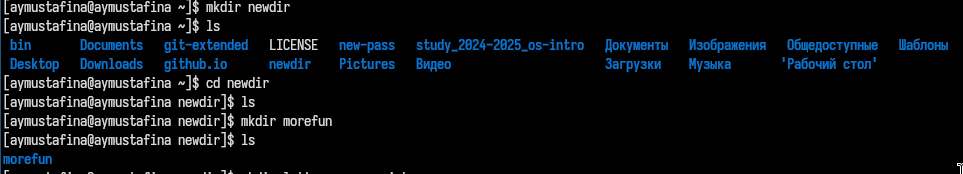{#fig:005 width=70%}

## Выполнение лабораторной работы

В домашнем каталоге создаю одной командой три новых каталога с именами letters, memos, misk. Затем удаляю эти каталоги одной командой (рис. 6).

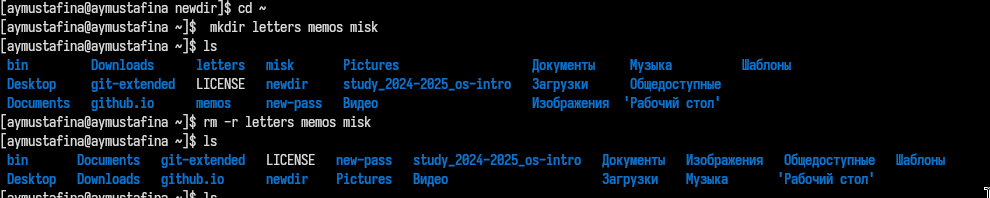{#fig:006 width=70%}

## Выполнение лабораторной работы

Пробую удалить ранее созданный каталог ~/newdir командой rm.
Проверяю, был ли каталог удалён. Удаляю каталог ~/newdir/morefun из домашнего каталога. Проверяю, был ли каталог удалён (рис. 7).

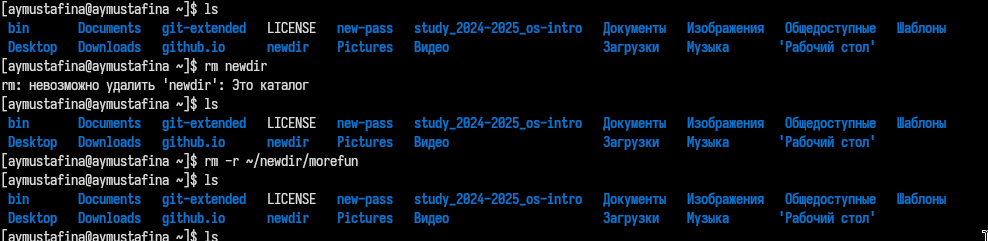{#fig:007 width=70%}

## Выполнение лабораторной работы

Команда man (рис. 8).

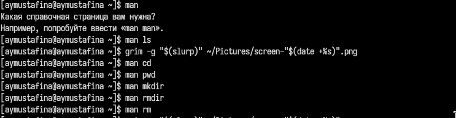{#fig:008 width=70%}

## Выполнение лабораторной работы

С помощью команды man определяю, какую опцию команды ls нужно использовать для просмотра содержимое не только указанного каталога,
но и подкаталогов, входящих в него (рис. 9).

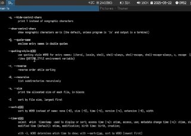{#fig:009 width=70%}

## Выполнение лабораторной работы

С помощью команды man определяю, основные опции команды cd (рис. 10).

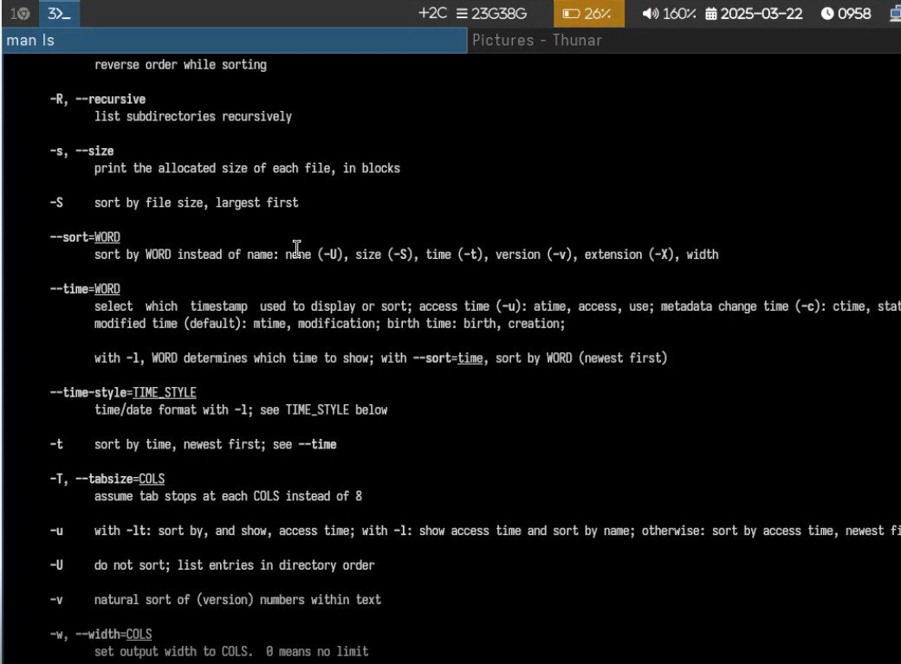{#fig:010 width=70%}

## Выполнение лабораторной работы

С помощью команды man определяю, основные опции команды pwd (рис. 11).

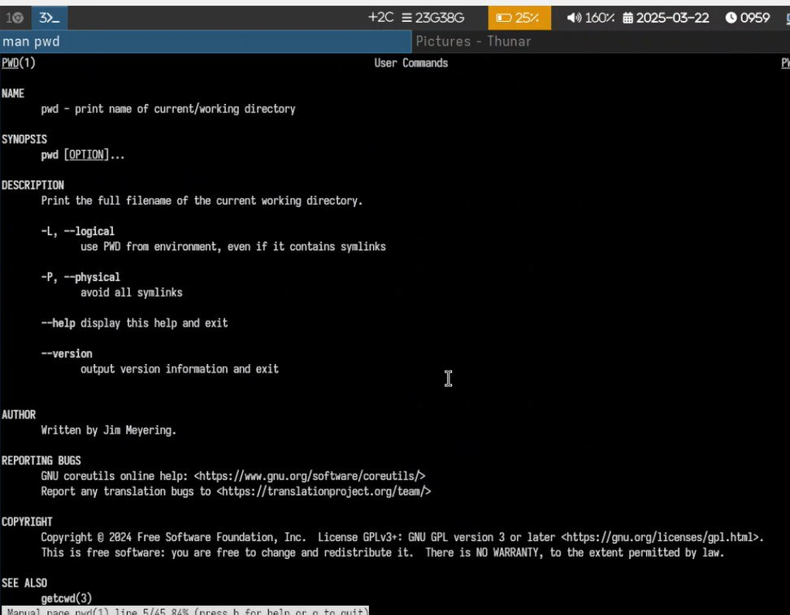{#fig:011 width=70%}

## Выполнение лабораторной работы

С помощью команды man определяю, основные опции команды mkdir (рис. 12).

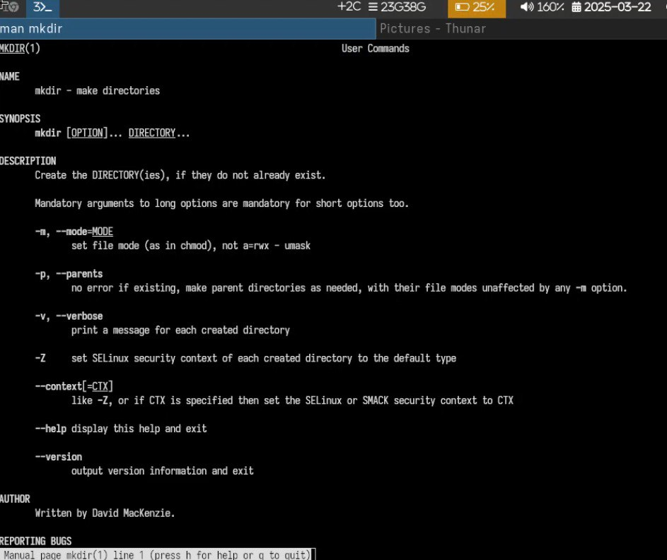{#fig:012 width=70%}

## Выполнение лабораторной работы

С помощью команды man определяю, основные опции команды rmdir (рис. 13).

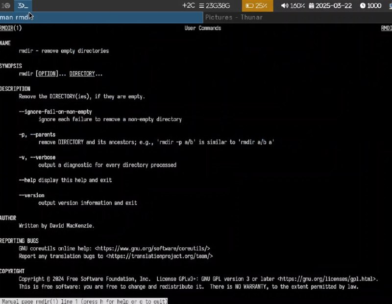{#fig:013 width=70%}

## Выполнение лабораторной работы

С помощью команды man определяю, основные опции команды rm (рис. 14).

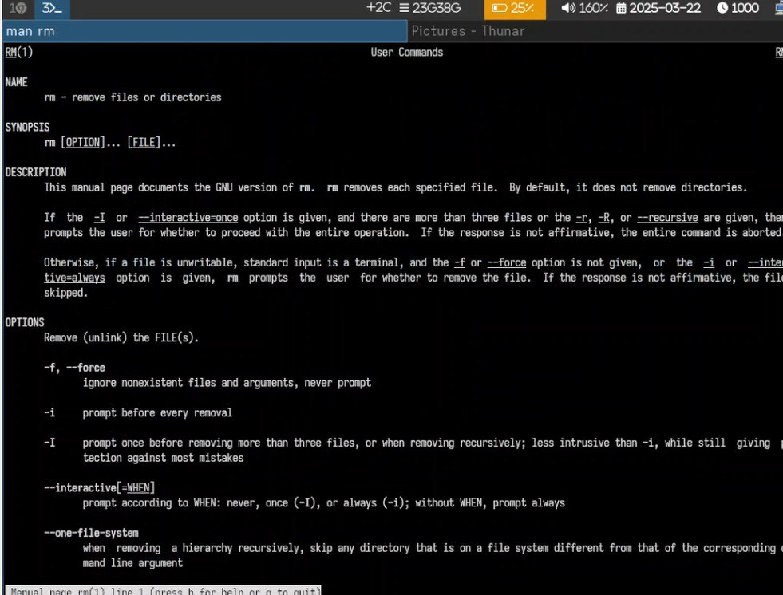{#fig:014 width=70%}

## Выполнение лабораторной работы

Используя информацию, полученную при помощи команды history, выполняю модификацию (рис. 15).

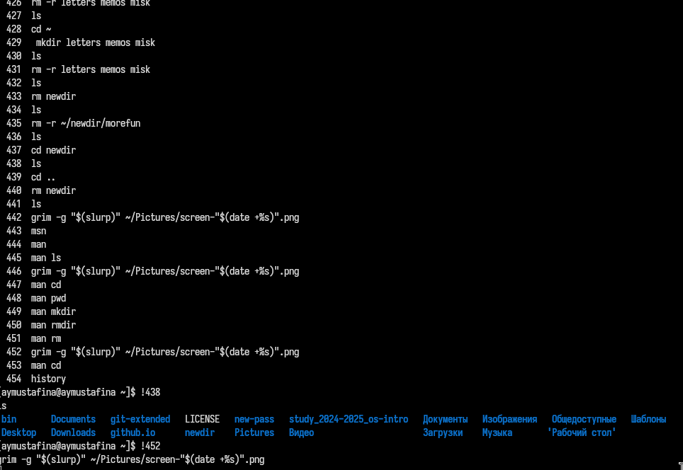{#fig:015 width=70%}

## Выполнение лабораторной работы

Исполнение нескольких команд из буфера команд (рис. 16).

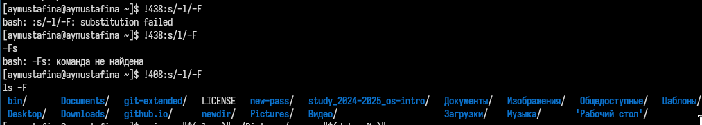{#fig:016 width=70%}

# Контрольные вопросы

## Контрольные вопросы

1. Что такое командная строка?

В операционной системе типа Linux взаимодействие пользователя с системой обычно осуществляется с помощью командной строки посредством построчного ввода команд. При этом обычно используется командные интерпретаторы языка shell: /bin/sh; /bin/csh; /bin/ksh.

2. При помощи какой команды можно определить абсолютный путь текущего каталога?
Приведите пример.

Для определения абсолютного пути к текущему каталогу используется
команда pwd (print working directory).
Например:
```
pwd
/afs/dk.sci.pfu.edu.ru/home/d/h/dharma
```
## Контрольные вопросы

3. При помощи какой команды и каких опций можно определить только тип файлов
и их имена в текущем каталоге? Приведите примеры.

При помощи команды ls -F.

4. Каким образом отобразить информацию о скрытых файлах? Приведите примеры.

С помощью комнады ls -a.

## Контрольные вопросы

5. При помощи каких команд можно удалить файл и каталог? Можно ли это сделать одной и той же командой? Приведите примеры.

Kоманда rm используется для удаления файлов и/или каталогов.
Формат команды:
rm [-опции] [файл]
Если требуется, чтобы выдавался запрос подтверждения на удаление файла, то необходимо использовать опцию i.
Чтобы удалить каталог, содержащий файлы, нужно использовать опцию r. Без указания этой опции команда не будет выполняться.
Пример:
```
1 cd
2 mkdir abs
3 rm abc
4
5 rm: abc is a directory
6
7 rm -r abc
```
Если каталог пуст, то можно воспользоваться командой rmdir. Если удаляемый каталог содержит файлы, то команда не будет выполнена — 
нужно использовать rm -r имя_каталога.

## Контрольные вопросы

6. Каким образом можно вывести информацию о последних выполненных пользователем командах? работы?

Для вывода на экран списка ранее выполненных команд используется команда history. Выводимые на экран команды в списке нумеруются. К любой команде из выведенного на экран списка можно обратиться по её номеру в списке, воспользовавшись конструкцией !<номер_команды>.

7. Как воспользоваться историей команд для их модифицированного выполнения? Приведите примеры.

Можно модифицировать команду из выведенного на экран списка при помощи следующей конструкции:
!<номер_команды>:s/<что_меняем>/<на_что_меняем>
Пример:
```
!3:s/a/F
ls -F
```

## Контрольные вопросы

8. Приведите примеры запуска нескольких команд в одной строке.

Если требуется выполнить последовательно несколько
команд, записанный в одной строке, то для этого используется символ точка с запятой
Пример:
```cd; ls```

9. Дайте определение и приведите примера символов экранирования.

Если в заданном контексте встречаются специальные символы (типа «.»,
«/», «*» и т.д.), надо перед ними поставить символ экранирования \ (обратный слэш).
Создание файла с именем, содержащим пробел:
```touch my\ document.txt```

## Контрольные вопросы

10. Охарактеризуйте вывод информации на экран после выполнения команды ls с опцией l.

Чтобы вывести на экран подробную информацию о файлах и каталогах, необходимо
использовать опцию l. При этом о каждом файле и каталоге будет выведена следующая
информация:
– тип файла,
– право доступа,
– число ссылок,
– владелец,
– размер,
– дата последней ревизии,
– имя файла или каталога.

## Контрольные вопросы

11. Что такое относительный путь к файлу? Приведите примеры использования относи-
тельного и абсолютного пути при выполнении какой-либо команды.

Относительный путь — это путь к файлу или каталогу, который указывается относительно текущего рабочего каталога. 
В отличие от абсолютного пути, который начинается с корневого каталога (/), относительный путь не включает полный путь от корня.
   Предположим, текущий каталог — /home/user. Чтобы перейти в подкаталог Documents, можно использовать относительный путь:
```  cd Documents```
Чтобы скопировать файл file.txt из текущего каталога в подкаталог Downloads:
    cp file.txt Downloads/

## Контрольные вопросы

12. Как получить информацию об интересующей вас команде?

С помощьью команды man (manual): Открывает руководство по команде. Например:
    man ls
С помощью команды --help или -h: Выводит краткую справку по команде. Например:

    ls --help

13. Какая клавиша или комбинация клавиш служит для автоматического дополнения
вводимых команд?

Для автоматического дополнения вводимых команд используется клавиша Tab. Она позволяет:

Автоматически дополнять имена файлов, каталогов и команд.
Если есть несколько вариантов, двойное нажатие Tab покажет список возможных дополнений.

# Выводы

Мы приобрели практические навыки взаимодействия пользователя с ситемой посредством командной строки.
