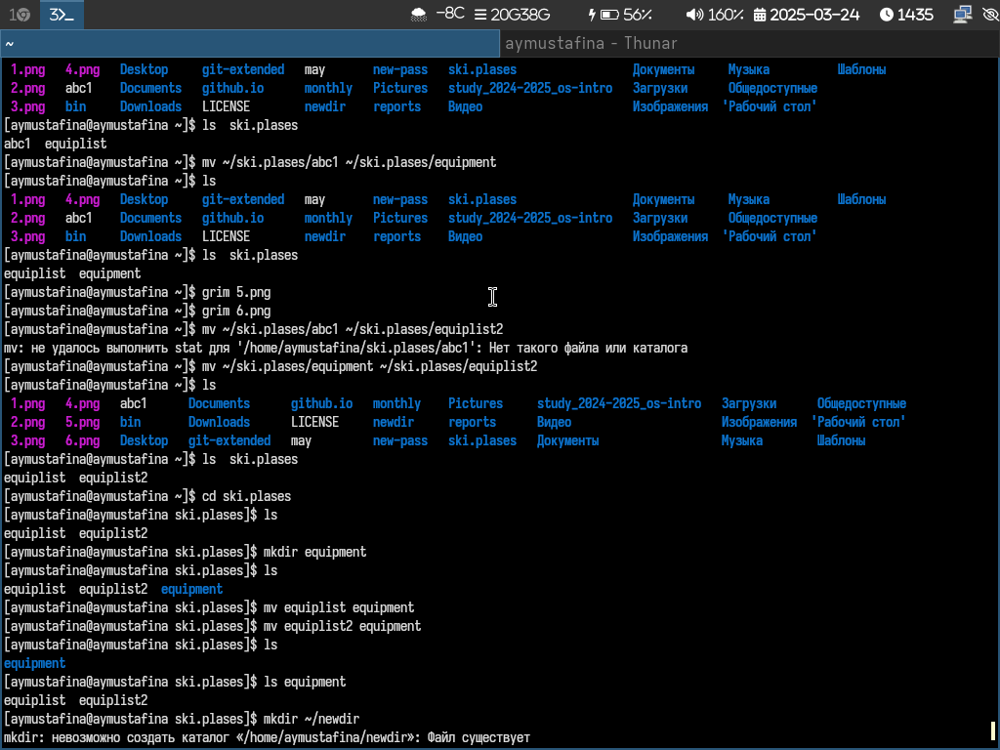
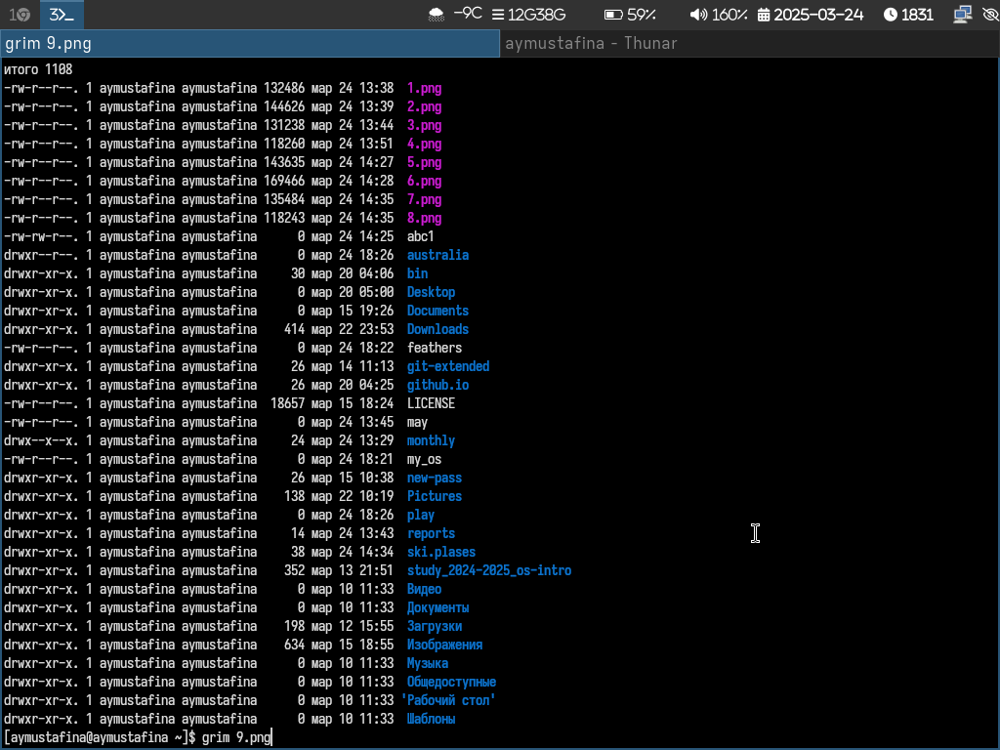
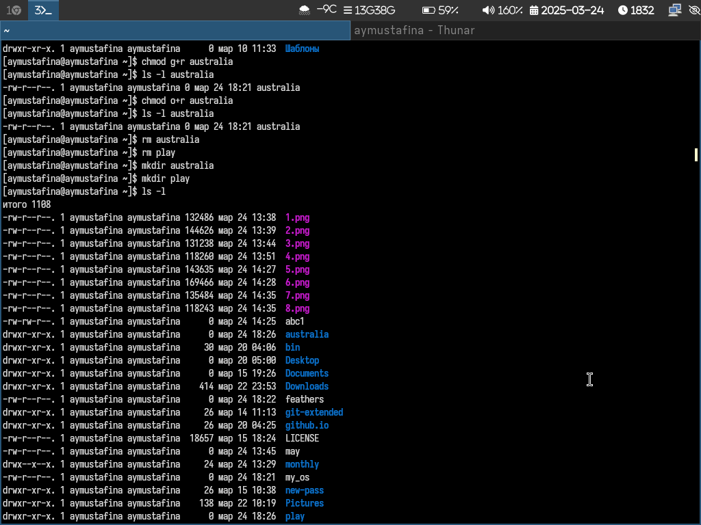
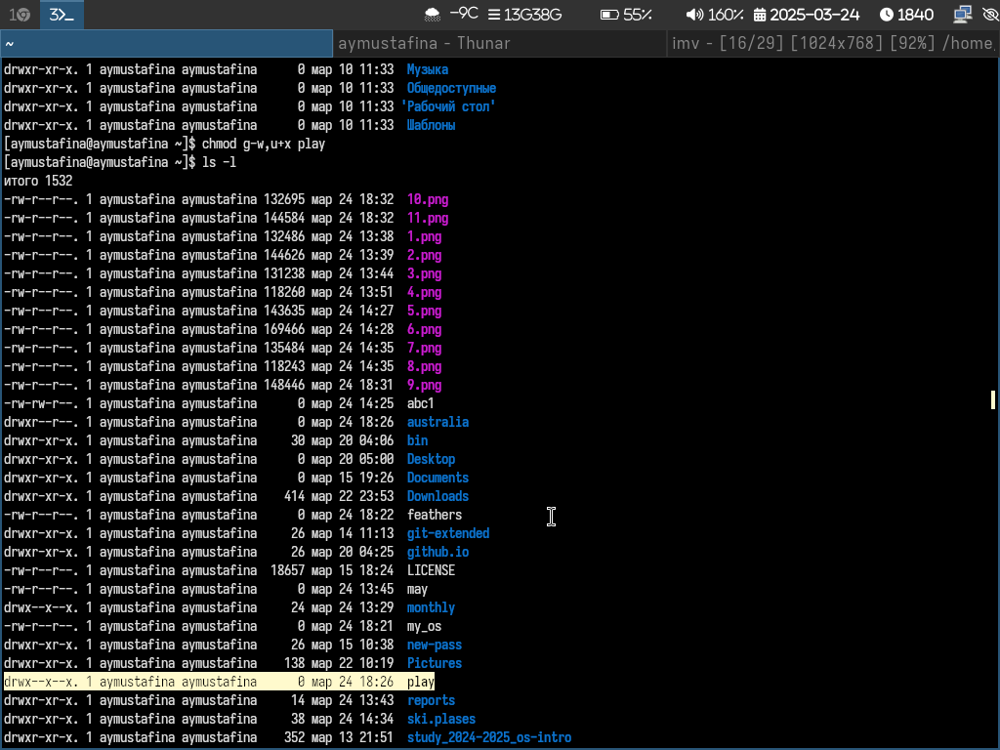
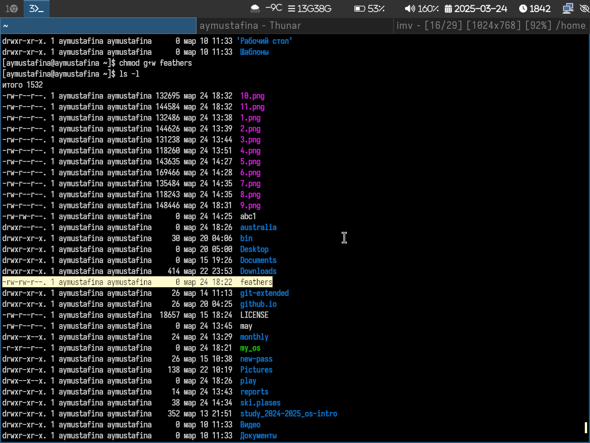
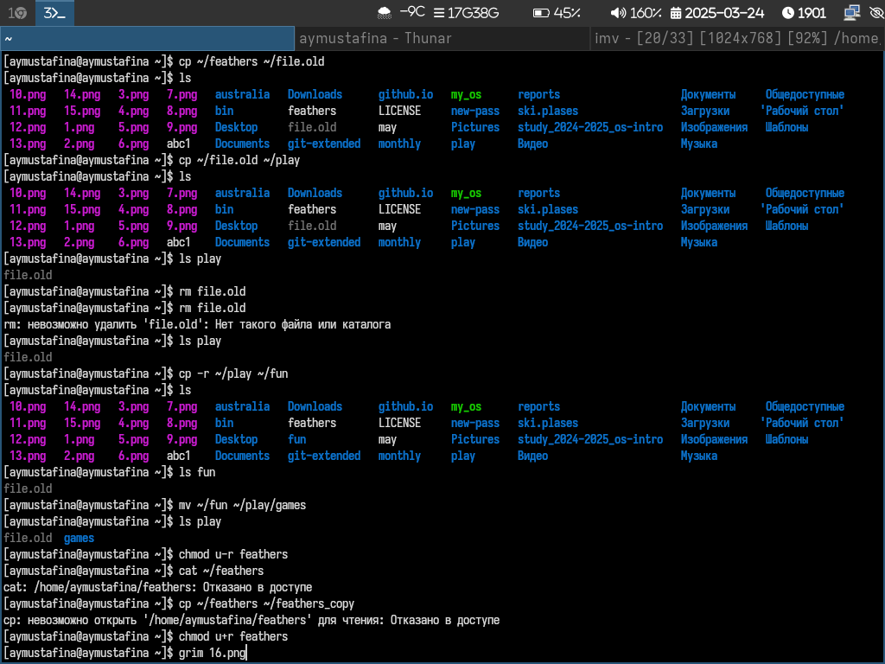

---
## Front matter
title: "Отчет по лабораторной работе №7"
subtitle: "Архитектура компьютера, раздел операционные системы"
author: "Мустафина Аделя Юрисовна"

## Generic otions
lang: ru-RU
toc-title: "Содержание"

## Bibliography
bibliography: bib/cite.bib
csl: pandoc/csl/gost-r-7-0-5-2008-numeric.csl

## Pdf output format
toc: true # Table of contents
toc-depth: 2
lof: true # List of figures
lot: true # List of tables
fontsize: 12pt
linestretch: 1.5
papersize: a4
documentclass: scrreprt
## I18n polyglossia
polyglossia-lang:
  name: russian
  options:
	- spelling=modern
	- babelshorthands=true
polyglossia-otherlangs:
  name: english
## I18n babel
babel-lang: russian
babel-otherlangs: english
## Fonts
mainfont: IBM Plex Serif
romanfont: IBM Plex Serif
sansfont: IBM Plex Sans
monofont: IBM Plex Mono
mathfont: STIX Two Math
mainfontoptions: Ligatures=Common,Ligatures=TeX,Scale=0.94
romanfontoptions: Ligatures=Common,Ligatures=TeX,Scale=0.94
sansfontoptions: Ligatures=Common,Ligatures=TeX,Scale=MatchLowercase,Scale=0.94
monofontoptions: Scale=MatchLowercase,Scale=0.94,FakeStretch=0.9
mathfontoptions:
## Biblatex
biblatex: true
biblio-style: "gost-numeric"
biblatexoptions:
  - parentracker=true
  - backend=biber
  - hyperref=auto
  - language=auto
  - autolang=other*
  - citestyle=gost-numeric
## Pandoc-crossref LaTeX customization
figureTitle: "Рис."
tableTitle: "Таблица"
listingTitle: "Листинг"
lofTitle: "Список иллюстраций"
lotTitle: "Список таблиц"
lolTitle: "Листинги"
## Misc options
indent: true
header-includes:
  - \usepackage{indentfirst}
  - \usepackage{float} # keep figures where there are in the text
  - \floatplacement{figure}{H} # keep figures where there are in the text
---

# Цель работы

Ознакомление с файловой системой Linux, её структурой, именами и содержанием
каталогов. Приобретение практических навыков по применению команд для работы
с файлами и каталогами, по управлению процессами (и работами), по проверке исполь-
зования диска и обслуживанию файловой системы.

# Задание

1. Выполнить все примеры, приведённые в первой части описания лабораторной работы.
2. Выполнить следующие действия, зафиксировав в отчёте по лабораторной работе
используемые при этом команды и результаты их выполнения.
3. Определить опции команды chmod, необходимые для того, чтобы присвоить перечис-
ленным ниже файлам выделенные права доступа, считая, что в начале таких прав
нет.
4. Проделать приведённые в задании упражнения, записывая в отчёт по лабораторной
работе используемые при этом команды.
5. Прочитайть man по командам mount, fsck, mkfs, kill и кратко их охарактиризую,
приведя примеры.

# Теоретическое введение

Команды для работы с файлами и каталогами
Для создания текстового файла можно использовать команду touch.
``` touch имя-файла```
Для просмотра файлов небольшого размера можно использовать команду cat.
``` cat имя-файла```
Для просмотра файлов постранично удобнее использовать команду less.
``` less имя-файла```
Следующие клавиши используются для управления процессом просмотра:
– Space — переход к следующей странице,
– ENTER — сдвиг вперёд на одну строку,
– b — возврат на предыдущую страницу,
– h — обращение за подсказкой,
– q — выход из режима просмотра файла.
Команда head выводит по умолчанию первые 10 строк файла.
``` head [-n] имя-файла,```
где n — количество выводимых строк.
Команда tail выводит умолчанию 10 последних строк файла.
``` tail [-n] имя-файла,```
где n — количество выводимых строк.

# Выполнение лабораторной работы

Выполняю все примеры, приведенные в первой части описания лабораторной работы (рис. [-@fig:001]).

{#fig:001 width=70%}

Копирование файлов (рис. [-@fig:002]).

{#fig:002 width=70%}

Копирую и переименовываю (рис. [-@fig:003]).

{#fig:003 width=70%}

Меняю права доступа с помощью chmod (рис. [-@fig:004]).

{#fig:004 width=70%}

Копирую файл /usr/include/sys/io.h в домашний каталог и называю его
equipment (рис. [-@fig:005]).

{#fig:005 width=70%}

В домашнем каталоге создаю директорию ~/ski.plases и перемещаю туда созданный файл. 
Переименую файл ~/ski.plases/equipment в ~/ski.plases/equiplist. Создаю в домашнем каталоге файл abc1 и копирую его в каталог
~/ski.plases, называю его equiplist2. (рис. [-@fig:006]).

{#fig:006 width=70%}

Создаю каталог с именем equipment в каталоге ~/ski.plases. Перемещаю файлы ~/ski.plases/equiplist и equiplist2 в каталог
~/ski.plases/equipment (рис. [-@fig:007]).

{#fig:007 width=70%}

Создаю и перемещаю каталог ~/newdir в каталог ~/ski.plases и называю его plans (рис. [-@fig:008]).

{#fig:008 width=70%}

Определяю опции команды chmod, необходимые для того, чтобы присвоить перечисленным ниже файлам выделенные права доступа, считая, 
что в начале таких прав нет:
```
drwxr--r-- ... australia
drwx--x--x ... play
-r-xr--r-- ... my_os
-rw-rw-r-- ... feathers```
Создаю нужные файлы (рис. [-@fig:009]).

{#fig:009 width=70%}

Права доступа 1 (рис. [-@fig:010]).

{#fig:010 width=70%}

2 (рис. [-@fig:011]).

{#fig:011 width=70%}

3 (рис. [-@fig:012]).

{#fig:012 width=70%}

4 (рис. [-@fig:013]).

{#fig:013 width=70%}

5 (рис. [-@fig:014])).

{#fig:014 width=70%}

1. Просмотриваю содержимое файла /etc/password командой ls.
2. Копирую файл ~/feathers в файл ~/file.old с помощью cp -r.
3. Перемещаю файл ~/file.old в каталог ~/play с помощью mv
4. Копирую каталог ~/play в каталог ~/fun с помощью cp.
5. Перемещаю каталог ~/fun в каталог ~/play и назовите его games с помощью mv (рис. [-@fig:015])).

{#fig:015 width=70%}

6. Лишаю владельца файла ~/feathers права на чтение с помощью chmod.
7. Что произойдёт, если вы попытаетесь просмотреть файл ~/feathers командой
cat?
Будет отказано в доступе, так как я лишила владельца права на чтение.
8. Что произойдёт, если вы попытаетесь скопировать файл ~/feathers?
Мне так же будет отказано в доступе, так как у владельца нет прав на чтение.
9. Возвращаю владельцу файла ~/feathers право на чтение с помощью chmod u+r (рис. [-@fig:016])).

{#fig:016 width=70%}

10. Лишаю владельца каталога ~/play права на выполнение  с помощью chmod u-x.
11. Перехожу в каталог ~/play. Что произошло?
Отказано в доступе.
12. Даю владельцу каталога ~/play право на выполнение с помощью chmod u+x (рис. [-@fig:017])).

{#fig:017 width=70%}

Читаю man по командам mount, fsck, mkfs, kill и кратко их охарактеризую,
приведя примеры. 
1. 
    Описание: Монтирует файловые системы или устройства.
    Пример:

    sudo mount /dev/sdb1 /mnt

2. 
    Описание: Проверяет и исправляет ошибки в файловых системах.
    Пример:

    sudo fsck /dev/sdb1

3. 
    Описание: Создает файловую систему на устройстве.
    Пример:

    sudo mkfs.ext4 /dev/sdb1

4. 
    Описание: Отправляет сигналы процессам (например, для завершения).
    Пример:

    kill -9 1234

# Контрольные вопросы
1. Дайте характеристику каждой файловой системе, существующей на жёстком диске
компьютера, на котором вы выполняли лабораторную работу.

На жёстком диске обычно используются следующие файловые системы:

1.1. ext4 (Extended File System 4): Основная файловая система в Linux. Быстрая, надёжная, поддерживает большие объёмы данных и журналирование (запись изменений для восстановления после сбоев).
1.2. swap: Используется для виртуальной памяти (свопинга). Это не файловая система в классическом смысле, а раздел для временного хранения данных, когда оперативной памяти не хватает.
1.3. vfat/FAT32: Используется для совместимости с Windows. Подходит для USB-накопителей, но не поддерживает большие файлы (ограничение 4 ГБ) и права доступа.
1.4. NTFS: Файловая система Windows. Linux может её читать и писать, но она не используется как основная.


2. Приведите общую структуру файловой системы и дайте характеристику каждой директории первого уровня этой структуры.

Файловая система Linux организована в виде дерева, начиная с корня (/). Основные директории первого уровня:

    /bin: Основные команды (например, ls, cp).
    /etc: Конфигурационные файлы системы.
    /home: Домашние каталоги пользователей.
    /var: Логи и изменяемые данные (например, базы данных).
    /tmp: Временные файлы.
    /usr: Программы и библиотеки.
    /dev: Файлы устройств (например, диски, принтеры).
    /proc: Виртуальная файловая система, отображающая информацию о процессах и системе.
    /boot: Файлы загрузчика (например, ядро Linux).
    /root: Домашний каталог суперпользователя.


3. Какая операция должна быть выполнена, чтобы содержимое некоторой файловой системы было доступно операционной системе?

Чтобы содержимое файловой системы стало доступно операционной системе, её нужно смонтировать. Это делается командой mount.

4. Назовите основные причины нарушения целостности файловой системы. Как устранить повреждения файловой системы?

Причины:

4.1. Неправильное завершение работы (например, отключение питания).
4.2. Ошибки в работе оборудования (например, повреждение диска).
4.3. Ошибки в программном обеспечении.

Устранение:
Используйте команду fsck для проверки и исправления ошибок:

sudo fsck /dev/sdb1


5. Как создаётся файловая система?

Файловая система создаётся командой mkfs.

6. Дайте характеристику командам для просмотра текстовых файлов.

cat - выводит содержимое файла на экран.
less - позваляет просматривать файл постранично.
head - показывает первые строки файла.
tail - показывает последние строки файла.

7. Приведите основные возможности команды cp в Linux.

Копирование файлов и каталогов. Сохранение атрибутов файла.

8. Приведите основные возможности команды mv в Linux.

Переименовывание и перемещение файлов и каталогов.

9. Что такое права доступа? Как они могут быть изменены?

Права доступа к файлу или каталогу можно изменить, воспользовавшись командой
chmod. Сделать это может владелец файла (или каталога) или пользователь с правами
администратора.
```chmod режим имя_файла```
Режим (в формате команды) имеет следующие компоненты структуры и способ записи:
= установить право
- лишить права
+ дать право
r чтение
w запись
x выполнение
u (user) владелец файла
g (group) группа, к которой принадлежит владелец файла
o (others) все остальные

# Выводы

Я ознакомилась с файловой системой Linux, её структурой, именами и содержанием каталогов. 
Я приобрела практические навыки по применению команд для работы с файлами и каталогами, 
по управлению процессами (и работами), по проверке использования диска и обслуживанию файловой системы.

# Список литературы

[@lab07]
