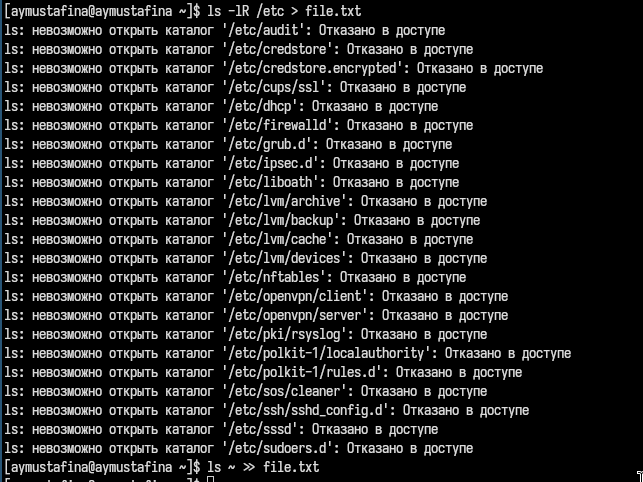
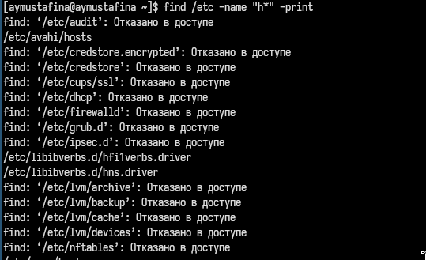
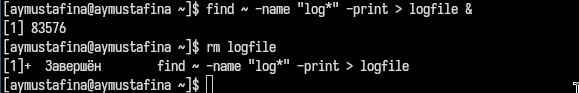
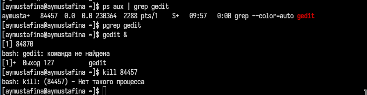
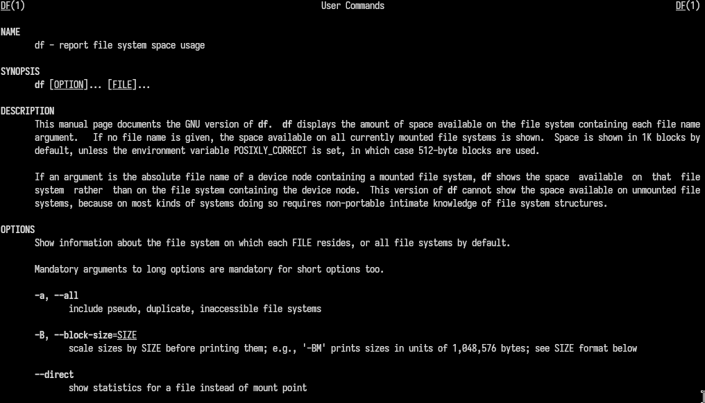
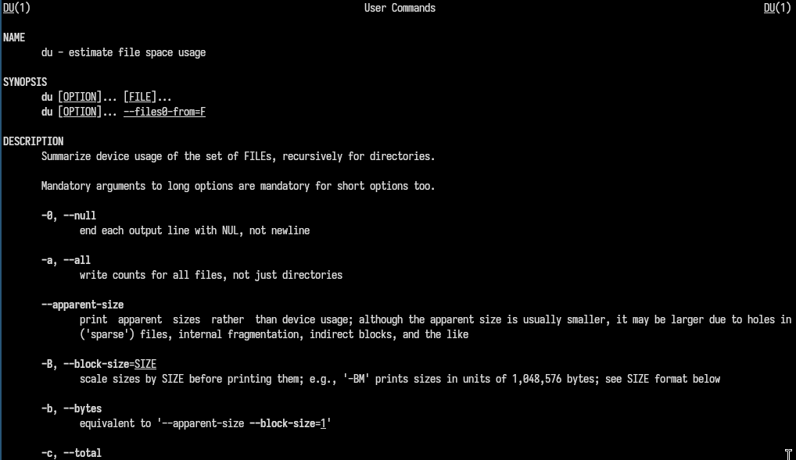
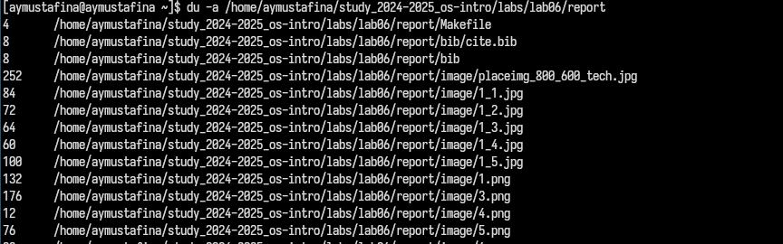
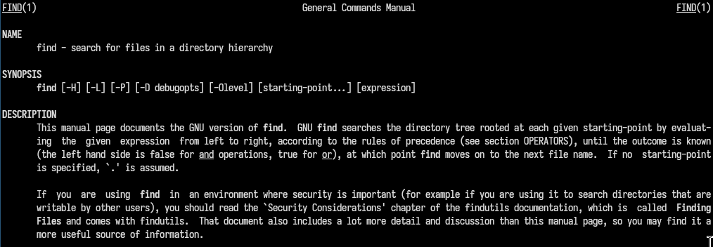

---
## Front matter
lang: ru-RU
title: Лабораторная работа №8
subtitle: Операционные системы
author:
  - Мустафина А. Ю.
institute:
  - Российский университет дружбы народов, Москва, Россия
date: 05 апреля 2025

## i18n babel
babel-lang: russian
babel-otherlangs: english

## Formatting pdf
toc: false
toc-title: Содержание
slide_level: 2
aspectratio: 169
section-titles: true
theme: metropolis
header-includes:
 - \metroset{progressbar=frametitle,sectionpage=progressbar,numbering=fraction}
---

# Информация

## Докладчик

:::::::::::::: {.columns align=center}
::: {.column width="70%"}

  * Мустафина Аделя Юрисовна
  * НКАбд-03-24, студ. билет №1132246719
  * Российский университет дружбы народов
  * <https://github.com/aymustafina/study_2024-2025_os-intro>

:::
::: {.column width="30%"}


:::
::::::::::::::


## Цель работы

Ознакомление с инструментами поиска файлов и фильтрации текстовых данных.
Приобретение практических навыков: по управлению процессами (и заданиями), по
проверке использования диска и обслуживанию файловых систем.

## Задание

1. Осуществите вход в систему, используя соответствующее имя пользователя.
2. Запишите в файл file.txt названия файлов, содержащихся в каталоге /etc. Допи-
шите в этот же файл названия файлов, содержащихся в вашем домашнем каталоге.
3. Выведите имена всех файлов из file.txt, имеющих расширение .conf, после чего
запишите их в новый текстовой файл conf.txt.
4. Определите, какие файлы в вашем домашнем каталоге имеют имена, начинавшиеся   
с символа c? Предложите несколько вариантов, как это сделать.
5. Выведите на экран (по странично) имена файлов из каталога /etc, начинающиеся 
с символа h.

## Задание

6. Запустите в фоновом режиме процесс, который будет записывать в файл ~/logfile
файлы, имена которых начинаются с log.
7. Удалите файл ~/logfile.
8. Запустите из консоли в фоновом режиме редактор gedit.
9. Определите идентификатор процесса gedit, используя команду ps, конвейер и фильтр
grep. Как ещё можно определить идентификатор процесса?
10. Прочтите справку (man) команды kill, после чего используйте её для завершения
процесса gedit.
11. Выполните команды df и du, предварительно получив более подробную информацию
об этих командах, с помощью команды man.
12. Воспользовавшись справкой команды find, выведите имена всех директорий, имею-
щихся в вашем домашнем каталоге.

# Выполнение лабораторной работы

## Выполнение лабораторной работы

Осуществила вход в систему, используя соответствующее имя пользователя.
Запишисала в файл file.txt названия файлов, содержащихся в каталоге /etc. Дописала в этот же файл названия файлов,
содержащихся в домашнем каталоге (рис. 1).

{#fig:001 width=70%}

## Выполнение лабораторной работы

Вывела имена всех файлов из file.txt, имеющих расширение .conf, после чего
записала их в новый текстовой файл conf.txt. (рис. 2).

{#fig:002 width=70%}

## Выполнение лабораторной работы

Вывод на экран (рис. 3).

{#fig:003 width=70%}

## Выполнение лабораторной работы

Определила, какие файлы в домашнем каталоге имеют имена, начинавшиеся
с символа с (рис. 4).

{#fig:004 width=70%}

## Выполнение лабораторной работы

Предлагаю несколько вариантов, как это сделать (рис. 5).

{#fig:005 width=70%}

## Выполнение лабораторной работы

Вывожу на экран (по странично) имена файлов из каталога /etc, начинающиеся
с символа h (рис. 6).

{#fig:006 width=70%}

## Выполнение лабораторной работы

Запустила в фоновом режиме процесс, который будет записывать в файл ~/logfile
файлы, имена которых начинаются с log. Удалила файл ~/logfile (рис. 7).

{#fig:007 width=70%}

## Выполнение лабораторной работы

Запустила из консоли в фоновом режиме редактор gedit.
Определила идентификатор процесса gedit, используя команду ps, конвейер и фильтр grep (рис. 8).

{#fig:008 width=70%}

## Выполнение лабораторной работы

 Как ещё можно определить идентификатор процесса? С помощью команды pdrep gedit и ps aux | pgrep gedit | grep -v grep (рис. 9).

{#fig:009 width=70%}

## Выполнение лабораторной работы

Прочла справку (man) команды kill, после чего использовала её для завершения
процесса gedit (рис. 10).

{#fig:010 width=70%}

## Выполнение лабораторной работы

Читаю man для команды df (рис. 11).

{#fig:011 width=70%}

## Выполнение лабораторной работы

Читаю man для команды du (рис. 12).

{#fig:012 width=70%}

## Выполнение лабораторной работы

После чего выполняю команду df (рис. 13).

{#fig:013 width=70%}


## Выполнение лабораторной работы

После чего выполняю команду du (рис. 14).

{#fig:014 width=70%}


## Выполнение лабораторной работы

Читаю man для команды find (рис. 15).

{#fig:015 width=70%}

## Выполнение лабораторной работы

Вывожу имена всех директорий, имеющихся в домашнем каталоге (рис. 16).

{#fig:016 width=70%}

# Контрольные вопросы

## Контрольные вопросы

1. Какие потоки ввода вывода вы знаете?

 - stdin (стандартный ввод, файловый дескриптор 0).  
   - stdout (стандартный вывод, файловый дескриптор 1).  
   - stderr (стандартный вывод ошибок, файловый дескриптор 2).

## Контрольные вопросы

2. Объясните разницу между операцией > и >>.

- > — перенаправляет вывод в файл, перезаписывая его содержимое.  
   - >> — перенаправляет вывод в файл, добавляя данные в конец файла.

## Контрольные вопросы

3. Что такое конвейер?

Конвейер (pipe, |) — это механизм, который передаёт вывод одной команды на ввод другой.

4. Что такое процесс? Чем это понятие отличается от программы?

- Процесс — это экземпляр выполняющейся программы, включающий её код, данные и состояние.  
   - Программа — это набор инструкций, хранящихся на диске.


## Контрольные вопросы

5. Что такое PID и GID?

- PID (Process ID) — уникальный идентификатор процесса.  
   - GID (Group ID) — идентификатор группы, к которой принадлежит процесс или пользователь.


## Контрольные вопросы

6. Что такое задачи и какая команда позволяет ими управлять?

 - Задачи — это процессы, запущенные в фоновом режиме.  
   - Команда jobs позволяет управлять задачами.  


## Контрольные вопросы

7. Найдите информацию об утилитах top и htop. Каковы их функции?

- top — отображает информацию о запущенных процессах и использовании системных ресурсов.  
   - htop — улучшенная версия top с поддержкой мыши и цветным интерфейсом, позволяющая более удобно управлять процессами.

## Контрольные вопросы

8. Назовите и дайте характеристику команде поиска файлов. Приведите примеры использования этой команды.

- Команда find используется для поиска файлов и директорий по заданным критериям.  
   Примеры:
```  find ~ -name "*.txt"  # Поиск всех файлов с расширением .txt в домашнем каталоге.```

## Контрольные вопросы

9. Можно ли по контексту (содержанию) найти файл? Если да, то как?

Да, с помощью команды grep. Например:
```   grep "искомая_строка" имя_файла```

## Контрольные вопросы

10. Как определить объем свободной памяти на жёстком диске?

 df -h

11. Как определить объем вашего домашнего каталога?

du -sh ~

12. Как удалить зависший процесс?

```ps aux | grep имя_процесса
kill <PID>```

## Выводы

Ознакомилась с инструментами поиска файлов и фильтрации текстовых данных.
Приобрела практические навыки: по управлению процессами (и заданиями), по
проверке использования диска и обслуживанию файловых систем.
