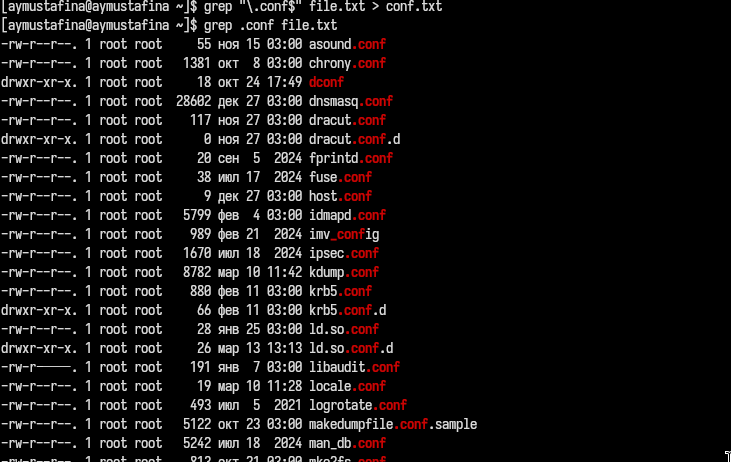
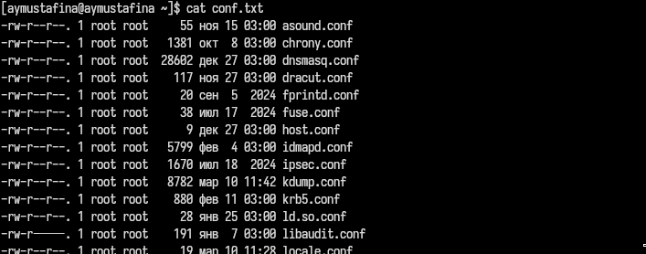
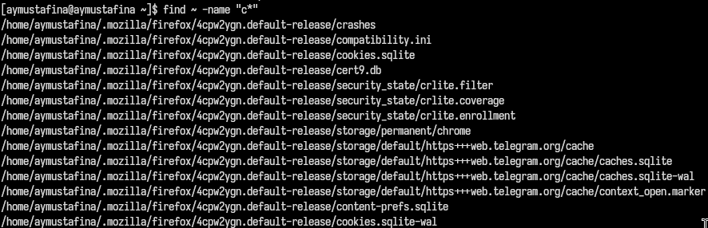
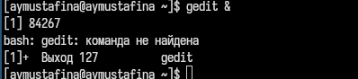
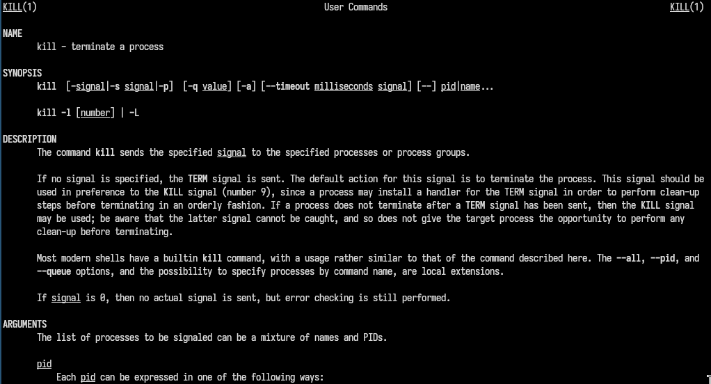
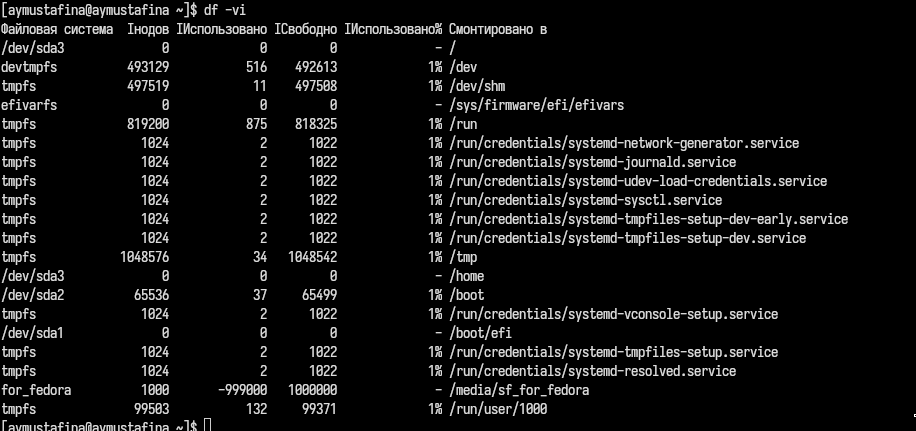
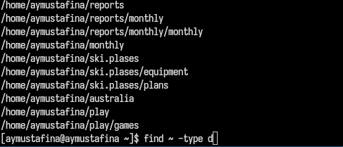

---
## Front matter
title: "Отчет по лабораторной работе №8"
subtitle: "Архитектура компьютера, раздел операционные системы"
author: "Мустафина Аделя Юрисовна"

## Generic otions
lang: ru-RU
toc-title: "Содержание"

## Bibliography
bibliography: bib/cite.bib
csl: pandoc/csl/gost-r-7-0-5-2008-numeric.csl

## Pdf output format
toc: true # Table of contents
toc-depth: 2
lof: true # List of figures
lot: true # List of tables
fontsize: 12pt
linestretch: 1.5
papersize: a4
documentclass: scrreprt
## I18n polyglossia
polyglossia-lang:
  name: russian
  options:
	- spelling=modern
	- babelshorthands=true
polyglossia-otherlangs:
  name: english
## I18n babel
babel-lang: russian
babel-otherlangs: english
## Fonts
mainfont: IBM Plex Serif
romanfont: IBM Plex Serif
sansfont: IBM Plex Sans
monofont: IBM Plex Mono
mathfont: STIX Two Math
mainfontoptions: Ligatures=Common,Ligatures=TeX,Scale=0.94
romanfontoptions: Ligatures=Common,Ligatures=TeX,Scale=0.94
sansfontoptions: Ligatures=Common,Ligatures=TeX,Scale=MatchLowercase,Scale=0.94
monofontoptions: Scale=MatchLowercase,Scale=0.94,FakeStretch=0.9
mathfontoptions:
## Biblatex
biblatex: true
biblio-style: "gost-numeric"
biblatexoptions:
  - parentracker=true
  - backend=biber
  - hyperref=auto
  - language=auto
  - autolang=other*
  - citestyle=gost-numeric
## Pandoc-crossref LaTeX customization
figureTitle: "Рис."
tableTitle: "Таблица"
listingTitle: "Листинг"
lofTitle: "Список иллюстраций"
lotTitle: "Список таблиц"
lolTitle: "Листинги"
## Misc options
indent: true
header-includes:
  - \usepackage{indentfirst}
  - \usepackage{float} # keep figures where there are in the text
  - \floatplacement{figure}{H} # keep figures where there are in the text
---

# Цель работы

Ознакомление с инструментами поиска файлов и фильтрации текстовых данных.
Приобретение практических навыков: по управлению процессами (и заданиями), по
проверке использования диска и обслуживанию файловых систем.

# Задание

1. Осуществите вход в систему, используя соответствующее имя пользователя.
2. Запишите в файл file.txt названия файлов, содержащихся в каталоге /etc. Допи-
шите в этот же файл названия файлов, содержащихся в вашем домашнем каталоге.
3. Выведите имена всех файлов из file.txt, имеющих расширение .conf, после чего
запишите их в новый текстовой файл conf.txt.
4. Определите, какие файлы в вашем домашнем каталоге имеют имена, начинавшиеся
с символа c? Предложите несколько вариантов, как это сделать.
5. Выведите на экран (по странично) имена файлов из каталога /etc, начинающиеся
с символа h.
6. Запустите в фоновом режиме процесс, который будет записывать в файл ~/logfile
файлы, имена которых начинаются с log.
7. Удалите файл ~/logfile.
8. Запустите из консоли в фоновом режиме редактор gedit.
9. Определите идентификатор процесса gedit, используя команду ps, конвейер и фильтр
grep. Как ещё можно определить идентификатор процесса?
10. Прочтите справку (man) команды kill, после чего используйте её для завершения
процесса gedit.
11. Выполните команды df и du, предварительно получив более подробную информацию
об этих командах, с помощью команды man.
12. Воспользовавшись справкой команды find, выведите имена всех директорий, имею-
щихся в вашем домашнем каталоге.

# Теоретическое введение

В системе по умолчанию открыто три специальных потока:
– stdin — стандартный поток ввода (по умолчанию: клавиатура), файловый дескриптор
0;
– stdout — стандартный поток вывода (по умолчанию: консоль), файловый дескриптор
1;
– stderr — стандартный поток вывод сообщений об ошибках (по умолчанию: консоль),
файловый дескриптор 2.
Большинство используемых в консоли команд и программ записывают результаты
своей работы в стандартный поток вывода stdout. Например, команда ls выводит в стан-
дартный поток вывода (консоль) список файлов в текущей директории. Потоки вывода
и ввода можно перенаправлять на другие файлы или устройства. Проще всего это делается
с помощью символов >, >>, <, <<. Рассмотрим пример.
```
1 # Перенаправление stdout (вывода) в файл.
2 # Если файл отсутствовал, то он создаётся,
3 # иначе -- перезаписывается.
4
5 # Создаёт файл, содержащий список дерева каталогов.
6 ls -lR > dir-tree.list
7
8 1>filename
9 # Перенаправление вывода (stdout) в файл "filename".
10 1>>filename
11 # Перенаправление вывода (stdout) в файл "filename",
12 # файл открывается в режиме добавления.
13 2>filename
14 # Перенаправление stderr в файл "filename".
15 2>>filename
16 # Перенаправление stderr в файл "filename",
17 # файл открывается в режиме добавления.
18 &>filename
19 # Перенаправление stdout и stderr в файл "filename".```

# Выполнение лабораторной работы

Осуществила вход в систему, используя соответствующее имя пользователя. 
Запишисала в файл file.txt названия файлов, содержащихся в каталоге /etc. Дописала в этот же файл названия файлов, 
содержащихся в домашнем каталоге (рис. [-@fig:001]).

{#fig:001 width=70%}

Вывела имена всех файлов из file.txt, имеющих расширение .conf, после чего
записала их в новый текстовой файл conf.txt. (рис. [-@fig:002]).

{#fig:002 width=70%}

Вывод на экран (рис. [-@fig:003]).

{#fig:003 width=70%}


Определила, какие файлы в домашнем каталоге имеют имена, начинавшиеся
с символа с (рис. [-@fig:004]).

{#fig:004 width=70%}

Предлагаю несколько вариантов, как это сделать (рис. [-@fig:005]).

{#fig:005 width=70%}

Вывожу на экран (по странично) имена файлов из каталога /etc, начинающиеся
с символа h (рис. [-@fig:006]).

{#fig:006 width=70%}

Запустила в фоновом режиме процесс, который будет записывать в файл ~/logfile
файлы, имена которых начинаются с log. Удалила файл ~/logfile (рис. [-@fig:007]).

{#fig:007 width=70%}

Запустила из консоли в фоновом режиме редактор gedit.
Определила идентификатор процесса gedit, используя команду ps, конвейер и фильтр grep (рис. [-@fig:008]).

{#fig:008 width=70%}

 Как ещё можно определить идентификатор процесса? С помощью команды pdrep gedit и ps aux | pgrep gedit | grep -v grep (рис. [-@fig:009]).

{#fig:009 width=70%}

Прочла справку (man) команды kill, после чего использовала её для завершения
процесса gedit (рис. [-@fig:010]).

{#fig:010 width=70%}

Читаю man для команды df (рис. [-@fig:011]).

{#fig:011 width=70%}

Читаю man для команды du (рис. [-@fig:012]).

{#fig:012 width=70%}

После чего выполняю команду df (рис. [-@fig:013]).

{#fig:013 width=70%}

После чего выполняю команду du (рис. [-@fig:014]).

{#fig:014 width=70%}

Читаю man для команды find (рис. [-@fig:015]).

{#fig:015 width=70%}

Вывожу имена всех директорий, имеющихся в домашнем каталоге (рис. [-@fig:016]).

{#fig:016 width=70%}

# Контрольные вопросы
1. Какие потоки ввода вывода вы знаете?

 - stdin (стандартный ввод, файловый дескриптор 0).  
   - stdout (стандартный вывод, файловый дескриптор 1).  
   - stderr (стандартный вывод ошибок, файловый дескриптор 2). 

2. Объясните разницу между операцией > и >>.

- > — перенаправляет вывод в файл, перезаписывая его содержимое.  
   - >> — перенаправляет вывод в файл, добавляя данные в конец файла. 

3. Что такое конвейер?

Конвейер (pipe, |) — это механизм, который передаёт вывод одной команды на ввод другой.

4. Что такое процесс? Чем это понятие отличается от программы?

- Процесс — это экземпляр выполняющейся программы, включающий её код, данные и состояние.  
   - Программа — это набор инструкций, хранящихся на диске.

5. Что такое PID и GID?

- PID (Process ID) — уникальный идентификатор процесса.  
   - GID (Group ID) — идентификатор группы, к которой принадлежит процесс или пользователь. 

6. Что такое задачи и какая команда позволяет ими управлять?

 - Задачи — это процессы, запущенные в фоновом режиме.  
   - Команда jobs позволяет управлять задачами.  

7. Найдите информацию об утилитах top и htop. Каковы их функции?

- top — отображает информацию о запущенных процессах и использовании системных ресурсов.  
   - htop — улучшенная версия top с поддержкой мыши и цветным интерфейсом, позволяющая более удобно управлять процессами. 

8. Назовите и дайте характеристику команде поиска файлов. Приведите примеры использования этой команды.

- Команда find используется для поиска файлов и директорий по заданным критериям.  
   Примеры:
```  find ~ -name "*.txt"  # Поиск всех файлов с расширением .txt в домашнем каталоге.```

9. Можно ли по контексту (содержанию) найти файл? Если да, то как?

Да, с помощью команды grep. Например:
```   grep "искомая_строка" имя_файла```

10. Как определить объем свободной памяти на жёстком диске?

 df -h

11. Как определить объем вашего домашнего каталога?

du -sh ~

12. Как удалить зависший процесс?

```ps aux | grep имя_процесса
kill <PID>```

# Выводы

Ознакомилась с инструментами поиска файлов и фильтрации текстовых данных.
Приобрела практические навыки: по управлению процессами (и заданиями), по
проверке использования диска и обслуживанию файловых систем.

# Список литературы

[-@lab08]
