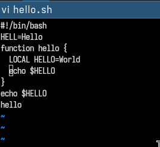
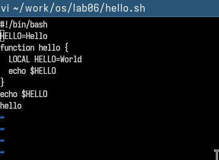

---
## Front matter
lang: ru-RU
title: Лабораторная работа №10
subtitle: Архитектура компьютеров
author:
  - Мустафина А.Ю.
institute:
  - Российский университет дружбы народов, Москва, Россия
date: 19 апреля 2025

## i18n babel
babel-lang: russian
babel-otherlangs: english

## Formatting pdf
toc: false
toc-title: Содержание
slide_level: 2
aspectratio: 169
section-titles: true
theme: metropolis
header-includes:
 - \metroset{progressbar=frametitle,sectionpage=progressbar,numbering=fraction}
---

## Цель работы

Познакомиться с операционной системой Linux. Получить практические навыки рабо-
ты с редактором vi, установленным по умолчанию практически во всех дистрибутивах.


## Задание

1. Ознакомиться с теоретическим материалом.
2. Ознакомиться с редактором vi.
3. Выполнить упражнения, используя команды vi.

# Выполнение лабораторной работы

## Задание 1. Создание нового файла с использованием vi

Создала каталог с именем ~/work/os/lab06.
Перешла во вновь созданный каталог.
Вызвала vi и создала файл hello.sh и добавила нужный текст.
 
(рис. 1).

{#fig:001 width=50%}

## Задание 1. Создание нового файла с использованием vi

Нажала клавишу Esc для перехода в командный режим после завершения ввода
текста.
Нажала : для перехода в режим последней строки и внизу экрана появится
приглашение в виде двоеточия.
Нажала w (записать) и q (выйти), а затем нажала клавишу Enter для сохранения текста и завершения работы.
Сделала файл исполняемым
``` chmod +x hello.sh```

(рис. 2).

{#fig:002 width=30%}

## Задание 2. Редактирование существующего файла

Вызвала vi на редактирование файла
```vi ~/work/os/lab06/hello.sh```

Установила курсор в конец слова HELL второй строки.
Перешла в режим вставки и заменила на HELLO. Нажала Esc для возврата в команд-
ный режим.(рис. 3).

{#fig:003 width=70%}

## Задание 2. Редактирование существующего файла

Установила курсор на четвертую строку и стерла слово LOCAL.
Перейдите в режим вставки и наберите следующий текст: local, нажмите Esc для
возврата в командный режим.
Установите курсор на последней строке файла. Вставьте после неё строку, содержащую
следующий текст: echo $HELLO.(рис. 4).

{#fig:004 width=70%}

## Задание 2. Редактирование существующего файла

Нажмите Esc для перехода в командный режим.
Удалите последнюю строку.(рис. 5).

{#fig:005 width=70%}

## Задание 2. Редактирование существующего файла

Введите команду отмены изменений u для отмены последней команды.
Введите символ : для перехода в режим последней строки. Запишите произведённые
изменения и выйдите из vi.(рис. 6).

{#fig:006 width=70%}


# Выводы

Познакомилсь с операционной системой Linux. Получила практические навыки рабо-
ты с редактором vi, установленным по умолчанию практически во всех дистрибутивах.
