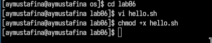
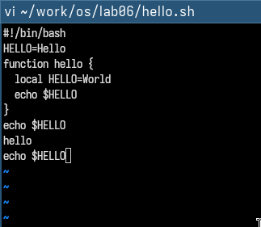
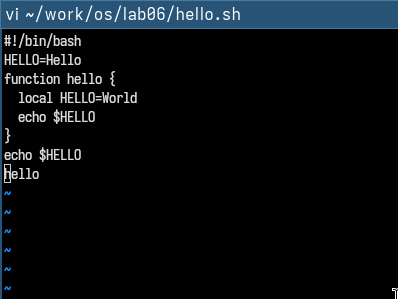
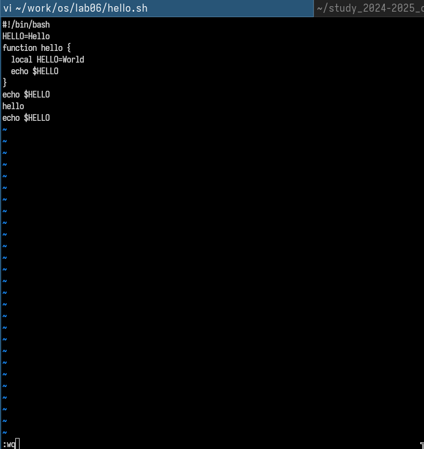

---
## Front matter
title: "Лабораторная работа №10"
subtitle: "Операционнные системы"
author: "Мустафина Аделя Юрисовна"

## Generic otions
lang: ru-RU
toc-title: "Содержание"

## Bibliography
bibliography: bib/cite.bib
csl: pandoc/csl/gost-r-7-0-5-2008-numeric.csl

## Pdf output format
toc: true # Table of contents
toc-depth: 2
lof: true # List of figures
lot: true # List of tables
fontsize: 12pt
linestretch: 1.5
papersize: a4
documentclass: scrreprt
## I18n polyglossia
polyglossia-lang:
  name: russian
  options:
	- spelling=modern
	- babelshorthands=true
polyglossia-otherlangs:
  name: english
## I18n babel
babel-lang: russian
babel-otherlangs: english
## Fonts
mainfont: IBM Plex Serif
romanfont: IBM Plex Serif
sansfont: IBM Plex Sans
monofont: IBM Plex Mono
mathfont: STIX Two Math
mainfontoptions: Ligatures=Common,Ligatures=TeX,Scale=0.94
romanfontoptions: Ligatures=Common,Ligatures=TeX,Scale=0.94
sansfontoptions: Ligatures=Common,Ligatures=TeX,Scale=MatchLowercase,Scale=0.94
monofontoptions: Scale=MatchLowercase,Scale=0.94,FakeStretch=0.9
mathfontoptions:
## Biblatex
biblatex: true
biblio-style: "gost-numeric"
biblatexoptions:
  - parentracker=true
  - backend=biber
  - hyperref=auto
  - language=auto
  - autolang=other*
  - citestyle=gost-numeric
## Pandoc-crossref LaTeX customization
figureTitle: "Рис."
tableTitle: "Таблица"
listingTitle: "Листинг"
lofTitle: "Список иллюстраций"
lotTitle: "Список таблиц"
lolTitle: "Листинги"
## Misc options
indent: true
header-includes:
  - \usepackage{indentfirst}
  - \usepackage{float} # keep figures where there are in the text
  - \floatplacement{figure}{H} # keep figures where there are in the text
---

# Цель работы

Познакомиться с операционной системой Linux. Получить практические навыки рабо-
ты с редактором vi, установленным по умолчанию практически во всех дистрибутивах.

# Задание

1. Ознакомиться с теоретическим материалом.
2. Ознакомиться с редактором vi.
3. Выполнить упражнения, используя команды vi.

# Теоретическое введение

 большинстве дистрибутивов Linux в качестве текстового редактора по умолчанию
устанавливается интерактивный экранный редактор vi (Visual display editor).
Редактор vi имеет три режима работы:
– командный режим — предназначен для ввода команд редактирования и навигации по
редактируемому файлу;
– режим вставки — предназначен для ввода содержания редактируемого файла;
– режим последней (или командной) строки — используется для записи изменений в файл
и выхода из редактора.
Для вызова редактора vi необходимо указать команду vi и имя редактируемого файла:
vi <имя_файла>
При этом в случае отсутствия файла с указанным именем будет создан такой файл.
Переход в командный режим осуществляется нажатием клавиши Esc . Для выхода из
редактора vi необходимо перейти в режим последней строки: находясь в командном
режиме, нажать Shift-; (по сути символ : — двоеточие), затем:
– набрать символы wq, если перед выходом из редактора требуется записать изменения
в файл;
– набрать символ q (или q!), если требуется выйти из редактора без сохранения.
Замечание. Следует помнить, что vi различает прописные и строчные буквы при наборе
(восприятии) команд.

# Выполнение лабораторной работы

## Задание 1. Создание нового файла с использованием vi

Создала каталог с именем ~/work/os/lab06.
Перешла во вновь созданный каталог.
Вызвала vi и создала файл hello.sh
```vi hello.sh```
Нажала клавишу i и ввела следующий текст.
``` #!/bin/bash
HELL=Hello
function hello {
LOCAL HELLO=World
echo $HELLO
}
echo $HELLO
hello```
 (рис. [-@fig:001]).

{#fig:001 width=70%}

Нажала клавишу Esc для перехода в командный режим после завершения ввода
текста.
Нажала : для перехода в режим последней строки и внизу экрана появится
приглашение в виде двоеточия.
Нажала w (записать) и q (выйти), а затем нажала клавишу Enter для сохранения текста и завершения работы.
Сделала файл исполняемым
``` chmod +x hello.sh```

(рис. [-@fig:002]).

{#fig:002 width=70%}

## Задание 2. Редактирование существующего файла

Вызвала vi на редактирование файла
```vi ~/work/os/lab06/hello.sh```

Установиkf курсор в конец слова HELL второй строки.
Перешла в режим вставки и заменила на HELLO. Нажала Esc для возврата в команд-
ный режим.
Установила курсор на четвертую строку и стерла слово LOCAL.
Перейдите в режим вставки и наберите следующий текст: local, нажмите Esc для
возврата в командный режим.
Установите курсор на последней строке файла. Вставьте после неё строку, содержащую
следующий текст: echo $HELLO.
Нажмите Esc для перехода в командный режим.
Удалите последнюю строку.
Введите команду отмены изменений u для отмены последней команды.
Введите символ : для перехода в режим последней строки. Запишите произведённые
изменения и выйдите из vi. (рис. [-@fig:003]).

{#fig:003 width=70%}

(рис. [-@fig:004]).

{#fig:004 width=70%}

(рис. [-@fig:005]).

{#fig:005 width=70%}

(рис. [-@fig:006]).

{#fig:006 width=70%}

# Контрольные вопросы

1. Дайте краткую характеристику режимам работы редактора vi.

Редактор vi имеет три режима работы:
– командный режим — предназначен для ввода команд редактирования и навигации по
редактируемому файлу;
– режим вставки — предназначен для ввода содержания редактируемого файла;
– режим последней (или командной) строки — используется для записи изменений в файл
и выхода из редактора.

2. Как выйти из редактора, не сохраняя произведённые изменения?

набрать символ q (или q!), если требуется выйти из редактора без сохранения.

3. Назовите и дайте краткую характеристику командам позиционирования.

Команды позиционирования
– 0 (ноль) — переход в начало строки;
– $ — переход в конец строки;
– G — переход в конец файла;
– 𝑛 G — переход на строку с номером 𝑛.

4. Что для редактора vi является словом?

 Определяется как последовательность символов, разделенная пробелами или знаками препинания.

5. Каким образом из любого места редактируемого файла перейти в начало (конец)
файла?

– 0 (ноль) — переход в начало строки;
– $ — переход в конец строки;
– G — переход в конец файла;

6. Назовите и дайте краткую характеристику основным группам команд редактирова-
ния.

  - Вставка текста: i, a, I, A, o, O.
   - Удаление текста: x, dw, dd, d$, d0.
   - Копирование и вставка: yy, p, P.
   - Замена текста: cw, r, R.
   - Отмена и повтор: u, ..


7. Необходимо заполнить строку символами $. Каковы ваши действия?

 - Перейдите в режим вставки (i), введите символы $, затем нажмите Esc.

8. Как отменить некорректное действие, связанное с процессом редактирования?

- Используйте команду u для отмены последнего изменения.

9. Назовите и дайте характеристику основным группам команд режима последней стро-
ки.

 - Копирование и перемещение текста: :n,m d, :i,j m k, :i,j t k.
   - Запись и выход: :w, :wq, :q!, :e!.

10. Как определить, не перемещая курсора, позицию, в которой заканчивается строка?

- Используйте команду $ для перехода в конец строки.

11. Выполните анализ опций редактора vi (сколько их, как узнать их назначение и т.д.).

 - Используйте команду :set all для вывода всех опций.
    - Примеры опций: :set nu (номера строк), :set list (отображение невидимых символов), :set ic (игнорирование регистра при поиске).

12. Как определить режим работы редактора vi?

 - В командном режиме курсор перемещается без ввода текста.
    - В режиме вставки вводится текст.
    - В режиме последней строки внизу экрана появляется приглашение :.

13. Постройте граф взаимосвязи режимов работы редактора vi.

  - Командный режим:
      - i, a, o → Режим вставки.
      - : → Режим последней строки.
    - Режим вставки:
      - Esc → Командный режим.
    - Режим последней строки:
      - Enter → Командный режим.

# Выводы

Познакомилсь с операционной системой Linux. Получила практические навыки рабо-
ты с редактором vi, установленным по умолчанию практически во всех дистрибутивах.

# Список литературы

[@lab10]
