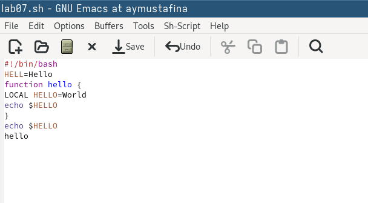
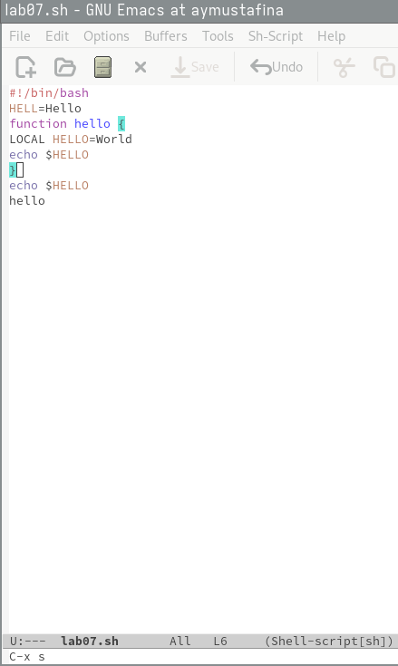
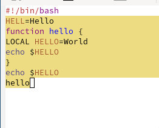
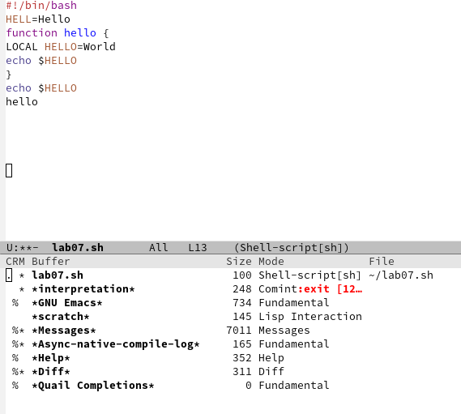
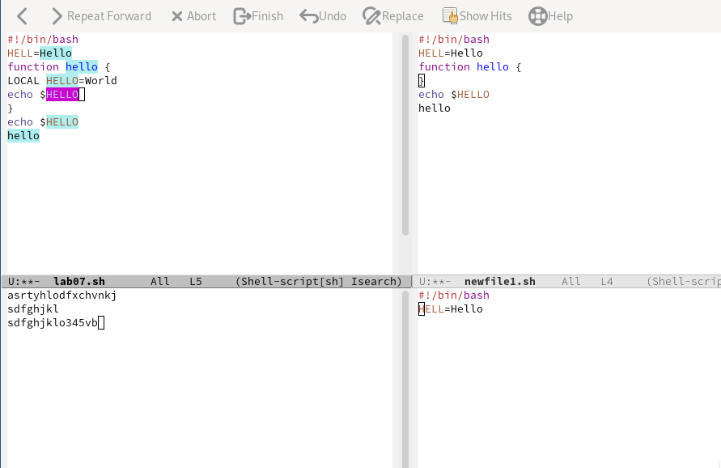
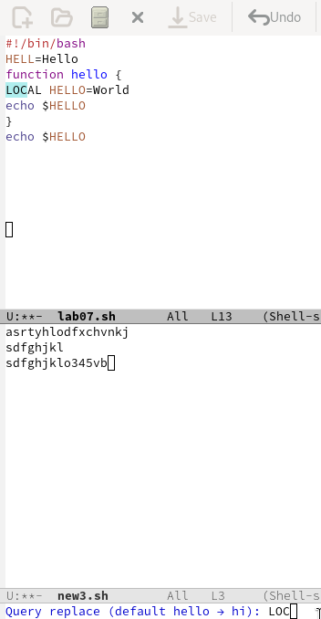
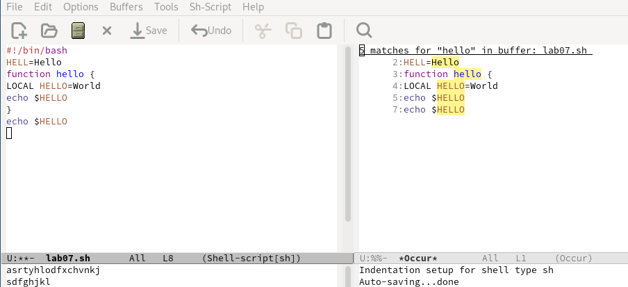

---
## Front matter
lang: ru-RU
title: Лабораторная работа №11
subtitle: Архитектура компьютеров
author:
  - Мустафина А. Ю.
institute:
  - Российский университет дружбы народов, Москва, Россия
date: 26 апреля 2025

## i18n babel
babel-lang: russian
babel-otherlangs: english

## Formatting pdf
toc: false
toc-title: Содержание
slide_level: 2
aspectratio: 169
section-titles: true
theme: metropolis
header-includes:
 - \metroset{progressbar=frametitle,sectionpage=progressbar,numbering=fraction}
---

## Цель работы

Познакомиться с операционной системой Linux. Получить практические навыки рабо-
ты с редактором Emacs.

## Задание

1. Ознакомиться с теоретическим материалом.
2. Ознакомиться с редактором emacs.
3. Выполнить упражнения.
4. Ответить на контрольные вопросы.

##  Выполнение лабораторной работы

(рис. 1).

{#fig:001 width=70%}

##  Выполнение лабораторной работы

Сохранить файл с помощью комбинации Ctrl-x Ctrl-s (C-x C-s)(рис. 2).

{#fig:002 width=70%}

##  Выполнение лабораторной работы

Проделать с текстом стандартные процедуры редактирования, каждое действие долж-
но осуществляться комбинацией клавиш.
Вырезать одной командой целую строку (С-k)(рис. 3).

{#fig:003 width=70%}

##  Выполнение лабораторной работы

Вставить эту строку в конец файла (C-y).
Выделить область текста (C-space) (рис. 4).

{#fig:004 width=70%}

##  Выполнение лабораторной работы

Скопировать область в буфер обмена (M-w).
Вставить область в конец файла (рис. 5).

{#fig:005 width=70%}

##  Выполнение лабораторной работы

Вновь выделить эту область и на этот раз вырезать её (C-w).
Отмените последнее действие (C-/).
Научитесь использовать команды по перемещению курсора.
Переместите курсор в начало строки (C-a).
Переместите курсор в конец строки (C-e).
Переместите курсор в начало буфера (M-<).
Переместите курсор в конец буфера (M->)  (рис. 6).

{#fig:006 width=30%}

##  Выполнение лабораторной работы

Управление буферами.
ывести список активных буферов на экран (C-x C-b).
Переместитесь во вновь открытое окно (C-x) o со списком открытых буферов
и переключитесь на другой буфер (рис. 7).

{#fig:007 width=70%}

##  Выполнение лабораторной работы

Закройте это окно (C-x 0).
Теперь вновь переключайтесь между буферами, но уже без вывода их списка на
экран (C-x b) (рис. 8).

{#fig:008 width=70%}

##  Выполнение лабораторной работы

Управление окнами.
Поделите фрейм на 4 части: разделите фрейм на два окна по вертикали (C-x 3),
а затем каждое из этих окон на две части по горизонтали (C-x 2) (рис. 9).

{#fig:009 width=70%}

##  Выполнение лабораторной работы

В каждом из четырёх созданных окон откройте новый буфер (файл) и введите
несколько строк текста (рис. 10).

{#fig:010 width=70%}

##  Выполнение лабораторной работы

Режим поиска
Переключитесь в режим поиска (C-s) и найдите несколько слов, присутствующих
в тексте.
Переключайтесь между результатами поиска, нажимая C-s.
Выйдите из режима поиска, нажав C-g (рис. 11).

{#fig:011 width=70%}

##  Выполнение лабораторной работы

Перейдите в режим поиска и замены (M-%), введите текст, который следует найти
и заменить, нажмите Enter , затем введите текст для замены. После того как будут
подсвечены результаты поиска, нажмите ! для подтверждения замены.

Испробуйте другой режим поиска, нажав M-s o (рис. 12).

{#fig:012 width=70%}

##  Выполнение лабораторной работы

Объясните, чем он отличается от
обычного режима?
Режим поиска и замены (M-%) полезен для замены текста, тогда как режим поиска по окружению (M-s o) предоставляет более
наглядный способ просмотра и анализа всех совпадений в документе.

# Выводы

Познакомилась с операционной системой Linux. Получила практические навыки работы с редактором Emacs.
