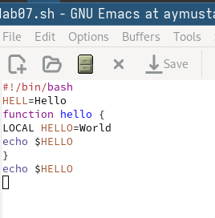
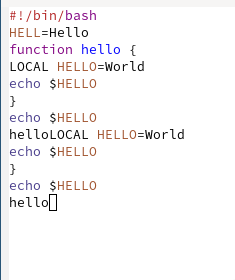
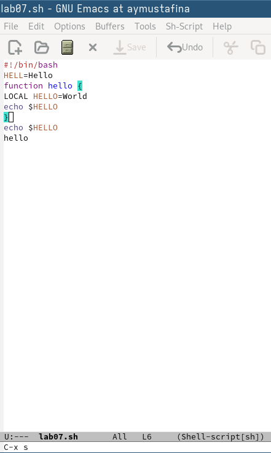
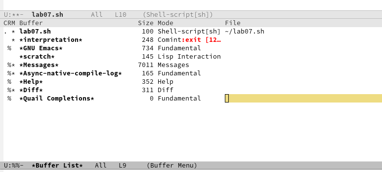
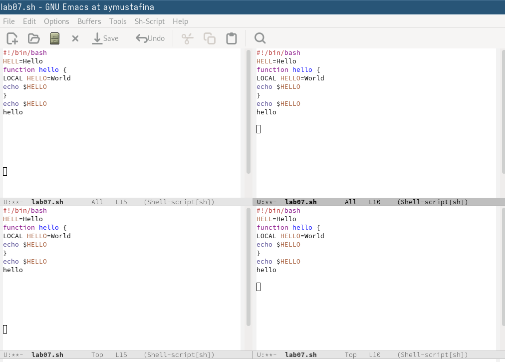

---
## Front matter
title: "Лабораторная работа №11"
subtitle: "Операционнные системы"
author: "Мустафина Аделя Юрисовна"

## Generic otions
lang: ru-RU
toc-title: "Содержание"

## Bibliography
bibliography: bib/cite.bib
csl: pandoc/csl/gost-r-7-0-5-2008-numeric.csl

## Pdf output format
toc: true # Table of contents
toc-depth: 2
lof: true # List of figures
lot: true # List of tables
fontsize: 12pt
linestretch: 1.5
papersize: a4
documentclass: scrreprt
## I18n polyglossia
polyglossia-lang:
  name: russian
  options:
	- spelling=modern
	- babelshorthands=true
polyglossia-otherlangs:
  name: english
## I18n babel
babel-lang: russian
babel-otherlangs: english
## Fonts
mainfont: IBM Plex Serif
romanfont: IBM Plex Serif
sansfont: IBM Plex Sans
monofont: IBM Plex Mono
mathfont: STIX Two Math
mainfontoptions: Ligatures=Common,Ligatures=TeX,Scale=0.94
romanfontoptions: Ligatures=Common,Ligatures=TeX,Scale=0.94
sansfontoptions: Ligatures=Common,Ligatures=TeX,Scale=MatchLowercase,Scale=0.94
monofontoptions: Scale=MatchLowercase,Scale=0.94,FakeStretch=0.9
mathfontoptions:
## Biblatex
biblatex: true
biblio-style: "gost-numeric"
biblatexoptions:
  - parentracker=true
  - backend=biber
  - hyperref=auto
  - language=auto
  - autolang=other*
  - citestyle=gost-numeric
## Pandoc-crossref LaTeX customization
figureTitle: "Рис."
tableTitle: "Таблица"
listingTitle: "Листинг"
lofTitle: "Список иллюстраций"
lotTitle: "Список таблиц"
lolTitle: "Листинги"
## Misc options
indent: true
header-includes:
  - \usepackage{indentfirst}
  - \usepackage{float} # keep figures where there are in the text
  - \floatplacement{figure}{H} # keep figures where there are in the text
---

# Цель работы

Познакомиться с операционной системой Linux. Получить практические навыки рабо-
ты с редактором Emacs.

# Задание

1. Ознакомиться с теоретическим материалом.
2. Ознакомиться с редактором emacs.
3. Выполнить упражнения.
4. Ответить на контрольные вопросы.

# Теоретическое введение

Определение 1. Буфер — объект, представляющий какой-либо текст.
Буфер может содержать что угодно, например, результаты компиляции программы
или встроенные подсказки. Практически всё взаимодействие с пользователем, в том
числе интерактивное, происходит посредством буферов.
Определение 2. Фрейм соответствует окну в обычном понимании этого слова. Каждый
фрейм содержит область вывода и одно или несколько окон Emacs.
Определение 3. Окно — прямоугольная область фрейма, отображающая один из буфе-
ров.
Каждое окно имеет свою строку состояния, в которой выводится следующая информа-
ция: название буфера, его основной режим, изменялся ли текст буфера и как далеко вниз
по буферу расположен курсор. Каждый буфер находится только в одном из возможных
основных режимов. Существующие основные режимы включают режим Fundamental
(наименее специализированный), режим Text, режим Lisp, режим С, режим Texinfo
и другие. Под второстепенными режимами понимается список режимов, которые вклю-
чены в данный момент в буфере выбранного окна.
Определение 4. Область вывода — одна или несколько строк внизу фрейма, в которой
Emacs выводит различные сообщения, а также запрашивает подтверждения и дополни-
тельную информацию от пользователя.
Определение 5. Минибуфер используется для ввода дополнительной информации и все-
гда отображается в области вывода.
Определение 6. Точка вставки — место вставки (удаления) данных в буфере.

# Выполнение лабораторной работы

Открыла emacs.
Создала файл lab07.sh с помощью комбинации Ctrl-x Ctrl-f (C-x C-f).
Набрала текст:
```1 #!/bin/bash
2 HELL=Hello
3 function hello {
4 LOCAL HELLO=World
5 echo $HELLO
6 }
echo $HELLO
8 hello```

 (рис. [-@fig:001]).

{#fig:001 width=70%}

4. Сохранить файл с помощью комбинации Ctrl-x Ctrl-s (C-x C-s)(рис. [-@fig:002]).

{#fig:002 width=70%}


5. Проделать с текстом стандартные процедуры редактирования, каждое действие долж-
но осуществляться комбинацией клавиш.
5.1. Вырезать одной командой целую строку (С-k)(рис. [-@fig:003]).

{#fig:003 width=70%}

5.2. Вставить эту строку в конец файла (C-y).
5.3. Выделить область текста (C-space) (рис. [-@fig:004]).

{#fig:004 width=70%}

5.4. Скопировать область в буфер обмена (M-w).
5.5. Вставить область в конец файла (рис. [-@fig:005]).

{#fig:005 width=70%}

5.6. Вновь выделить эту область и на этот раз вырезать её (C-w).
5.7. Отмените последнее действие (C-/).
6. Научитесь использовать команды по перемещению курсора.
6.1. Переместите курсор в начало строки (C-a).
6.2. Переместите курсор в конец строки (C-e).
6.3. Переместите курсор в начало буфера (M-<).
6.4. Переместите курсор в конец буфера (M->)  (рис. [-@fig:006]).

{#fig:006 width=70%}

7. Управление буферами.
7.1. Вывести список активных буферов на экран (C-x C-b).
7.2. Переместитесь во вновь открытое окно (C-x) o со списком открытых буферов
и переключитесь на другой буфер (рис. [-@fig:007]).

{#fig:007 width=70%}

7.3. Закройте это окно (C-x 0).
7.4. Теперь вновь переключайтесь между буферами, но уже без вывода их списка на
экран (C-x b) (рис. [-@fig:008]).

{#fig:008 width=70%}

8. Управление окнами.
8.1. Поделите фрейм на 4 части: разделите фрейм на два окна по вертикали (C-x 3),
а затем каждое из этих окон на две части по горизонтали (C-x 2) (рис. [-@fig:009]).

{#fig:009 width=70%}

8.2. В каждом из четырёх созданных окон откройте новый буфер (файл) и введите
несколько строк текста (рис. [-@fig:010]).

{#fig:010 width=70%}


9. Режим поиска
9.1. Переключитесь в режим поиска (C-s) и найдите несколько слов, присутствующих
в тексте.
9.2. Переключайтесь между результатами поиска, нажимая C-s.
9.3. Выйдите из режима поиска, нажав C-g (рис. [-@fig:011]).

{#fig:011 width=70%}

9.4. Перейдите в режим поиска и замены (M-%), введите текст, который следует найти
и заменить, нажмите Enter , затем введите текст для замены. После того как будут
подсвечены результаты поиска, нажмите ! для подтверждения замены.

9.5. Испробуйте другой режим поиска, нажав M-s o (рис. [-@fig:012]).

{#fig:012 width=70%}

Объясните, чем он отличается от
обычного режима? 
Режим поиска и замены (M-%) полезен для замены текста, тогда как режим поиска по окружению (M-s o) предоставляет более 
наглядный способ просмотра и анализа всех совпадений в документе.

# Контрольные вопросы

1. Кратко охарактеризуйте редактор emacs.

Emacs — это мощный текстовый редактор, который предлагает обширные возможности настройки и расширения. Он поддерживает различные режимы редактирования, включая программирование, разметку и редактирование текста. Emacs также предоставляет интегрированные инструменты для работы с версиями, компиляцией, отладкой и многими другими задачами. Благодаря своей гибкости и расширяемости через встроенный язык программирования Emacs Lisp, Emacs стал популярным среди программистов и пользователей, которые ценят мощные инструменты.

2. Какие особенности данного редактора могут сделать его сложным для освоения но-
вичком?


    Клавиатурные комбинации: Emacs использует множество комбинаций клавиш, которые могут быть непривычными для новичков.
    Модель управления: В отличие от других текстовых редакторов, Emacs не имеет стандартного интерфейса, что требует времени на привыкание.
    Расширяемость: Огромное количество функций и возможностей настройки может быть подавляющим для новых пользователей.
    Документация: Хотя документация обширна, она может быть трудной для восприятия новичками.


3. Своими словами опишите, что такое буфер и окно в терминологии emacs’а.


    Буфер: Это область памяти, где хранится текст, который вы редактируете. Каждый открытый файл или документ в Emacs представляется буфером. Вы можете иметь несколько буферов, и они могут содержать разные тексты или данные.
    Окно: Это видимая часть интерфейса Emacs, в которой отображается содержимое одного из буферов. Вы можете разделить окно на несколько частей, чтобы одновременно видеть несколько буферов.


4. Можно ли открыть больше 10 буферов в одном окне?

Да, в Emacs можно открыть любое количество буферов, и они не ограничены числом 10. Вы можете переключаться между буферами в одном окне или разделить окно для отображения нескольких буферов одновременно.

5. Какие буферы создаются по умолчанию при запуске emacs?

При запуске Emacs обычно создается буфер с именем *scratch*, который предназначен для временного ввода текста и выполнения кода на Emacs Lisp. Также может быть создан буфер с информацией о версии Emacs или приветственное сообщение.

6. Какие клавиши вы нажмёте, чтобы ввести следующую комбинацию C-c | и C-c C-|?


    Для ввода C-c | нужно нажать Control + c, затем |.
    Для ввода C-c C-| нужно нажать Control + c, затем Control + |.


7. Как поделить текущее окно на две части?

Чтобы поделить текущее окно на две части, вы можете использовать команду C-x 2, которая разделит окно горизонтально, или C-x 3, чтобы разделить его вертикально.

8. В каком файле хранятся настройки редактора emacs?

Настройки Emacs обычно хранятся в файле ~/.emacs или ~/.emacs.d/init.el, в зависимости от предпочтений пользователя и версии Emacs.

9. Какую функцию выполняет клавиша и можно ли её переназначить?

Клавиша C-g в Emacs используется для отмены текущей команды или прерывания выполнения. Да, клавиши в Emacs можно переназначить, используя механизм настройки, основанный на Emacs Lisp.

10. Какой редактор вам показался удобнее в работе vi или emacs? Поясните почему.

Выбор между vi и Emacs зависит от личных предпочтений и рабочих процессов. Emacs может показаться более удобным для пользователей, которые ценят мощные возможности настройки, интеграцию с другими инструментами и богатый функционал. Vi, с другой стороны, может быть более интуитивно понятным для тех, кто предпочитает режимы редактирования и быстрое управление с помощью клавиатуры. Лично я не имею предпочтений, но каждый редактор имеет свои сильные и слабые стороны, и лучшее решение зависит от конкретных нужд пользователя.

# Выводы

Познакомилась с операционной системой Linux. Получила практические навыки работы с редактором Emacs.

# Список литературы

[@lab11]
