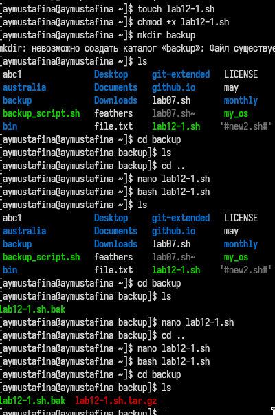

---
## Front matter
title: "Лабораторная работа №12"
subtitle: "Операционные системы"
author: "Мустафина Аделя Юрисовна"

## Generic otions
lang: ru-RU
toc-title: "Содержание"

## Bibliography
bibliography: bib/cite.bib
csl: pandoc/csl/gost-r-7-0-5-2008-numeric.csl

## Pdf output format
toc: true # Table of contents
toc-depth: 2
lof: true # List of figures
lot: true # List of tables
fontsize: 12pt
linestretch: 1.5
papersize: a4
documentclass: scrreprt
## I18n polyglossia
polyglossia-lang:
  name: russian
  options:
	- spelling=modern
	- babelshorthands=true
polyglossia-otherlangs:
  name: english
## I18n babel
babel-lang: russian
babel-otherlangs: english
## Fonts
mainfont: IBM Plex Serif
romanfont: IBM Plex Serif
sansfont: IBM Plex Sans
monofont: IBM Plex Mono
mathfont: STIX Two Math
mainfontoptions: Ligatures=Common,Ligatures=TeX,Scale=0.94
romanfontoptions: Ligatures=Common,Ligatures=TeX,Scale=0.94
sansfontoptions: Ligatures=Common,Ligatures=TeX,Scale=MatchLowercase,Scale=0.94
monofontoptions: Scale=MatchLowercase,Scale=0.94,FakeStretch=0.9
mathfontoptions:
## Biblatex
biblatex: true
biblio-style: "gost-numeric"
biblatexoptions:
  - parentracker=true
  - backend=biber
  - hyperref=auto
  - language=auto
  - autolang=other*
  - citestyle=gost-numeric
## Pandoc-crossref LaTeX customization
figureTitle: "Рис."
tableTitle: "Таблица"
listingTitle: "Листинг"
lofTitle: "Список иллюстраций"
lotTitle: "Список таблиц"
lolTitle: "Листинги"
## Misc options
indent: true
header-includes:
  - \usepackage{indentfirst}
  - \usepackage{float} # keep figures where there are in the text
  - \floatplacement{figure}{H} # keep figures where there are in the text
---

# Цель работы

Изучить основы программирования в оболочке ОС UNIX/Linux. Научиться писать
небольшие командные файлы.

# Задание

1. Написать скрипт, который при запуске будет делать резервную копию самого себя (то
есть файла, в котором содержится его исходный код) в другую директорию backup
в вашем домашнем каталоге. При этом файл должен архивироваться одним из ар-
хиваторов на выбор zip, bzip2 или tar. Способ использования команд архивации
необходимо узнать, изучив справку.
2. Написать пример командного файла, обрабатывающего любое произвольное число
аргументов командной строки, в том числе превышающее десять. Например, скрипт
может последовательно распечатывать значения всех переданных аргументов.
3. Написать командный файл — аналог команды ls (без использования самой этой ко-
манды и команды dir). Требуется, чтобы он выдавал информацию о нужном каталоге
и выводил информацию о возможностях доступа к файлам этого каталога.
4. Написать командный файл, который получает в качестве аргумента командной строки
формат файла (.txt, .doc, .jpg, .pdf и т.д.) и вычисляет количество таких файлов
в указанной директории. Путь к директории также передаётся в виде аргумента ко-
мандной строки.

# Теоретическое введение

Командный процессор (командная оболочка, интерпретатор команд shell) — это про-
грамма, позволяющая пользователю взаимодействовать с операционной системой
компьютера. В операционных системах типа UNIX/Linux наиболее часто используются
следующие реализации командных оболочек:
– оболочка Борна (Bourne shell или sh) — стандартная командная оболочка UNIX/Linux,
содержащая базовый, но при этом полный набор функций;
– С-оболочка (или csh) — надстройка на оболочкой Борна, использующая С-подобный
синтаксис команд с возможностью сохранения истории выполнения команд;
– оболочка Корна (или ksh) — напоминает оболочку С, но операторы управления програм-
мой совместимы с операторами оболочки Борна;
– BASH — сокращение от Bourne Again Shell (опять оболочка Борна), в основе своей сов-
мещает свойства оболочек С и Корна (разработка компании Free Software Foundation).
POSIX (Portable Operating System Interface for Computer Environments) — набор стандартов
описания интерфейсов взаимодействия операционной системы и прикладных программ.
Стандарты POSIX разработаны комитетом IEEE (Institute of Electrical and Electronics
Engineers) для обеспечения совместимости различных UNIX/Linux-подобных опера-
ционных систем и переносимости прикладных программ на уровне исходного кода.
POSIX-совместимые оболочки разработаны на базе оболочки Корна.
Рассмотрим основные элементы программирования в оболочке bash. В других оболоч-
ках большинство команд будет совпадать с описанными ниже.

# Выполнение лабораторной работы

Написать скрипт, который при запуске будет делать резервную копию самого себя (то
есть файла, в котором содержится его исходный код) в другую директорию backup
в вашем домашнем каталоге. При этом файл должен архивироваться одним из ар-
хиваторов на выбор zip, bzip2 или tar. Способ использования команд архивации
необходимо узнать, изучив справку (рис. [-@fig:001]), (рис. [-@fig:002]).

{#fig:001 width=70%}

{#fig:002 width=70%}

Написать пример командного файла, обрабатывающего любое произвольное число
аргументов командной строки, в том числе превышающее десять. Например, скрипт
может последовательно распечатывать значения всех переданных аргументов (рис. [-@fig:003]), (рис. [-@fig:004]).

{#fig:003 width=70%}

{#fig:004 width=70%}

Написать командный файл — аналог команды ls (без использования самой этой ко-
манды и команды dir). Требуется, чтобы он выдавал информацию о нужном каталоге
и выводил информацию о возможностях доступа к файлам этого каталога (рис. [-@fig:005]), (рис. [-@fig:006]).

{#fig:005 width=70%}

{#fig:006 width=70%}

Написать командный файл, который получает в качестве аргумента командной строки
формат файла (.txt, .doc, .jpg, .pdf и т.д.) и вычисляет количество таких файлов
в указанной директории. Путь к директории также передаётся в виде аргумента ко-
мандной строки (рис. [-@fig:007]), (рис. [-@fig:008]).

{#fig:007 width=70%}

{#fig:008 width=70%}

# Контрольные вопросы

1. Объясните понятие командной оболочки. Приведите примеры командных оболочек. Чем они отличаются?
   Командная оболочка — это программа, которая предоставляет интерфейс для взаимодействия пользователя с операционной системой. Она позволяет пользователю вводить команды и получать результаты их выполнения. Примеры командных оболочек: Bash, Zsh, Ksh, Csh. Они отличаются синтаксисом, функциональностью, поддержкой расширенных возможностей (например, автозаполнение, управление историей команд) и поведением.

2. Что такое POSIX?
   POSIX (Portable Operating System Interface) — это стандарт, который определяет интерфейсы и поведение операционных систем, чтобы обеспечить совместимость между различными UNIX-подобными системами. Он включает в себя спецификации для командной строки, системных вызовов и библиотек.

3. Как определяются переменные и массивы в языке программирования bash?
   Переменные в Bash определяются простым присваиванием значения, например: variable_name=value. Массивы определяются с помощью синтаксиса: array_name=(value1 value2 value3).

4. Каково назначение операторов let и read?
   Оператор let используется для выполнения арифметических операций, например: let result=5+3. Оператор read используется для чтения пользовательского ввода из стандартного ввода и присваивания его переменной, например: read variable_name.

5. Какие арифметические операции можно применять в языке программирования bash?
   В Bash можно применять основные арифметические операции: сложение (+), вычитание (-), умножение (*), деление (/), взятие остатка от деления (%).

6. Что означает операция (( ))?
   Операция (( )) используется для выполнения арифметических вычислений и возвращает результат. Внутри скобок можно использовать арифметические выражения, например: ((result = a + b)).

7. Какие стандартные имена переменных Вам известны?
   Стандартные имена переменных в Bash включают: $HOME (домашний каталог пользователя), $USER (имя текущего пользователя), $PATH (список каталогов для поиска исполняемых файлов), $PWD (текущий рабочий каталог).

8. Что такое метасимволы?
   Метасимволы — это специальные символы, которые имеют особое значение в командной строке. Например, * (означает любое количество символов), ? (означает один любой символ), | (передает вывод одной команды на вход другой).

9. Как экранировать метасимволы?
   Метасимволы экранируются с помощью обратного слэша (\). Например, чтобы использовать символ * как обычный символ, нужно писать \*.

10. Как создавать и запускать командные файлы?
    Командные файлы создаются с помощью текстового редактора, например, nano или vim. Чтобы файл стал исполняемым, необходимо использовать команду chmod +x имя_файла. Запускать файл можно, введя его имя в терминале.

11. Как определяются функции в языке программирования bash?
    Функции в Bash определяются с помощью ключевого слова function, за которым следует имя функции и список команд в фигурных скобках. Например:
    

bash
    function my_function {
        # команды
    }
    

12. Каким образом можно выяснить, является файл каталогом или обычным файлом?
    Для проверки можно использовать команду test с флагом -d для каталогов и -f для обычных файлов. Например:
    

shell

bash
    test -d имя_файла && echo "Это каталог"
    test -f имя_файла && echo "Это файл"
    

13. Каково назначение команд set, typeset и unset?
    - set — используется для установки значений переменных и параметров оболочки.
    - typeset — определяет переменные и устанавливает их атрибуты (например, массивы).
    - unset — удаляет переменные или функции.

14. Как передаются параметры в командные файлы?
    Параметры передаются в командные файлы через командную строку. Они могут быть доступны в скрипте с помощью символов $1, $2, ..., $9
, а также $@ (все параметры) и $# (количество переданных параметров). Например, если скрипт вызывается с командой ./script.sh arg1 arg2, то внутри скрипта arg1 будет доступен как $1, а arg2 как $2.

15. Как использовать условные конструкции в Bash?
    Условные конструкции в Bash могут быть реализованы с помощью if, elif, и else. Например:
    

shell

bash
    if [ условие ]; then
        # команды, если условие истинно
    elif [ другое_условие ]; then
        # команды, если другое условие истинно
    else
        # команды, если ни одно из условий не истинно
    fi
    

16. Как организовать циклы в Bash?
    В Bash можно организовать циклы с помощью for, while, и until. Например, цикл for может выглядеть так:
    

shell

bash
    for item in список; do
        # команды для каждого элемента
    done
    

    Цикл while будет выполняться, пока условие истинно:
    

shell

bash
    while [ условие ]; do
        # команды
    done
    

17. Как обрабатывать ошибки в Bash?
    Обработка ошибок в Bash может быть выполнена с помощью проверки кода возврата команд (с помощью $?) или с использованием конструкции trap. Например:
    

shell

bash
    команда
    if [ $? -ne 0 ]; then
        echo "Ошибка выполнения команды"
    fi
    

18. Что такое "потоки" и как они используются в Bash?
    Потоки — это каналы, через которые происходит ввод и вывод данных. В Bash стандартные потоки включают стандартный ввод (stdin), стандартный вывод (stdout) и стандартный вывод ошибок (stderr). Их можно перенаправлять, используя символы >, >>, <, и 2>.

19. Как перенаправлять ввод и вывод в Bash?
    Перенаправление ввода и вывода осуществляется с помощью символов:
    - > для перенаправления стандартного вывода в файл (перезаписывает файл).
    - >> для добавления стандартного вывода в конец файла.
    - < для перенаправления ввода из файла.
    - 2> для перенаправления стандартного вывода ошибок в файл.

20. Как создать и использовать массивы в Bash?
    Массивы в Bash создаются с помощью синтаксиса:
    

bash
    array_name=(value1 value2 value3)
    

    Для доступа к элементам массива используется индекс:
    

shell

bash
    echo ${array_name[0]} # выводит первый элемент
    

    Чтобы получить все элементы массива, можно использовать:
    

shell

bash
    echo ${array_name[@]}
    

# Выводы

Изучила основы программирования в оболочке ОС UNIX/Linux. Научилась писать
небольшие командные файлы.

# Список литературы

[@lab12]

