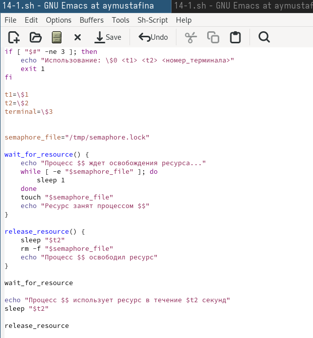
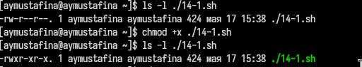
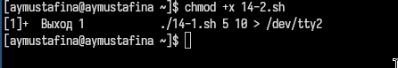
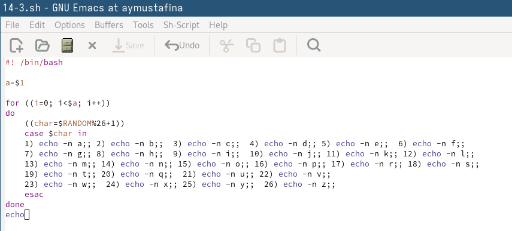

---
## Front matter
lang: ru-RU
title: Лабораторная работа №14
subtitle: Архитектура компьютеров
author:
  - Мустафина А. Ю.
institute:
  - Российский университет дружбы народов, Москва, Россия
date: 17 мая 2025

## i18n babel
babel-lang: russian
babel-otherlangs: english

## Formatting pdf
toc: false
toc-title: Содержание
slide_level: 2
aspectratio: 169
section-titles: true
theme: metropolis
header-includes:
 - \metroset{progressbar=frametitle,sectionpage=progressbar,numbering=fraction}
---

## Цель работы

Изучить основы программирования в оболочке ОС UNIX. Научиться писать более
сложные командные файлы с использованием логических управляющих конструкций
и циклов.

## Выполнение лабораторной работы

Написала командный файл, реализующий упрощённый механизм семафоров. (рис. 1).

{#fig:001 width=70%}

## Выполнение лабораторной работы

Даю права на исполнение (рис. 2).

{#fig:002 width=70%}

## Выполнение лабораторной работы

Исполнение (рис. 3), (рис. 4), (рис. 5).

{#fig:003 width=70%}

## Выполнение лабораторной работы

{#fig:004 width=70%}

## Выполнение лабораторной работы

{#fig:005 width=70%}

## Выполнение лабораторной работы

Реализовала команду man с помощью командного файла (рис. 6).

{#fig:006 width=70%}

## Выполнение лабораторной работы

Исполнение (рис. 7).

{#fig:007 width=70%}

## Выполнение лабораторной работы

Используя встроенную переменную $RANDOM, написала командный файл, генерирую-
щий случайную последовательность букв латинского алфавита (рис. 8).

{#fig:008 width=70%}

## Выполнение лабораторной работы

Исполнение (рис. 9).

{#fig:009 width=70%}

## Контрольные вопросы

1. Найдите синтаксическую ошибку в следующей строке:
while [$1 != "exit"]

Синтаксическая ошибка: Ошибка в строке 1: while [\$1 != "exit"] должна быть исправлена на while [ "\$1" != "exit" ].

2. Как объединить (конкатенация) несколько строк в одну?

Конкатенация строк: Можно использовать string1="Hello" и string2="World" и затем combined="$string1 $string2".

## Контрольные вопросы

3. Найдите информацию об утилите seq. Какими иными способами можно реализовать
её функционал при программировании на bash?

Утилита seq: seq генерирует последовательность чисел. Альтернативы: циклы for, while, использование printf.

4. Какой результат даст вычисление выражения $((10/3))?

Результат выражения: Выражение $((10/3)) даст результат 3 (целочисленное деление).

## Контрольные вопросы

5. Укажите кратко основные отличия командной оболочки zsh от bash.

Отличия zsh от bash: zsh имеет более продвинутую автозаполнение, поддержку плагинов, улучшенные возможности настройки и более мощный механизм управления задачами.

6. Проверьте, верен ли синтаксис данной конструкции
1 for ((a=1; a <= LIMIT; a++))

Проверка синтаксиса: Синтаксис конструкции for ((a=1; a <= LIMIT; a++)) верен, если LIMIT определена.

## Контрольные вопросы

7. Сравните язык bash с какими-либо языками программирования. Какие преимущества
у bash по сравнению с ними? Какие недостатки?

Сравнение bash с другими языками: Bash — это скриптовый язык, удобный для автоматизации задач. Преимущества: простота и доступность для системного администрирования. Недостатки: ограниченные возможности по сравнению с полноценными языками программирования (например, отсутствие строгой типизации, сложность в отладке и ограниченная поддержка структур данных).

## Выводы

Изучила основы программирования в оболочке ОС UNIX. Научидась писать более
сложные командные файлы с использованием логических управляющих конструкций
и циклов.
