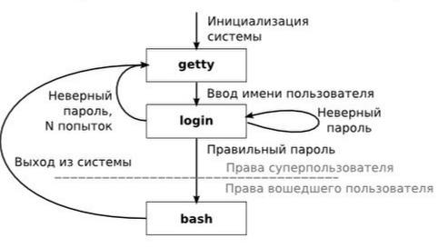
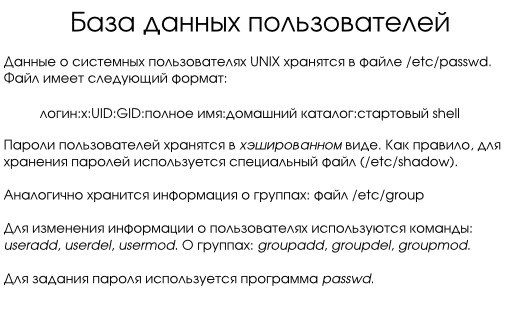

---
## Front matter
title: "Схема аутентификации пользователей с помощью логинов и паролей."
subtitle: "Операционные системы"
author: "Мустафина Аделя Юрисовна"

## Generic otions
lang: ru-RU
toc-title: "Содержание"

## Bibliography
bibliography: bib/cite.bib
csl: pandoc/csl/gost-r-7-0-5-2008-numeric.csl

## Pdf output format
toc: true # Table of contents
toc-depth: 2
lof: true # List of figures
lot: true # List of tables
fontsize: 12pt
linestretch: 1.5
papersize: a4
documentclass: scrreprt
## I18n polyglossia
polyglossia-lang:
  name: russian
  options:
	- spelling=modern
	- babelshorthands=true
polyglossia-otherlangs:
  name: english
## I18n babel
babel-lang: russian
babel-otherlangs: english
## Fonts
mainfont: IBM Plex Serif
romanfont: IBM Plex Serif
sansfont: IBM Plex Sans
monofont: IBM Plex Mono
mathfont: STIX Two Math
mainfontoptions: Ligatures=Common,Ligatures=TeX,Scale=0.94
romanfontoptions: Ligatures=Common,Ligatures=TeX,Scale=0.94
sansfontoptions: Ligatures=Common,Ligatures=TeX,Scale=MatchLowercase,Scale=0.94
monofontoptions: Scale=MatchLowercase,Scale=0.94,FakeStretch=0.9
mathfontoptions:
## Biblatex
biblatex: true
biblio-style: "gost-numeric"
biblatexoptions:
  - parentracker=true
  - backend=biber
  - hyperref=auto
  - language=auto
  - autolang=other*
  - citestyle=gost-numeric
## Pandoc-crossref LaTeX customization
figureTitle: "Рис."
tableTitle: "Таблица"
listingTitle: "Листинг"
lofTitle: "Список иллюстраций"
lotTitle: "Список таблиц"
lolTitle: "Листинги"
## Misc options
indent: true
header-includes:
  - \usepackage{indentfirst}
  - \usepackage{float} # keep figures where there are in the text
  - \floatplacement{figure}{H} # keep figures where there are in the text
---

# Цели и задачи

- Узнать, что такое аутентификация: понять, как система проверяет подлинность пользователя.
- Изучить процесс аутентификации: разобрать этапы, через которые проходит пользователь для входа в систему.
- Как хранятся данные о пользователях: изучить структуру файлов, содержащих информацию о пользователях и их паролях.
- Проверка пароля: понять, как система проверяет введённый пароль на соответствие сохранённому хешу.

# Аутентификация 

Аутентификация пользователей — важнейший аспект управления пользователями в Linux, обеспечивающий доступ к системе
только авторизованным пользователям.
Как правило, при этом пользователю необходимо ввести пароль или предоставить секретный ключ.

В Linux аутентификация реализована с использованием логинов и паролей, что является стандартным подходом в UNIX-подобных системах.

## Аутентификация на основе пароля 

Аутентификация на основе пароля — наиболее распространённый метод аутентификации пользователей в Linux.
При входе в систему пользователи вводят своё имя пользователя и соответствующий пароль для подтверждения своей личности.
Например, пользователь входит в систему, введя своё имя и пароль в поле для входа.
Затем система проверяет введённый пароль по сохранённому хешу пароля, связанному с учётной записью пользователя.

## Аутентификация на основе ключей Secure Shell (SSH) 

Аутентификация на основе ключей Secure Shell (SSH) обеспечивает более безопасную альтернативу аутентификации на основе паролей.
Пользователи генерируют пару открытого и закрытого ключей, где открытый ключ хранится на сервере,
а закрытый ключ надёжно хранится на устройстве пользователя.
С помощью аутентификации на основе SSH-ключей пользователь может пройти аутентификацию без ввода пароля. Вместо этого сервер проверяет личность пользователя на основе наличия у него закрытого ключа.

Преимущества SSH-аутентификации:
• Более высокая безопасность, так как ключи сложнее подделать, чем пароли.
• Удобство — пользователю не нужно каждый раз вводить пароль.

## Процесс аутентификации

В UNIX сеанс работы пользователя начинается с его аутентификации и заканчивается его выходом из системы.

1. Запрос регистрационных данных
   Процесс getty ожидает активности пользователя на терминальной линии. При обнаружении активности он выводит приглашение ввести логин и пароль.

2. Проверка подлинности данных
   После ввода логина запускается программа login, которая проверяет подлинность введённых данных.
Основным механизмом проверки является сравнение введённого пароля с хэшем, хранящимся в системе.

3. Запуск командной оболочки
   Если пароль введён верно, login запускает командную оболочку (например, /bin/bash) с установленными идентификаторами пользователя (UID)
и группы (GID). Эти идентификаторы определяют права доступа для всех процессов, запущенных пользователем в текущем сеансе.
Она проверяет правильность ввода имени и пароля пользователя, меняет каталог на домашний, выстраивает окружение и
запускает командный интерпретатор. Команду login нельзя запускать из командной строки - это вызовет ошибку и может привести к завершению сеанса (рис. [-@fig:001]).

{#fig:001 width=70%}

# Хранение данных о пользователях  

Информация о пользователях в Linux хранится в файле /etc/passwd. Каждая строка этого файла соответствует одному пользователю и содержит следующие поля:

- Логин — имя пользователя.  
- Пароль — символ x, указывающий, что хэш пароля хранится в отдельном файле /etc/shadow.  
- UID — уникальный идентификатор пользователя.  
- GID — уникальный идентификатор группы пользователя.  
- Полное имя — дополнительная информация о пользователе.  
- Домашний каталог — путь к домашней директории пользователя.  
- Командная оболочка — путь к оболочке, используемой по умолчанию.

Пример строки из файла /etc/passwd:
```
root:x:0:0:root:/root:/bin/bash```


Пароли в Linux хранятся в зашифрованном виде в файле /etc/shadow. Этот файл доступен только для чтения суперпользователю (root), что повышает безопасность системы. Каждая строка в файле /etc/shadow соответствует одному пользователю и содержит следующие поля:

1. Логин — имя пользователя.
2. Хеш пароля — зашифрованный пароль пользователя.
3. Дата последнего изменения пароля — количество дней с 1 января 1970 года (эпоха Unix).
4. Минимальный срок действия пароля — минимальное количество дней, которое должно пройти перед изменением пароля.
5. Максимальный срок действия пароля — максимальное количество дней, через которое пароль нужно изменить.
6. Период предупреждения — количество дней до истечения срока действия пароля, когда пользователю начнут приходить предупреждения.
7. Период неактивности — количество дней после истечения срока действия пароля, в течение которых учётная запись будет заблокирована.
8. Дата истечения срока действия учётной записи — дата, после которой учётная запись будет заблокирована.
9. Зарезервированное поле — поле для будущего использования.

Пример строки из файла /etc/shadow:

```root:$6$randomsalt$hashedpassword:19180:0:99999:7:::```

## Хеширование паролей

Пароли в Linux хранятся в виде хешей, что делает их безопасными даже в случае утечки данных. Хеширование — это процесс преобразования пароля в уникальную строку фиксированной длины с использованием криптографических алгоритмов. Наиболее распространённые алгоритмы хеширования в Linux:

- MD5 — устаревший алгоритм, не рекомендуется к использованию.
- SHA-256 и SHA-512 — современные и безопасные алгоритмы, используемые по умолчанию в большинстве дистрибутивов Linux.


## Управление пользователями и паролями  

Для управления пользователями и их паролями в Linux используются следующие команды:

- useradd — добавление нового пользователя.
- userdel — удаление пользователя.
- passwd — изменение пароля пользователя. Позволяет пользователю изменить свой пароль или администратору изменить пароль другого пользователя.
- usermod — изменение параметров пользователя.  Позволяет изменять параметры учётной записи, включая пароль.

Эти команды доступны только суперпользователю, что обеспечивает контроль над безопасностью системы (рис. [-@fig:002]).

{#fig:002 width=70%}

# Заключение  

Схема аутентификации пользователей в Linux с использованием логинов и паролей является надёжным и проверенным временем механизмом. Она обеспечивает безопасность системы за счёт хранения паролей в виде хэшей, использования файлов /etc/passwd и /etc/shadow,
а также предоставления администратору инструментов для управления пользователями и их правами.
Понимание процессов аутентификации, хранения данных о пользователях и проверки паролей помогает администраторам эффективно управлять безопасностью системы. Использование современных алгоритмов хеширования, таких как SHA-256 и SHA-512, а также правильное управление паролями значительно повышают уровень защиты системы.

Несмотря на свою простоту, эта схема эффективно защищает систему от несанкционированного доступа, что делает её важным элементом информационной безопасности в Linux.

# Список литературы

[-@mann_mitchell_krell_book_linux-security_en]
[-@kuryachiy_book_unix-os_en]
