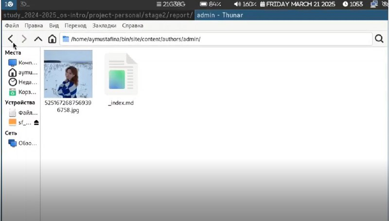
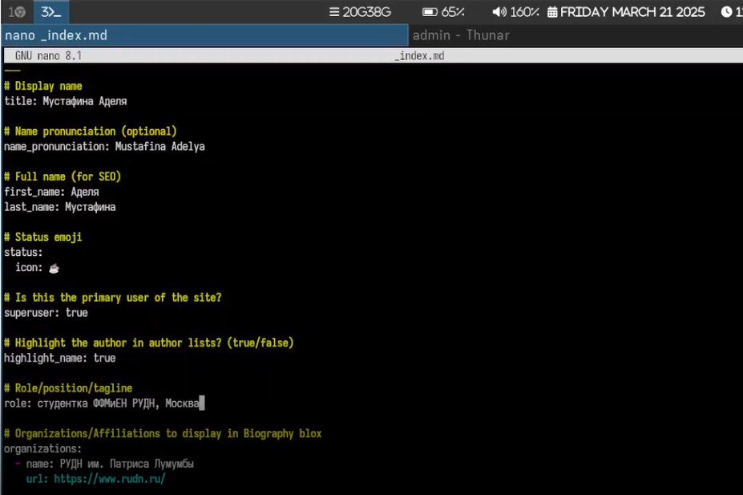
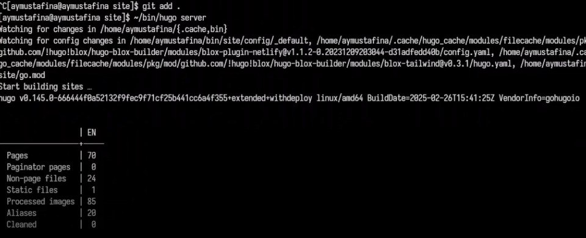
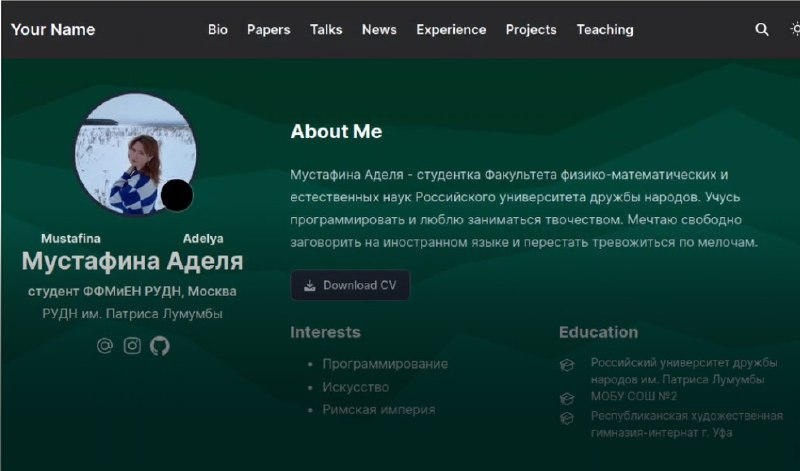
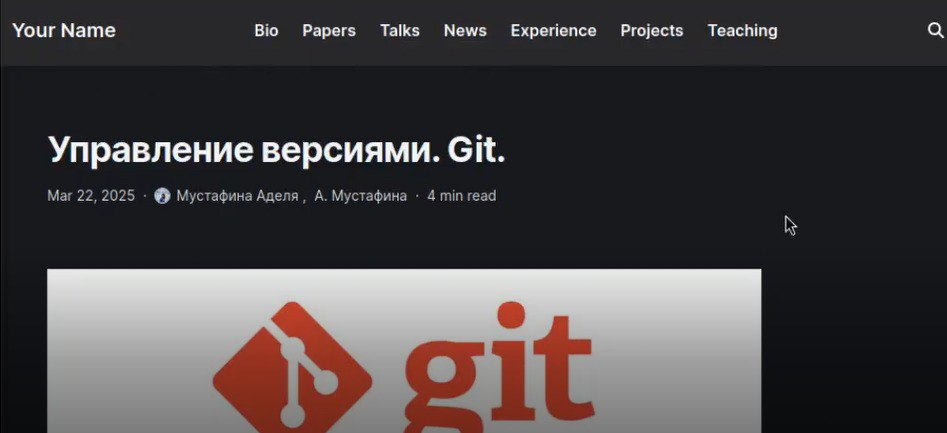
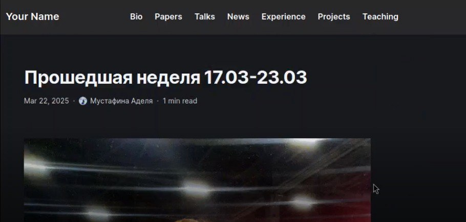

---
## Front matter
lang: ru-RU
title: Проект №2
subtitle: Операционные системы
author:
  - Мустафина А.Ю.
institute:
  - Российский университет дружбы народов, Москва, Россия
date: 22 марта 2025

## i18n babel
babel-lang: russian
babel-otherlangs: english

## Formatting pdf
toc: false
toc-title: Содержание
slide_level: 2
aspectratio: 169
section-titles: true
theme: metropolis
header-includes:
 - \metroset{progressbar=frametitle,sectionpage=progressbar,numbering=fraction}
---

# Информация

## Докладчик

:::::::::::::: {.columns align=center}
::: {.column width="70%"}

  * Мустафина Аделя Юрисовна
  * НКАбд-03-24, студ. билет №1132246719
  * Российский университет дружбы народов
  * <https://github.com/aymustafina/study_2024-2025_os-intro>

:::
::: {.column width="30%"}
:::
::::::::::::::

## Цель работы 

Продолжить работу с сайтом, отредактировать его в соответствии с требованиями, добавить данные о себе.

## Задание

1. Разместить фотографию владельца сайта.
2. Разместить краткое описание владельца сайта.
3. Добавить информацию об интересах.
4. Добавить информацию от образовании.
5. Сделать пост по прошедшей неделе.
6. Добавить пост на тему по выбору:  Управление версиями. Git. Непрерывная интеграция и непрерывное развертывание (CI/CD).

# Выполнение лабораторной работы

## Выполнение лабораторной работы

Переношу свою фотографию в нужный каталог (рис. 1).

{#fig:001 width=70%}

## Выполнение лабораторной работы

В файле _index.md добваляю данные о себе (рис. 2).

{#fig:002 width=70%}

## Выполнение лабораторной работы

Отправляю изменения в репозиторий (рис. 3).

{#fig:003 width=70%}

## Выполнение лабораторной работы

Проверяю изменения на сайте (рис. 4).

{#fig:004 width=70%}

## Выполнение лабораторной работы

Пишу пост на выбранную тему и, отправив в репозиторий, проверяю сайт (рис. 5).

{#fig:005 width=70%}

## Выполнение лабораторной работы

Пишу пост о прошедшей неделе и, отправив в репозиторий, проверяю сайт (рис. 6).

{#fig:006 width=70%}

# Выводы

Отредактировали сайт в соответствии с треобованиями, добавили данные о себе на сайт.
