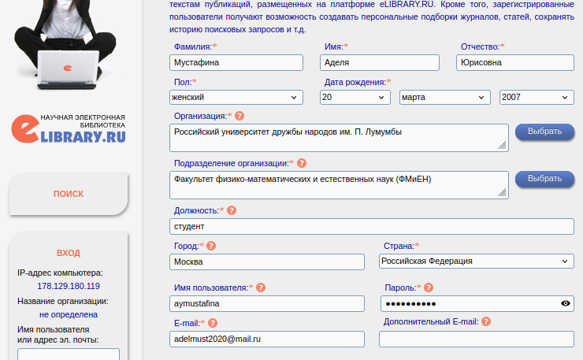
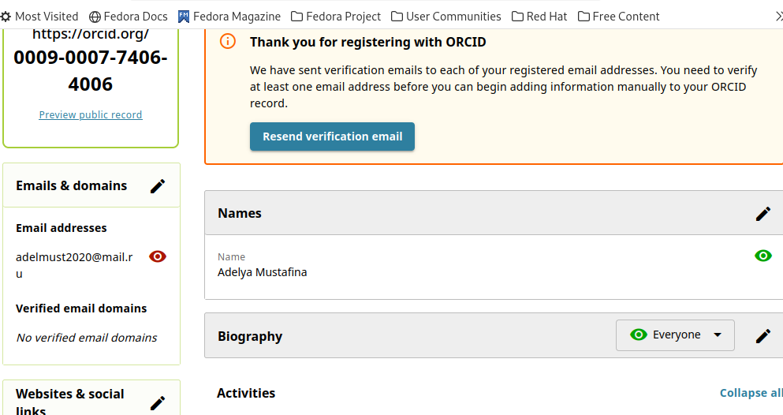
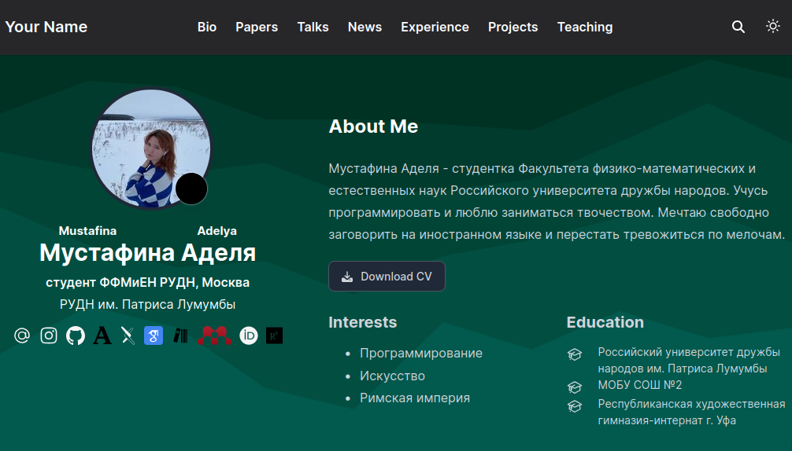
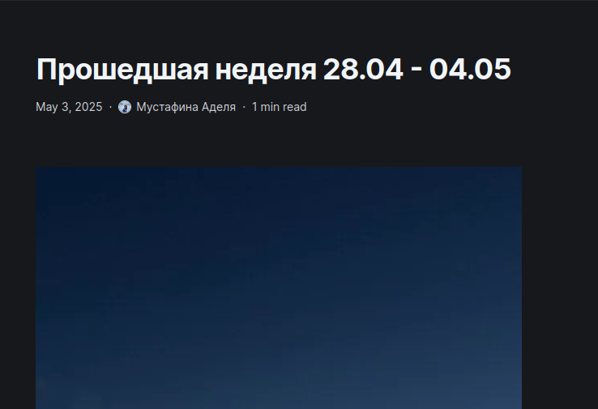

---
## Front matter
lang: ru-RU
title: Четвертый этап индивидуального проекта
subtitle: Операционные системы
author:
  - Мустафина А. Ю.
institute:
  - Российский университет дружбы народов, Москва, Россия
date: 03 мая 2025

## i18n babel
babel-lang: russian
babel-otherlangs: english

## Formatting pdf
toc: false
toc-title: Содержание
slide_level: 2
aspectratio: 169
section-titles: true
theme: metropolis
header-includes:
 - \metroset{progressbar=frametitle,sectionpage=progressbar,numbering=fraction}
---

## Цель работы

Добавить к сайту ссылки на научные и библиометрические ресурсы.

## Задание

 1. Зарегистрироваться на соответствующих ресурсах и разместить на них ссылки на сайте:
        eLibrary : https://elibrary.ru/;
        Google Scholar : https://scholar.google.com/;
        ORCID : https://orcid.org/;
        Mendeley : https://www.mendeley.com/;
        ResearchGate : https://www.researchgate.net/;
        Academia.edu : https://www.academia.edu/;
        arXiv : https://arxiv.org/;
        github : https://github.com/.
 2. Сделать пост по прошедшей неделе.
 3. Добавить пост на тему по выбору:
        Оформление отчёта.
        Создание презентаций.

## Выполнение 

Регистрируюсь на необходимых сайтах (рис. 1), (рис. 2), (рис. 3), (рис. 4), (рис. 5), 
 (рис. 6), (рис. 7), (рис. 8).

{#fig:001 width=40%}

## Выполнение 

{#fig:002 width=40%}

## Выполнение 

{#fig:003 width=40%}

## Выполнение 

{#fig:004 width=40%}

## Выполнение 

{#fig:005 width=40%}

## Выполнение 

{#fig:006 width=40%}

## Выполнение 

{#fig:007 width=40%}

## Выполнение 

{#fig:008 width=40%}

## Выполнение 

Добавила ссылки и иконки на персональный сайт (рис. 9).

{#fig:009 width=70%}

## Выполнение 

Перешла в папку с постами и добавила новые папки для двух постов (рис. 10).

{#fig:010 width=70%}

## Выполнение 

Написала пост о прошедшей неделе (рис. 11).

{#fig:011 width=70%}

## Выполнение 

Написала пост о работе с библиографией (рис. 12).

{#fig:012 width=70%}

## Выводы

Зарегестрировалась на необходимых сайтах и добавила ссылки на сайт.
Написала два поста.
