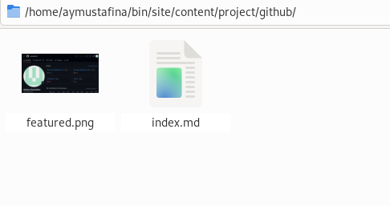
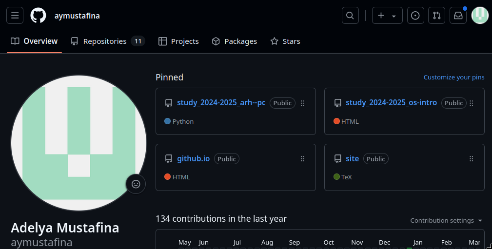
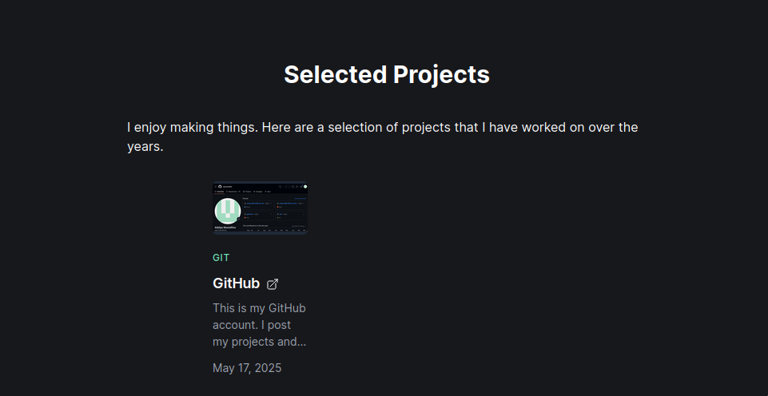
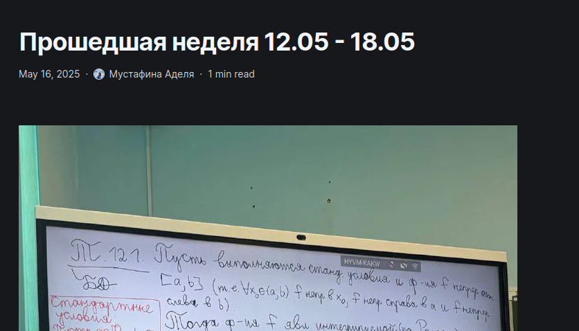
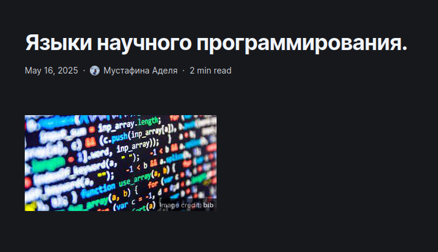
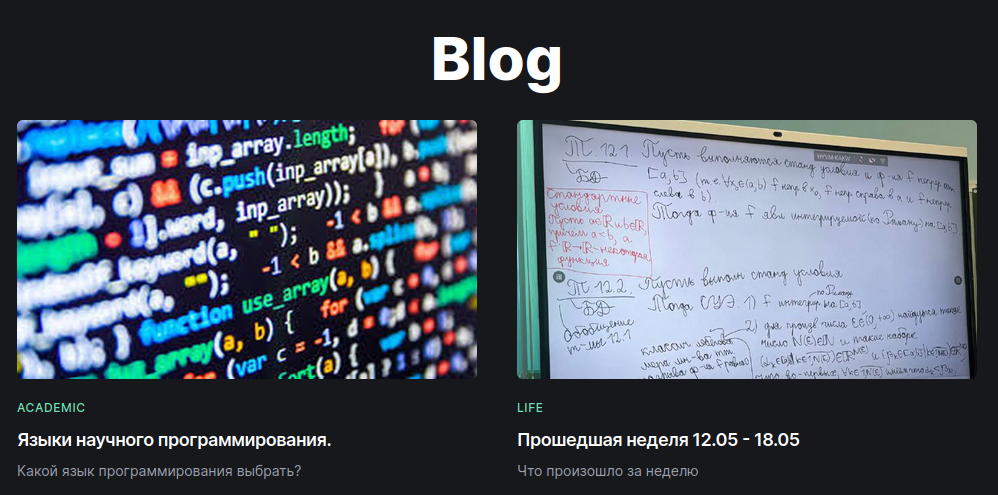

---
## Front matter
lang: ru-RU
title: Этап №5 
subtitle: Операционные системы 
author:
  - Мустафина А. Ю.
institute:
  - Российский университет дружбы народов, Москва, Россия
date: 17 мая 2025

## i18n babel
babel-lang: russian
babel-otherlangs: english

## Formatting pdf
toc: false
toc-title: Содержание
slide_level: 2
aspectratio: 169
section-titles: true
theme: metropolis
header-includes:
 - \metroset{progressbar=frametitle,sectionpage=progressbar,numbering=fraction}
---

## Цель работы 

Добавить с сайту все остальные элементы.

## Задание

-  Сделать записи для персональных проектов.
-  Сделать пост по прошедшей неделе.
-  Добавить пост на тему "Языки научного программирования."

## Выполнение проекта

Перешла в папку (рис. 1).

{#fig:001 width=70%}

## Выполнение проекта

Мой GitHub (рис. 2).

{#fig:002 width=70%}

## Выполнение проекта

Отредактировала файлы и добавила все на свой сайт (рис. 3).

{#fig:003 width=70%}

## Выполнение проекта

Написала пост о прошедшей неделе (рис. 4).

{#fig:004 width=70%}

## Выполнение проекта

Написала пост о научных языках программирования (рис. 5).

{#fig:005 width=70%}

## Выполнение проекта

Добавила все сайт (рис. 6).

{#fig:006 width=70%}

## Выводы

Добавила два поста и информацию о проектах на сайт.
