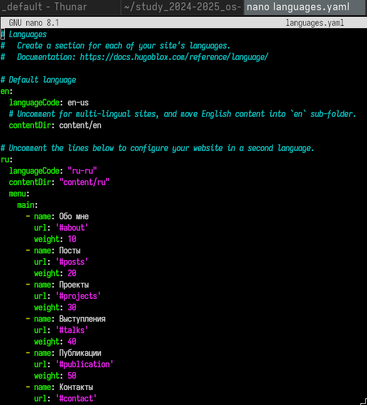
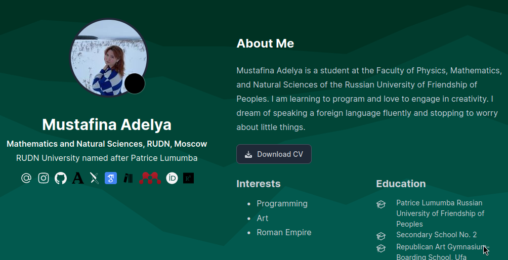
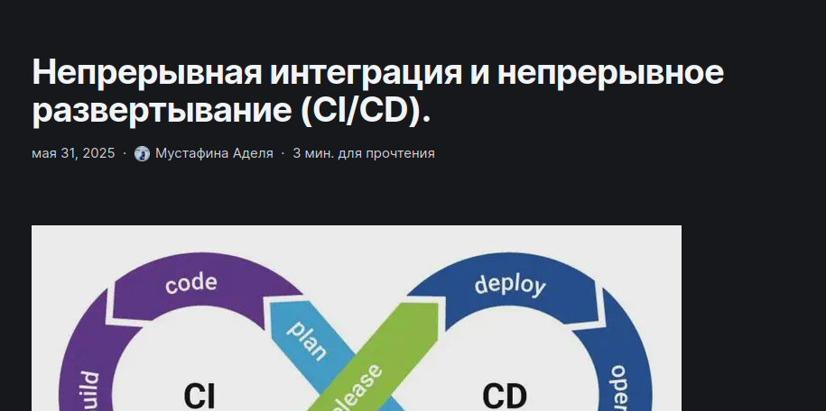
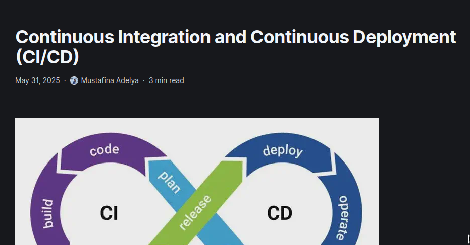
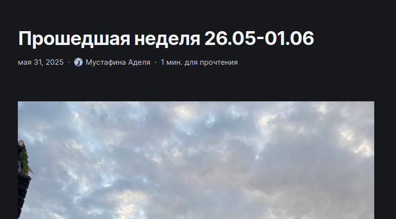
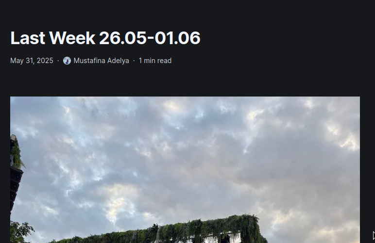

---
## Front matter
lang: ru-RU# 
title: Этап №5
subtitle: Операционные системы
author:
  - Мустафина А. Ю.
institute:
  - Российский университет дружбы народов, Москва, Россия
date: 31 мая 2025

## i18n babel
babel-lang: russian
babel-otherlangs: english

## Formatting pdf
toc: false
toc-title: Содержание
slide_level: 2
aspectratio: 169
section-titles: true
theme: metropolis
header-includes:
 - \metroset{progressbar=frametitle,sectionpage=progressbar,numbering=fraction}
---

## Цель работы

Продолжить работу с сайтом, Разместить двуязычный сайт на Github.

## Задание

1. Сделать поддержку английского и русского языков.
2. Разместить элементы сайта на обоих языках.
3. Разместить контент на обоих языках.
4. Сделать пост по прошедшей неделе.
5. Добавить пост на тему по выбору (на двух языках).
5. Добавить пост на тему по выбору (на двух языках).

## Выполнение индивидуального проекта

1. Делаю поддержку двух языков. Cкачиваю файл с поддержкой русского языка ru.yaml, размещаю его в каталоге i18n. Редактирую файл language.yaml. (рис. 1).

{#fig:001 width=70%}

## Выполнение индивидуального проекта

2. Создаю в каталоге content две папки, в которых хранится содержимое сайта на двух языках, перевожу все данные на нужный язык.

3. Проверяю изменения на сайте (рис. 2).

{#fig:002 width=70%}

## Выполнение индивидуального проекта

4. Пишу пост на тему по выбору на двух языках. (рис. 3). (рис. 4).

{#fig:003 width=70%}

## Выполнение индивидуального проекта

{#fig:004 width=70%}

## Выполнение индивидуального проекта

5. Пишу пост по прошедшей неделе на двух языках.(рис. 5). (рис. 6).

{#fig:005 width=70%}

## Выполнение индивидуального проекта

{#fig:006 width=70%}

## Выводы

Мы продолжили работу с сайтом, разместили двуязычный сайт на Github.
